# Clase 1 — Introducción a Estructuras de Datos y Análisis de Algoritmos

---

## Tabla de contenidos

1. [Estructuras de datos y algoritmos](#bloque-1)
2. [Aplicaciones en la industria](#bloque-2)
3. [Repaso de funciones en Python](#bloque-3)
4. [Tiempo de ejecución `T(n)` y operaciones básicas](#bloque-4)
5. [Notación Big O](#bloque-5)
6. [Clases comunes de complejidad](#bloque-6)
7. [Reglas para combinar costos](#bloque-7)
8. [Caso práctico: análisis de un *selection sort*](#bloque-8)
9. [Experimentos prácticos](#bloque-9)
10. [Plantilla y patrones para analizar algoritmos](#bloque-10)

---

## Bloque 1 — Estructuras de datos y algoritmos {#bloque-1}

Esta clase introduce dos ideas centrales para el resto del módulo:

1. **Estructuras de datos:** formas sistemáticas de organizar y acceder a datos.
2. **Algoritmos:** procedimientos finitos, ordenados y sin ambigüedades para resolver problemas.

La idea principal es que **la estructura de datos elegida puede cambiar radicalmente la eficiencia de un programa**, especialmente cuando trabajamos con grandes volúmenes de datos.

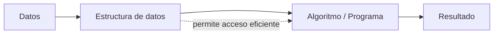

### ¿Qué es una estructura de datos?

Una **estructura de datos** es una forma particular de organizar datos en la memoria de un computador para que puedan ser utilizados y procesados eficientemente por un programa.

En términos prácticos, responde preguntas como:

- ¿Cómo se almacenan los datos?
- ¿Cómo se accede a ellos?
- ¿Qué operaciones son rápidas?
- ¿Qué operaciones son costosas?
- ¿Qué tan bien escala cuando aumenta el tamaño de entrada?

> 💡 **No existe una estructura universalmente mejor.** Cada una tiene ventajas y desventajas según el problema.

| Problema | Estructura útil |
|---|---|
| Guardar elementos en orden cronológico | Lista, pila, cola |
| Buscar datos por clave | Diccionario, tabla hash, árbol de búsqueda |
| Modelar rutas o redes | Grafo |
| Representar directorios | Árbol |
| Indexar documentos | Índice invertido |

### ¿Qué es un algoritmo?

Un **algoritmo** es un conjunto finito de instrucciones bien definidas y ordenadas que permiten resolver un problema sin ambigüedad.

Una analogía útil: una receta de cocina.

1. Tiene una entrada (los ingredientes).
2. Sigue pasos claros.
3. Termina en una cantidad finita de tiempo.
4. Produce una salida (el plato listo).

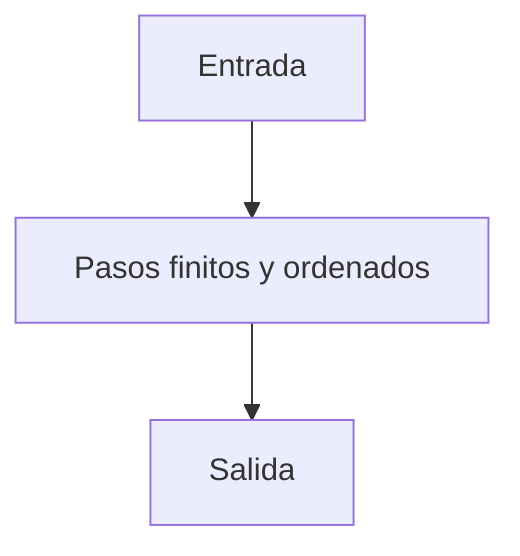

En programación, normalmente analizamos el tamaño de la entrada usando la variable `n`. Por ejemplo: si una función calcula el promedio de una lista, `n` será la cantidad de elementos de esa lista.

> 💡 **Contexto DE:** la elección de estructura es decisiva en pipelines de datos. Buscar un valor en una lista de un millón de filas con `valor in lista` toma segundos; el mismo valor en un `set` toma microsegundos. La diferencia entre un pipeline lento y uno rápido suele estar en este tipo de decisiones.

---

## Bloque 2 — Aplicaciones en la industria {#bloque-2}

Las estructuras de datos aparecen en prácticamente todos los sistemas informáticos reales.

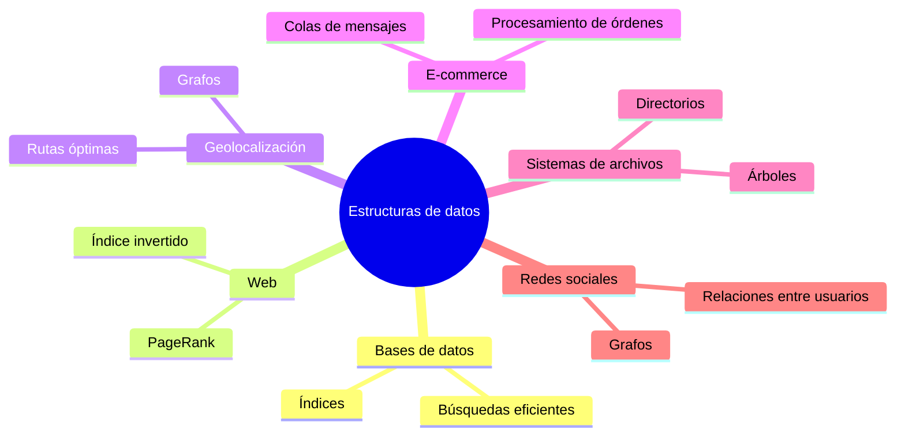

### Sistemas de e-commerce

En sistemas de e-commerce es común almacenar eventos en orden cronológico. Una orden llega a una cola de mensajes y luego es procesada por distintos *workers*.

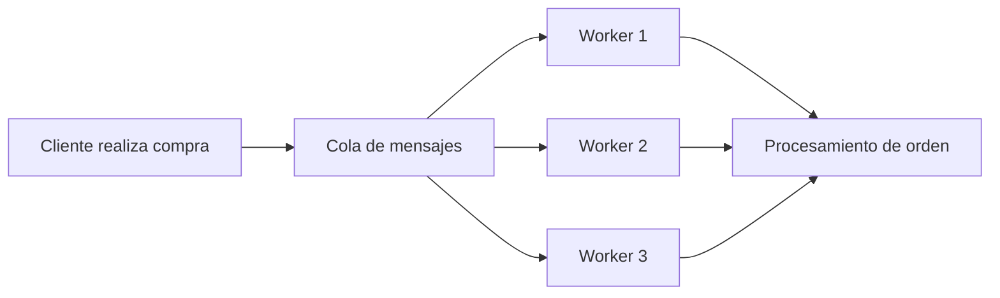

Estructuras involucradas: listas, pilas y colas.

### Sistemas de archivos

Los sistemas de archivos suelen representarse como árboles.

```mermaid
graph TD
    root[/]
    root --> bin[bin]
    root --> users[Users]
    root --> volumes[Volumes]
    users --> jp[jp]
    users --> admin[admin]
    volumes --> c["C:"]
    volumes --> d["D:"]
```

- La raíz representa el directorio principal.
- Los nodos internos representan carpetas.
- Las hojas representan archivos o carpetas vacías.

### Sistemas de geolocalización

Aplicaciones como Google Maps u OpenStreetMap modelan lugares y caminos mediante grafos.

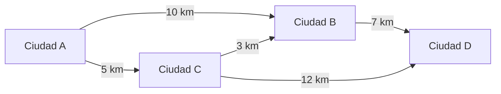

Problemas típicos: ruta más corta, lugares dentro de una zona, optimización de trayectos.

### Indexación de la web

Los motores de búsqueda usan estructuras especializadas como el **índice invertido**, que asocia cada palabra con la lista de documentos donde aparece.

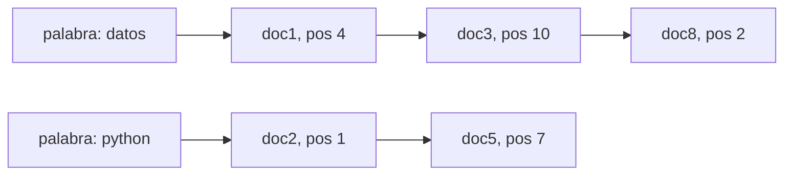

Esto permite responder consultas rápidamente sin revisar todos los documentos desde cero.

---

## Bloque 3 — Repaso de funciones en Python {#bloque-3}

Una **función** es una sección de un programa que realiza una tarea de forma independiente y reutilizable.

Toda función tiene tres componentes:

1. **Parámetros:** valores de entrada.
2. **Cuerpo:** instrucciones que ejecuta.
3. **Retorno:** valor que entrega.

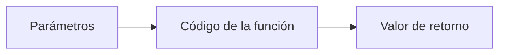

### Ejemplo: factorial

```python
def factorial(n):
    f = 1
    for i in range(1, n + 1):
        f *= i
    return f

print(factorial(5))    # 120
```

La función calcula `n! = 1 · 2 · 3 · … · n`. Para `n = 5`: `5! = 120`.

### Ejemplo: promedio

```python
def promedio(lista):
    suma = 0.0
    n = len(lista)

    if n == 0:
        return None

    for numero in lista:
        suma += numero

    return suma / n
```

Si la lista tiene `n` elementos, el ciclo se ejecuta `n` veces. Por eso su tiempo de ejecución crece linealmente con el tamaño de entrada — formalmente: `T(n) = c · n`, o en notación Big O: `T(n) ∈ O(n)`. Vamos a ver de dónde vienen estos términos.

---

## Bloque 4 — Tiempo de ejecución `T(n)` y operaciones básicas {#bloque-4}

Cuando diseñamos un algoritmo, queremos saber qué tan eficiente es. Una idea inicial sería medir el tiempo real de ejecución:

```python
import time

inicio = time.time()
# ejecutar algoritmo
fin = time.time()

print(fin - inicio)
```

Pero esta estrategia tiene problemas:

1. Depende de la máquina usada.
2. Depende del lenguaje de programación.
3. Depende de las entradas elegidas.
4. Solo te enteras de que el algoritmo es lento *después* de implementarlo.

Por eso usamos **análisis asintótico**: estudiar el crecimiento del costo del algoritmo sin depender de una máquina específica.

### Definición de `T(n)`

`T(n)` es la cantidad de operaciones básicas que ejecuta un algoritmo en función del tamaño de entrada `n`.

Ejemplo:

```python
def suma(lista):
    total = 0
    for x in lista:
        total += x
    return total
```

Si la lista tiene `n` elementos, el ciclo se ejecuta `n` veces. Entonces:

```text
T(n) = c · n + k
```

Donde `c` es el costo constante de cada iteración y `k` representa operaciones fuera del ciclo (la inicialización de `total` y el `return`).

Para valores grandes de `n`, las constantes pierden importancia. Por eso escribimos `T(n) ∈ O(n)`.

### ¿Qué cuenta como operación básica?

Para estimar `T(n)` contamos operaciones elementales:

| Tipo de operación | Ejemplos en Python |
|---|---|
| Asignación | `=`, `+=`, `*=` |
| Aritméticas | `+`, `-`, `*`, `/`, `//` |
| Lógicas | `and`, `or`, `not` |
| Relacionales | `<`, `>`, `<=`, `>=`, `==`, `!=` |
| Saltos | `return`, `break` |

Cada una se cuenta como **una unidad de tiempo**.

### Reglas para calcular tiempos

| Estructura | Regla de costo |
|---|---|
| Operación básica | 1 unidad de tiempo |
| Secuencia de sentencias | Suma de los tiempos de cada sentencia |
| `if cond: S1 else: S2` | `T(cond) + max(T(S1), T(S2))` |
| `while cond: S` | `T(cond) + iteraciones · (T(S) + T(cond))` |
| `for` con `n` iteraciones | `n · costo_del_cuerpo` |

> 💡 **Pesimismo razonable:** estimamos el peor caso. Si un algoritmo a veces termina rápido pero ocasionalmente tarda mucho, el comportamiento que importa para producción es el peor caso, no el promedio.

---

## Bloque 5 — Notación Big O {#bloque-5}

La notación Big O permite **acotar el crecimiento** de una función de tiempo.

Decimos que `f(n) ∈ O(g(n))` si existen constantes positivas `c` y `n₀` tales que:

```text
f(n) ≤ c · g(n),  para todo n ≥ n₀
```

En palabras simples:

> A partir de cierto tamaño de entrada, `g(n)` crece al menos tan rápido como `f(n)`, ignorando constantes.

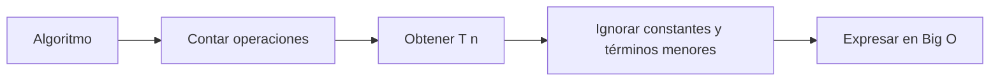

### Ejemplo: máximo de una lista

```python
def maximo(lista):
    n = len(lista)

    if n == 0:
        return None

    maximo = lista[0]

    for i in range(1, n):
        if lista[i] > maximo:
            maximo = lista[i]

    return maximo
```

El ciclo se ejecuta `n − 1` veces. Cada iteración hace una comparación y, en peor caso, una asignación. Por lo tanto:

```text
T(n) = c · n + k    →    T(n) ∈ O(n)
```

---

## Bloque 6 — Clases comunes de complejidad {#bloque-6}

| Función ejemplo | Clase Big O | Nombre |
|---|---|---|
| `15` | `O(1)` | Constante |
| `log₂(n) − 1` | `O(log n)` | Logarítmica |
| `3n − 1` | `O(n)` | Lineal |
| `n log n` | `O(n log n)` | Lineal-logarítmica |
| `n² / 2 + 1` | `O(n²)` | Cuadrática |
| `5n³ + 2n − 3` | `O(n³)` | Cúbica |
| `2ⁿ` | `O(2ⁿ)` | Exponencial |

Orden de mayor a menor eficiencia:

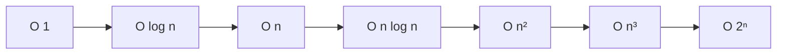

### Comparación numérica de crecimiento

Esta tabla muestra cómo crece el número de operaciones para distintas funciones:

| n | log n | n | n log n | n² | n³ | 2ⁿ |
|---:|---:|---:|---:|---:|---:|---:|
| 8 | 3 | 8 | 24 | 64 | 512 | 256 |
| 16 | 4 | 16 | 64 | 256 | 4 096 | 65 536 |
| 32 | 5 | 32 | 160 | 1 024 | 32 768 | 4,29 × 10⁹ |
| 64 | 6 | 64 | 384 | 4 096 | 262 144 | 1,84 × 10¹⁹ |
| 128 | 7 | 128 | 896 | 16 384 | 2 097 152 | 3,40 × 10³⁸ |
| 256 | 8 | 256 | 2 048 | 65 536 | 16 777 216 | 1,15 × 10⁷⁷ |

> ⚠️ **Conclusión clave:** mejorar el algoritmo suele ser más importante que mejorar la máquina. Una CPU más rápida puede ayudar con algoritmos lineales o logarítmicos, pero **no salva fácilmente un algoritmo exponencial**: cuando `n = 64`, `2ⁿ` ya supera a la cantidad de átomos en la galaxia.

---

## Bloque 7 — Reglas para combinar costos {#bloque-7}

### Regla de la suma

Si `f₁ ∈ O(g)` y `f₂ ∈ O(h)`, entonces:

```text
f₁ + f₂ ∈ O(max(g, h))
```

Ejemplo: `n²/2 + 2n − 1 ∈ O(n²)` porque `n²` domina a `n` cuando `n` crece.

### Regla del producto

Si `f₁ ∈ O(g)` y `f₂ ∈ O(h)`, entonces:

```text
f₁ · f₂ ∈ O(g · h)
```

Ejemplo: `(n²/2) · 3n ∈ O(n³)`.

### Aplicación inmediata: ciclos

```python
# Dos ciclos consecutivos
for i in range(n):
    print(i)

for j in range(n):
    print(j)
# Costo: O(n) + O(n) = O(n)
```

```python
# Dos ciclos anidados
for i in range(n):
    for j in range(n):
        print(i, j)
# Costo: O(n) · O(n) = O(n²)
```

> 💡 **Truco mnemotécnico:** cuando ves dos ciclos anidados sobre el mismo `n`, casi siempre estás ante `O(n²)`.

---

## Bloque 8 — Caso práctico: análisis de un *selection sort* {#bloque-8}

Analicemos el siguiente algoritmo de ordenamiento, una variante de **selection sort**:

```python
from sys import maxsize  # número muy grande

def sort(lista):
    n = len(lista)
    listaOrdenada = []

    for i in range(0, n):
        min = maxsize
        minIndex = 0

        for j in range(0, n):
            if lista[j] != "x" and lista[j] < min:
                min = lista[j]
                minIndex = j

        lista[minIndex] = "x"
        listaOrdenada.append(min)

    return listaOrdenada


print(sort([2, 5, 1, 4, 6, 10, 3]))
# Salida: [1, 2, 3, 4, 5, 6, 10]
```

### ¿Qué hace?

Ordena una lista de menor a mayor:

1. Busca el menor elemento disponible.
2. Lo agrega a `listaOrdenada`.
3. Marca la posición original con `"x"` para no volver a usarlo.
4. Repite `n` veces.

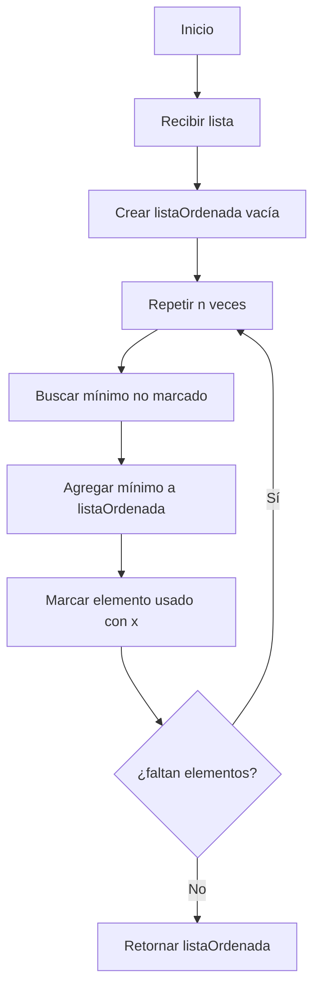

> ⚠️ **Observación de calidad:** modificar la lista original mezclando números y strings (`"x"`) funciona pero es frágil. En código real, conviene usar un valor centinela del mismo tipo (por ejemplo, `None` o `float('inf')`) o mejor aún, una estructura paralela de booleanos.

### Tiempo de ejecución

Los dos ciclos anidados ejecutan el bloque interno aproximadamente `n · n = n²` veces:

```text
T(n) = c · n² + k · n + b    →    T(n) ∈ O(n²)
```

### Versión más segura

```python
def sort_seguro(lista):
    trabajo = lista.copy()
    n = len(trabajo)
    lista_ordenada = []

    for i in range(n):
        minimo = float('inf')
        indice_minimo = 0

        for j in range(n):
            if trabajo[j] is not None and trabajo[j] < minimo:
                minimo = trabajo[j]
                indice_minimo = j

        trabajo[indice_minimo] = None
        lista_ordenada.append(minimo)

    return lista_ordenada


print(sort_seguro([2, 5, 1, 4, 6, 10, 3]))
```

Sigue siendo `O(n²)`, pero no altera la lista original ni mezcla tipos.

---

## Bloque 9 — Experimentos prácticos {#bloque-9}

### Experimento 1: medir crecimiento lineal

Crea `lineal.py`:

```python
import time


def suma_lineal(n):
    total = 0
    for i in range(n):
        total += i
    return total


for n in [10_000, 100_000, 1_000_000, 10_000_000]:
    inicio = time.time()
    suma_lineal(n)
    fin = time.time()
    print(n, fin - inicio)
```

Ejecuta:

```bash
python3 lineal.py
```

Al multiplicar `n` por 10, el tiempo debería multiplicarse aproximadamente por 10 (crecimiento lineal).

### Experimento 2: medir crecimiento cuadrático

Crea `cuadratico.py`:

```python
import time


def cuadratico(n):
    total = 0
    for i in range(n):
        for j in range(n):
            total += i + j
    return total


for n in [100, 500, 1000, 2000]:
    inicio = time.time()
    cuadratico(n)
    fin = time.time()
    print(n, fin - inicio)
```

Al duplicar `n`, el tiempo se cuadruplica (crecimiento cuadrático).

### Experimento 3: lista vs. set

```python
import time

n = 1_000_000
lista = list(range(n))
conjunto = set(lista)
objetivo = n - 1

inicio = time.time()
print(objetivo in lista)
fin = time.time()
print("lista:", fin - inicio)

inicio = time.time()
print(objetivo in conjunto)
fin = time.time()
print("set:", fin - inicio)
```

Resultado típico: la lista demora milisegundos; el set, microsegundos.

> 💡 **Por qué:** buscar en una lista revisa elementos secuencialmente (`O(n)`); buscar en un `set` usa hashing (`O(1)` promedio). Lo veremos en detalle en la Clase 4.

---

## Bloque 10 — Plantilla y patrones para analizar algoritmos {#bloque-10}

### Procedimiento general

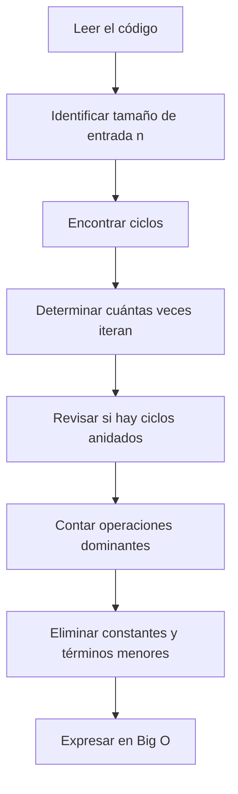

### Preguntas útiles

1. ¿Cuál es el tamaño de entrada `n`?
2. ¿Hay ciclos? ¿Anidados o consecutivos?
3. ¿Hay recursión?
4. ¿Qué operación domina el tiempo total?
5. ¿Qué término crece más rápido?

### Patrones comunes

| Patrón en código | Complejidad típica |
|---|---:|
| Acceso directo a una variable | `O(1)` |
| Un ciclo sobre `n` elementos | `O(n)` |
| Dos ciclos consecutivos sobre `n` | `O(n)` |
| Dos ciclos anidados sobre `n` | `O(n²)` |
| Dividir el problema por la mitad repetidamente | `O(log n)` |
| Ordenamientos eficientes (mergesort, heapsort, Timsort) | `O(n log n)` |
| Probar todos los subconjuntos | `O(2ⁿ)` |

---

<details>
<summary><strong>🟢 Ejercicio 1 — Análisis simple (click para ver)</strong></summary>

Analiza la complejidad del siguiente algoritmo:

```python
def imprimir_pares(lista):
    for x in lista:
        if x % 2 == 0:
            print(x)
```

**Preguntas:**

1. ¿Cuál es el tamaño de entrada?
2. ¿Cuántas veces se ejecuta el ciclo?
3. ¿Cuál es la complejidad Big O?

**Solución:**

1. El tamaño es `n = len(lista)`.
2. El ciclo se ejecuta exactamente `n` veces (la condición `if` no afecta el conteo, solo decide si se imprime).
3. `T(n) ∈ O(n)`. El `if` interno cuesta `O(1)` por iteración.

</details>

<details>
<summary><strong>🟢 Ejercicio 2 — Ciclos anidados (click para ver)</strong></summary>

Analiza:

```python
def pares(lista):
    resultado = []
    for x in lista:
        for y in lista:
            resultado.append((x, y))
    return resultado
```

**Preguntas:**

1. ¿Cuántas veces se ejecuta `append`?
2. ¿Cuál es el tiempo de ejecución?
3. ¿Cuál es el uso de memoria?

**Solución:**

1. `n · n = n²` veces (cada `x` se combina con cada `y`).
2. `T(n) ∈ O(n²)`.
3. Memoria: `O(n²)`, porque la lista resultado contiene `n²` tuplas.

</details>

<details>
<summary><strong>🟢 Ejercicio 3 — Lista vs. set (click para ver)</strong></summary>

Compara los siguientes enfoques:

```python
def contiene_lista(lista, objetivo):
    return objetivo in lista
```

```python
def contiene_set(lista, objetivo):
    conjunto = set(lista)
    return objetivo in conjunto
```

**Preguntas:**

1. ¿Cuál es el costo de construir el `set`?
2. ¿Cuándo conviene usar un `set`?
3. ¿Qué pasa si solo se hará una búsqueda?
4. ¿Qué pasa si se harán muchas búsquedas?

**Solución:**

1. Construir un `set` desde una lista cuesta `O(n)` (recorre y aplica hash a cada elemento).
2. Conviene cuando vamos a hacer **muchas** búsquedas sobre la misma colección.
3. Si solo es una búsqueda, `objetivo in lista` es `O(n)` y el `set` añade `O(n)` para construirse + `O(1)` para buscar = sin ganancia neta.
4. Con `k` búsquedas: lista cuesta `O(k · n)`, set cuesta `O(n + k)`. Para `k` grande, el `set` gana por mucho.

</details>

---

## Referencia rápida — Análisis de algoritmos

```
PROCESO DE ANÁLISIS
─────────────────────────────────────────────────────────────────
  1. Identificar n (tamaño de entrada)
  2. Contar operaciones básicas
  3. Sumar/multiplicar costos según estructura del código
  4. Eliminar constantes y términos menores
  5. Expresar en Big O

OPERACIONES BÁSICAS = 1 unidad
─────────────────────────────────────────────────────────────────
  asignación, aritmética, comparación, lógica, return

COSTO DE ESTRUCTURAS DE CONTROL
─────────────────────────────────────────────────────────────────
  secuencia      →  T(S1) + T(S2) + ...
  if/else        →  T(cond) + max(T(S1), T(S2))
  while          →  T(cond) + iter · (T(S) + T(cond))
  for con n iter →  n · costo_del_cuerpo

CLASES DE COMPLEJIDAD (de mejor a peor)
─────────────────────────────────────────────────────────────────
  O(1)         constante           acceso directo
  O(log n)     logarítmica         búsqueda binaria, BST balanceado
  O(n)         lineal              un ciclo
  O(n log n)   lineal-logarítmica  ordenamientos eficientes
  O(n²)        cuadrática          dos ciclos anidados
  O(n³)        cúbica              tres ciclos anidados
  O(2ⁿ)        exponencial         probar todos los subconjuntos

REGLAS BIG O
─────────────────────────────────────────────────────────────────
  f1 + f2 ∈ O(max(g, h))
  f1 · f2 ∈ O(g · h)

GLOSARIO RÁPIDO
─────────────────────────────────────────────────────────────────
  n         tamaño de la entrada
  T(n)      tiempo en función de n
  Big O     cota asintótica superior
```

---

*→ Próxima clase: [Estructuras de Datos Lineales](../clase-02-estructuras-de-datos-lineales/README.md)*
