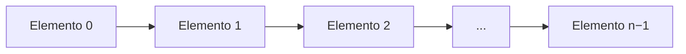
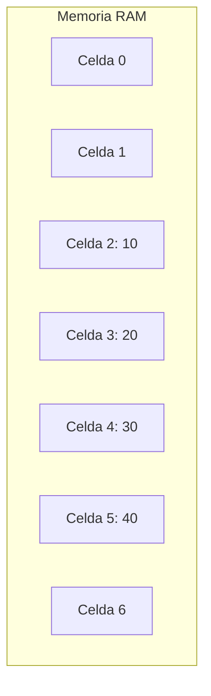
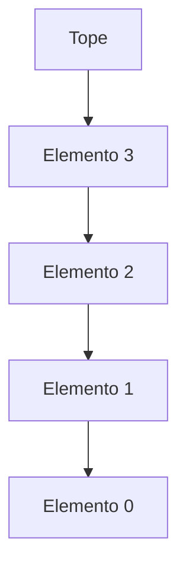
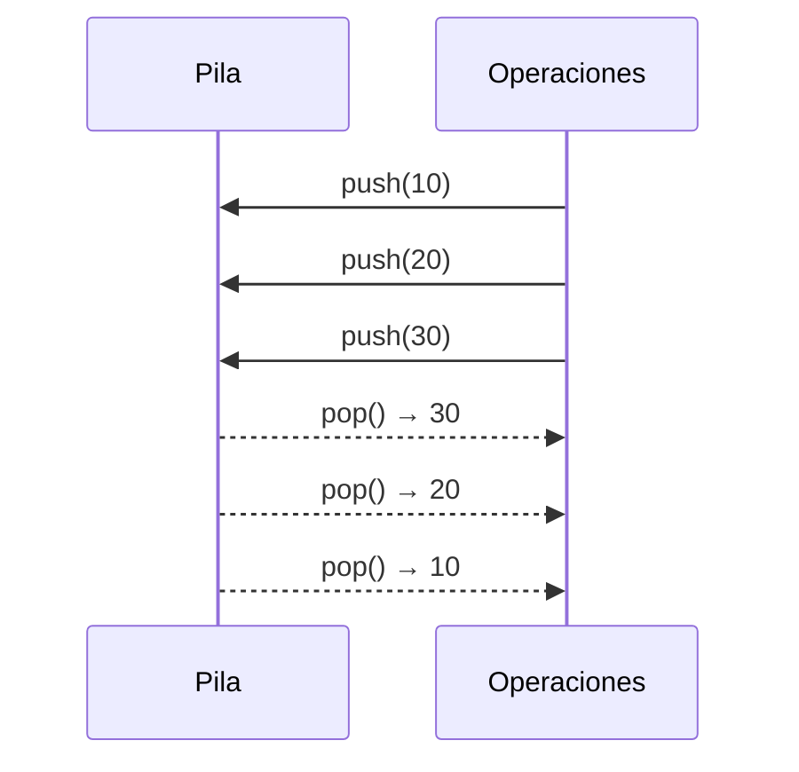
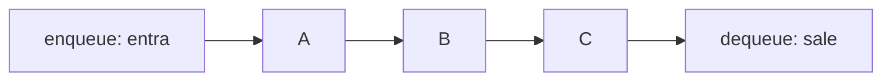
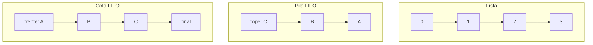
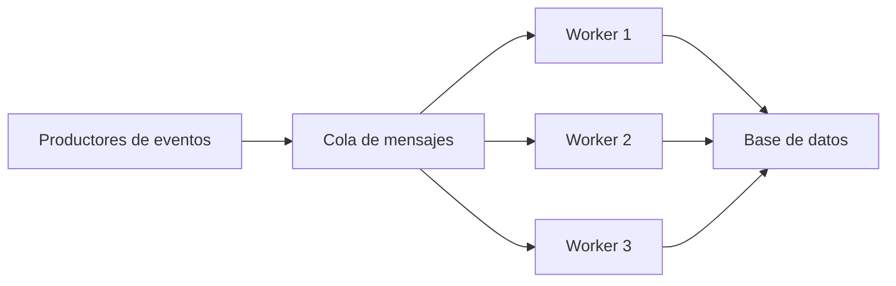

# Clase 2 — Estructuras de Datos Lineales

**Arreglos, listas, pilas y colas**

---

## Tabla de contenidos

1. [Estructuras lineales: definición y motivación](#bloque-1)
2. [Arreglos](#bloque-2)
3. [Listas en Python](#bloque-3)
4. [Operaciones no mutadoras](#bloque-4)
5. [Operaciones mutadoras](#bloque-5)
6. [Listas anidadas y matrices](#bloque-6)
7. [Pilas (LIFO)](#bloque-7)
8. [Colas (FIFO)](#bloque-8)
9. [Comparación: lista, pila y cola](#bloque-9)
10. [Aplicaciones en ingeniería de datos](#bloque-10)

---

## Bloque 1 — Estructuras lineales: definición y motivación {#bloque-1}

Una estructura de datos **lineal** organiza sus elementos en secuencia.

> Cada elemento tiene un único predecesor y un único sucesor, excepto el primero y el último.



Muchas aplicaciones procesan datos siguiendo un orden específico:

- Órdenes de compra que llegan a un sistema.
- Procesos de impresión enviados a una impresora.
- Eventos almacenados cronológicamente.
- Operación **deshacer** en editores de texto.
- Botón **volver** en navegadores web.
- Colas de espera en sistemas operativos.

En esta clase revisaremos cuatro estructuras lineales fundamentales: **arreglos**, **listas**, **pilas** y **colas**.

---

## Bloque 2 — Arreglos {#bloque-2}

Un **arreglo** es una de las estructuras de datos más básicas. Almacena un conjunto de datos en memoria principal usando **celdas contiguas**.



### Propiedades

- Sus elementos se almacenan en posiciones **contiguas** de memoria.
- Cada elemento se accede mediante un índice.
- El acceso por índice es eficiente.
- En muchos lenguajes (C, C++, Java), los arreglos son **estáticos**: no cambian de tamaño durante la ejecución.

Conceptualmente:

```text
Índice:      0    1    2    3    4
Arreglo:   [10] [20] [30] [40] [50]
```

### ¿Por qué `A[i]` es `O(1)`?

Si el arreglo comienza en cierta dirección de memoria, el computador calcula directamente dónde está el elemento `i`:

```text
direccion_elemento_i = direccion_base + i · tamaño_del_elemento
```

Esto permite acceso directo en tiempo constante, sin importar el largo del arreglo:

```text
A[i] → O(1)
```

> 💡 **Esta propiedad es fundamental.** Es la razón por la que los arreglos son la base sobre la que se implementan estructuras más complejas (listas dinámicas, matrices, tablas hash).

---

## Bloque 3 — Listas en Python {#bloque-3}

Una **lista** es una secuencia finita y ordenada de datos:

```text
L = ⟨e₀, e₁, e₂, …, e_(n−1)⟩
```

Las listas son **ordenadas** porque cada elemento tiene una posición asociada, y son **dinámicas**: pueden crecer y decrecer durante la ejecución.

### Sintaxis en Python

```python
# Lista vacía
L = []
L = list()

# Lista con valores iniciales
L = [1, 2, 3, 10, 0, 1.0, "a"]

# A partir de una tupla
L = list((1, 2, 3, 10, 0, 1.0, "a"))

# Tipos heterogéneos permitidos
datos = [42, "hola", 3.14, True]
```

### Implementación interna

Aunque las listas de Python crecen dinámicamente, internamente se implementan como **arreglos dinámicos**.

Esto significa:

- El acceso por índice es rápido (`O(1)`).
- Agregar al final suele ser rápido (`O(1)` amortizado).
- Insertar o borrar en posiciones intermedias puede ser costoso (`O(n)`), porque los elementos posteriores deben desplazarse.

Ejemplo:

```python
L = [10, 20, 30, 40]
L.insert(1, 15)
print(L)    # [10, 15, 20, 30, 40]
```

Internamente, los elementos `20`, `30` y `40` deben desplazarse una posición a la derecha.

> 💡 **Esto importa en pipelines:** si estás construyendo una lista con miles de inserciones al **inicio** (`L.insert(0, x)`), tu pipeline será cuadrático sin que lo notes hasta que el dataset crezca. Solución: agregar al final con `append` y al final hacer `L.reverse()`, o usar una `deque` (Bloque 8).

---

## Bloque 4 — Operaciones no mutadoras {#bloque-4}

Una operación **no mutadora** consulta información de la lista, pero no cambia su contenido.

### Operaciones comunes

```python
L = [1, 2, 3, 10, 0, 1.0, 10]

len(L)             # 7  → cantidad de elementos
L[3]               # 10 → acceso por índice
3 in L             # True → pertenencia
L.count(10)        # 2  → cantidad de apariciones
L.index(10)        # 3  → primera posición de 10
L[2:5]             # [3, 10, 0] → slicing
L + [99]           # [1, 2, 3, 10, 0, 1.0, 10, 99] → concatenación
2 * [1, 2, 3]      # [1, 2, 3, 1, 2, 3] → repetición

# Comparación
[1, 2, 3] == [1, 2, 3]   # True
[1, 2, 3] == [3, 2, 1]   # False  (el orden importa)
```

> ⚠️ **Slicing crea una nueva lista.** `L[2:5]` no es una vista — copia los elementos. Para listas grandes, esto puede ser costoso en memoria.

### Tabla de complejidad

| Operación | Complejidad | Por qué |
|---|---:|---|
| `len(L)` | `O(1)` | Python almacena el largo. |
| `L[i]` | `O(1)` | Acceso directo por índice. |
| `value in L` | `O(n)` | En peor caso revisa toda la lista. |
| `L.count(value)` | `O(n)` | Recorre toda la lista. |
| `L.index(value)` | `O(k+1)` | Compara hasta encontrar el valor en índice `k`. |
| `L1 == L2` | `O(k+1)` | Compara hasta la primera diferencia. |
| `L[j:k]` | `O(k − j)` | Copia los elementos del rango. |
| `L1 + L2` | `O(n₁ + n₂)` | Crea una lista nueva con ambos contenidos. |
| `c * L` | `O(c · n)` | Replica la lista `c` veces. |

---

## Bloque 5 — Operaciones mutadoras {#bloque-5}

Una operación **mutadora** modifica la lista original.

### Operaciones comunes

```python
L = [1, 2, 3, 4, 5]

# Asignación por índice
L[2] = -1                # [1, 2, -1, 4, 5]

# Agregar al final
L.append(6)              # [1, 2, -1, 4, 5, 6]

# Insertar en posición arbitraria
L.insert(2, 99)          # [1, 2, 99, -1, 4, 5, 6]

# Eliminar el último
ultimo = L.pop()         # ultimo = 6, L = [1, 2, 99, -1, 4, 5]

# Eliminar por índice
L.pop(2)                 # [1, 2, -1, 4, 5]

# Eliminar la primera ocurrencia de un valor
L.remove(-1)             # [1, 2, 4, 5]

# Extender con otra lista
L.extend([6, 7])         # [1, 2, 4, 5, 6, 7]
# equivalente a:
# L += [6, 7]

# Invertir
L.reverse()              # [7, 6, 5, 4, 2, 1]

# Ordenar
L.sort()                 # [1, 2, 4, 5, 6, 7]
```

### Tabla de complejidad

| Operación | Complejidad | Por qué |
|---|---:|---|
| `L[i] = val` | `O(1)` | Acceso directo. |
| `L.append(value)` | `O(1)` amortizado | Agrega al final. |
| `L.insert(i, value)` | `O(n − i + 1)` | Desplaza elementos a la derecha. |
| `L.pop()` | `O(1)` | Elimina el último. |
| `L.pop(i)` | `O(n − i)` | Desplaza elementos a la izquierda. |
| `del L[i]` | `O(n − i)` | Idem. |
| `L.remove(value)` | `O(n)` | Busca el valor y luego elimina. |
| `L1.extend(L2)` | `O(n₂)` | Agrega `n₂` elementos. |
| `L.reverse()` | `O(n)` | Recorre la lista. |
| `L.sort()` | `O(n log n)` | Ordenamiento eficiente. |

> 💡 **`list.sort()` en Python usa Timsort,** un algoritmo híbrido derivado de *merge sort* e *insertion sort*. Es uno de los ordenamientos más eficientes en la práctica para datos del mundo real (que suelen tener segmentos parcialmente ordenados).

---

## Bloque 6 — Listas anidadas y matrices {#bloque-6}

Una lista puede contener otras listas:

```python
L = [
    [1, 2, 3, 4],
    ["a", "b", "c", "d"],
    [9, 10, 11, 12]
]
```

Acceso a elementos:

```python
L[0]         # [1, 2, 3, 4]
L[0][2]      # 3
L[1][3]      # 'd'
```

### Listas anidadas como matrices

```python
M = [
    [1, 2, 3],
    [4, 5, 6],
    [7, 8, 9]
]
```

Representación visual:

```text
1 2 3
4 5 6
7 8 9
```

Acceso a una celda:

```python
M[1][2]    # 6  → fila 1 (segunda), columna 2 (tercera)
```

Porque:

- `M[1]` es la segunda fila: `[4, 5, 6]`
- `M[1][2]` es el tercer elemento de esa fila: `6`

### Recorrer una matriz

```python
# Sin índices
for fila in M:
    for valor in fila:
        print(valor)

# Con índices (cuando necesitas las coordenadas)
for i in range(len(M)):
    for j in range(len(M[i])):
        print(i, j, M[i][j])
```

> 💡 **Conexión con NumPy:** las listas anidadas de Python son una primera aproximación a matrices, pero para cómputo serio (Pandas, NumPy) se usan `ndarray` que son mucho más rápidos. Lo viste en la Clase 4 del Módulo 02.

---

## Bloque 7 — Pilas (LIFO) {#bloque-7}

Una **pila** o **stack** es una estructura lineal donde solo se trabaja con el elemento del **tope**.

Analogías cotidianas:

- Pila de platos.
- Pila de libros.
- Pila de sillas.



### Política LIFO

> **LIFO: Last In, First Out**
> El último elemento en entrar es el primero en salir.



### Operaciones básicas

| Operación | Nombre | Descripción |
|---|---|---|
| Insertar | `push` | Agrega al tope. |
| Eliminar | `pop` | Elimina del tope. |
| Consultar | `top` / `peek` | Mira el tope sin eliminar. |
| Verificar vacío | `is_empty` | Indica si está vacía. |

### Implementación con `list`

Como `append()` y `pop()` al final son `O(1)`, una `list` permite simular una pila eficientemente:

```python
pila = []

# push
pila.append(10)
pila.append(20)
pila.append(30)

# peek
print(pila[-1])    # 30

# pop
print(pila.pop())  # 30
print(pila.pop())  # 20

print(pila)        # [10]
```

### Clase `Stack` reutilizable

```python
class Stack:
    def __init__(self):
        self._data = []

    def push(self, value):
        self._data.append(value)

    def pop(self):
        if self.is_empty():
            raise IndexError("pop desde una pila vacía")
        return self._data.pop()

    def peek(self):
        if self.is_empty():
            raise IndexError("peek desde una pila vacía")
        return self._data[-1]

    def is_empty(self):
        return len(self._data) == 0

    def __len__(self):
        return len(self._data)


pila = Stack()
pila.push("primero")
pila.push("segundo")
print(pila.peek())     # segundo
print(pila.pop())      # segundo
print(len(pila))       # 1
```

### Aplicaciones de pilas

1. **Historial de navegación** — el botón "volver" usa LIFO.
2. **Operación deshacer** — cada acción se apila; `Ctrl+Z` desapila.
3. **Recursividad** — las llamadas a funciones se almacenan en una pila de llamadas (cada llamada con sus variables locales y punto de retorno).
4. **Evaluación de expresiones** — validar paréntesis, evaluar notación postfija.

### Caso práctico: validar paréntesis

```python
def parentesis_balanceados(expresion):
    pila = []

    for caracter in expresion:
        if caracter == "(":
            pila.append(caracter)
        elif caracter == ")":
            if len(pila) == 0:
                return False
            pila.pop()

    return len(pila) == 0


print(parentesis_balanceados("(a + b)"))    # True
print(parentesis_balanceados("((a + b)"))   # False
print(parentesis_balanceados("a + b)"))     # False
```

Complejidad: `O(n)`, recorre la expresión una sola vez.

---

## Bloque 8 — Colas (FIFO) {#bloque-8}

Una **cola** o **queue** es una estructura lineal donde:

- Los elementos se insertan por un extremo (el **final**).
- Los elementos se eliminan por el extremo contrario (el **frente**).

Analogías cotidianas:

- Cola de banco o supermercado.
- Cola de impresión.
- Cola de procesos esperando CPU.



### Política FIFO

> **FIFO: First In, First Out**
> El primer elemento en entrar es el primero en salir.

### Operaciones básicas

| Operación | Nombre | Descripción |
|---|---|---|
| Insertar | `enqueue` | Agrega al final. |
| Eliminar | `dequeue` | Elimina el primero. |
| Consultar frente | `front` / `peek` | Consulta el primero sin eliminar. |
| Verificar vacío | `is_empty` | Indica si está vacía. |

### ¿Por qué `list` no es ideal para colas?

Podríamos intentar:

```python
cola = []
cola.append("A")    # enqueue
cola.append("B")
cola.append("C")
print(cola.pop(0))  # dequeue → "A"
```

El problema es que `pop(0)` cuesta **`O(n)`**: al eliminar el primero, todos los demás deben desplazarse una posición a la izquierda.

```text
Antes:   [A, B, C, D]
pop(0):  [B, C, D]
          ↑  ↑  ↑
          todos se mueven
```

Con muchos elementos, esto es lento.

### Solución: `collections.deque`

`deque` (*double-ended queue*) es una lista doblemente enlazada que permite agregar y quitar en ambos extremos en `O(1)`:

```python
from collections import deque

cola = deque()

# enqueue
cola.append("A")
cola.append("B")
cola.append("C")

# dequeue
print(cola.popleft())   # A
print(cola.popleft())   # B
print(cola.popleft())   # C
```

| Operación | Complejidad |
|---|---:|
| `append(x)` | `O(1)` |
| `popleft()` | `O(1)` |
| `appendleft(x)` | `O(1)` |
| `pop()` | `O(1)` |

### Clase `Queue` con `deque`

```python
from collections import deque


class Queue:
    def __init__(self):
        self._data = deque()

    def enqueue(self, value):
        self._data.append(value)

    def dequeue(self):
        if self.is_empty():
            raise IndexError("dequeue desde una cola vacía")
        return self._data.popleft()

    def front(self):
        if self.is_empty():
            raise IndexError("front desde una cola vacía")
        return self._data[0]

    def is_empty(self):
        return len(self._data) == 0

    def __len__(self):
        return len(self._data)


cola = Queue()
cola.enqueue("pedido-1")
cola.enqueue("pedido-2")
cola.enqueue("pedido-3")

print(cola.front())     # pedido-1
print(cola.dequeue())   # pedido-1
print(cola.dequeue())   # pedido-2
print(len(cola))        # 1
```

### Comparación rápida de alternativas

| Alternativa | Uso recomendado |
|---|---|
| `list` | Pilas simples (`append`/`pop`). |
| `collections.deque` | Colas eficientes en un solo hilo. |
| `queue.Queue` | Colas seguras para múltiples hilos (concurrencia). |

> 💡 **`queue.Queue` vs `collections.deque`:** la primera es *thread-safe* (sincronizada con candados), la segunda no. Si trabajas con un solo hilo, `deque` es notablemente más rápida porque no paga el costo de la sincronización.

---

## Bloque 9 — Comparación: lista, pila y cola {#bloque-9}

| Estructura | Política | Inserción | Eliminación | Ejemplo real |
|---|---|---|---|---|
| Lista | Posicional | Cualquier posición | Cualquier posición | Secuencia editable |
| Pila | LIFO | Tope | Tope | Deshacer, historial |
| Cola | FIFO | Final | Frente | Atención de clientes |



### Cuándo usar cada una

**Lista**, cuando:

- Necesitas acceso por índice.
- Necesitas recorrer todos los elementos.
- Almacenas una secuencia general.
- Insertar o borrar al medio no es frecuente.

**Pila**, cuando:

- Necesitas procesar elementos en orden inverso al que llegaron.
- Modelas estados anteriores (deshacer, historial).
- Implementas *backtracking*.
- Quieres simular llamadas recursivas iterativamente.

**Cola**, cuando:

- Procesas elementos en orden de llegada.
- Modelas turnos o espera.
- Distribuyes tareas entre *workers*.
- Implementas BFS en grafos o árboles (Clase 5).

---

## Bloque 10 — Aplicaciones en ingeniería de datos {#bloque-10}

### Listas

- Almacenar *batches* de registros temporalmente antes de cargarlos a una base.
- Representar filas durante el procesamiento.
- Manipular secuencias de datos.

### Pilas

- *Backtracking* en algoritmos.
- Evaluación de expresiones.
- Procesamiento de árboles y grafos mediante DFS (Clase 5).

### Colas

- **Sistemas de mensajería** (Kafka, RabbitMQ, AWS SQS): el corazón de los pipelines distribuidos.
- **Procesamiento de eventos** y *schedulers*.
- Algoritmos BFS sobre grafos.



> 💡 **El patrón productor-consumidor con colas** es la base de prácticamente todos los pipelines de datos modernos. Un servicio produce eventos (clicks, transacciones, sensores); una cola los amortigua; varios *workers* los consumen y procesan en paralelo. Tecnologías como Kafka aplican este patrón a escala de millones de eventos por segundo.

---

## Experimentos prácticos

### Experimento 1: `append` vs `insert(0, x)`

```python
import time

N = 100_000

L = []
inicio = time.time()
for i in range(N):
    L.append(i)
fin = time.time()
print("append:", fin - inicio)


L = []
inicio = time.time()
for i in range(N):
    L.insert(0, i)
fin = time.time()
print("insert(0, i):", fin - inicio)
```

`insert(0, i)` es **mucho más lento** porque desplaza toda la lista en cada inserción: `O(n)` por inserción → `O(n²)` total.

### Experimento 2: pila usando lista

```python
pila = []

for i in range(5):
    pila.append(i)
    print("push:", i, pila)

while pila:
    x = pila.pop()
    print("pop:", x, pila)
```

### Experimento 3: cola usando `deque`

```python
from collections import deque

cola = deque()

for nombre in ["Ana", "Beto", "Carla"]:
    cola.append(nombre)
    print("llega:", nombre, list(cola))

while cola:
    persona = cola.popleft()
    print("atienden a:", persona, list(cola))
```

---

<details>
<summary><strong>🟢 Ejercicio 1 — Operaciones sobre listas (click para ver)</strong></summary>

Dada la lista:

```python
L = [5, 1, 3, 5, 7, 5, 9]
```

Responde:

1. ¿Cuál es el resultado de `len(L)`?
2. ¿Cuál es el resultado de `L[2]`?
3. ¿Cuál es el resultado de `L.count(5)`?
4. ¿Cuál es el resultado de `L.index(7)`?
5. ¿Cuál es el resultado de `L[1:4]`?
6. ¿Cuál es la complejidad de `5 in L`?

**Solución:**

1. `7`
2. `3`
3. `3` (el valor `5` aparece tres veces)
4. `4` (índice de la primera aparición)
5. `[1, 3, 5]`
6. `O(n)` en peor caso

</details>

<details>
<summary><strong>🟢 Ejercicio 2 — Listas anidadas (click para ver)</strong></summary>

Dada la matriz:

```python
M = [
    [2, 4, 6],
    [1, 3, 5],
    [7, 8, 9]
]
```

Escribe código para:

1. Imprimir el valor `5`.
2. Imprimir la segunda fila completa.
3. Sumar todos los elementos.
4. Obtener el mayor valor.

**Solución:**

```python
# 1. El 5 está en M[1][2]
print(M[1][2])

# 2. Segunda fila
print(M[1])

# 3. Suma total
total = sum(sum(fila) for fila in M)
print(total)    # 45

# 4. Mayor valor
mayor = max(max(fila) for fila in M)
print(mayor)    # 9
```

</details>

<details>
<summary><strong>🟢 Ejercicio 3 — Implementar inversión con pila (click para ver)</strong></summary>

Implementa una función que reciba una lista y retorne una nueva lista con los elementos en orden inverso, usando una pila.

```python
invertir_con_pila([1, 2, 3, 4])    # [4, 3, 2, 1]
```

**Solución:**

```python
def invertir_con_pila(lista):
    pila = []

    # Push de todos los elementos
    for x in lista:
        pila.append(x)

    # Pop los va devolviendo en orden inverso
    resultado = []
    while pila:
        resultado.append(pila.pop())

    return resultado


print(invertir_con_pila([1, 2, 3, 4]))    # [4, 3, 2, 1]
```

</details>

<details>
<summary><strong>🟢 Ejercicio 4 — Simular cola de atención (click para ver)</strong></summary>

Simula una cola con las siguientes acciones:

```text
Llega Ana
Llega Beto
Llega Carla
Atienden a una persona
Llega Diego
Atienden a dos personas
```

Imprime el estado de la cola después de cada acción.

**Solución:**

```python
from collections import deque

cola = deque()


def llega(nombre):
    cola.append(nombre)
    print(f"Llega {nombre}. Cola: {list(cola)}")


def atender(n=1):
    for _ in range(n):
        if cola:
            print(f"Atendido: {cola.popleft()}. Cola: {list(cola)}")
        else:
            print("Cola vacía.")


llega("Ana")
llega("Beto")
llega("Carla")
atender()
llega("Diego")
atender(2)
```

</details>

<details>
<summary><strong>🟢 Ejercicio 5 — Analizar complejidad (click para ver)</strong></summary>

Indica la complejidad temporal de cada fragmento.

| Fragmento | Código |
|---|---|
| A | `L.append(x)` |
| B | `L.insert(0, x)` |
| C | `x in L` |
| D | `L.pop()` |
| E | `L.pop(0)` |

**Solución:**

| Fragmento | Complejidad | Razón |
|---|---:|---|
| A | `O(1)` amortizado | Agrega al final. |
| B | `O(n)` | Desplaza todos los elementos. |
| C | `O(n)` peor caso | Recorre la lista hasta encontrar `x`. |
| D | `O(1)` | Elimina el último. |
| E | `O(n)` | Desplaza todos los elementos. |

</details>

---

## Referencia rápida — Listas, pilas y colas

```
LISTA — operaciones comunes
─────────────────────────────────────────────────────────────────
  L = [1, 2, 3]
  L.append(4)              O(1) amortizado
  L.insert(0, x)           O(n)
  L.pop()                  O(1)
  L.pop(i)                 O(n − i)
  L.remove(value)          O(n)
  L.reverse()              O(n)
  L.sort()                 O(n log n)   Timsort
  L[i]                     O(1)
  value in L               O(n)

PILA con list (LIFO)
─────────────────────────────────────────────────────────────────
  stack = []
  stack.append(x)          push   O(1)
  stack.pop()              pop    O(1)
  stack[-1]                peek   O(1)

COLA con deque (FIFO)
─────────────────────────────────────────────────────────────────
  from collections import deque
  q = deque()
  q.append(x)              enqueue    O(1)
  q.popleft()              dequeue    O(1)
  q[0]                     peek       O(1)

CUÁNDO USAR
─────────────────────────────────────────────────────────────────
  list                acceso por índice, secuencia general
  list como pila      LIFO (deshacer, historial, DFS)
  deque               FIFO (mensajería, BFS)
  queue.Queue         FIFO con concurrencia (multi-hilo)
```

---

*→ Próxima clase: [Diccionarios y Árboles Binarios](../clase-03-diccionarios-y-arboles-binarios/README.md)*
