# Clase 3 — Diccionarios y Árboles Binarios

**Estructuras para búsqueda eficiente**

---

## Tabla de contenidos

1. [El problema de búsqueda](#bloque-1)
2. [Diccionarios: ordenados y desordenados](#bloque-2)
3. [Árboles: definición y terminología](#bloque-3)
4. [Recorridos: BFS y DFS](#bloque-4)
5. [Árboles binarios](#bloque-5)
6. [Aplicaciones de árboles binarios](#bloque-6)
7. [Árboles binarios de búsqueda (BST)](#bloque-7)
8. [Construcción paso a paso de un BST](#bloque-8)
9. [Costo de las operaciones y el problema del balance](#bloque-9)
10. [Implementación de referencia en Python](#bloque-10)

---

## Bloque 1 — El problema de búsqueda {#bloque-1}

Organizar y recuperar información es una tarea central en informática. Muchas aplicaciones se basan en buscar datos dentro de grandes colecciones:

- Bases de datos de personas.
- Sistemas transaccionales (bancos, e-commerce).
- Motores de búsqueda web.
- Redes sociales.
- Catálogos, inventarios, sistemas de recomendación.

De forma simple: el **problema de búsqueda** consiste en determinar si un elemento pertenece a un conjunto.

### Definición formal

Supongamos una colección de datos:

```text
L = {(k₀, I₀), (k₁, I₁), …, (k_(n−1), I_(n−1))}
```

Donde:

- `kⱼ` es una **clave**.
- `Iⱼ` es la **información asociada** a la clave `kⱼ`.

Dada una clave `K`, el problema de búsqueda consiste en encontrar el registro `(kⱼ, Iⱼ)` en `L` tal que `kⱼ = K`. En este curso nos enfocamos en **búsquedas exactas**: la clave buscada debe coincidir exactamente con una clave existente.

### Ejemplo

| Clave `k` | Información `I` |
|---:|---|
| `1001` | Ana, Ingeniería de Datos |
| `1002` | Luis, Ciencia de Datos |
| `1003` | Camila, Software |

Buscar la clave `1002` significa localizar el registro `(1002, "Luis, Ciencia de Datos")`. Si la clave no existe, la búsqueda debe indicar que el elemento no está.

### Tres familias de soluciones

| Técnica | Idea principal | Costo típico |
|---|---|---|
| Listas | Recorrer secuencialmente hasta encontrar la clave | Peor caso `O(n)` |
| Árboles | Organizar datos jerárquicamente para descartar partes del conjunto | Idealmente `O(log₂ n)` |
| Hashing | Acceso directo mediante una función sobre la clave | Promedio `O(1)` |

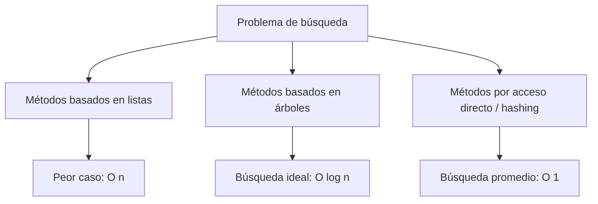

> 💡 **Esta clase cubre árboles.** Hashing lo veremos en la Clase 4. Cada técnica tiene fortalezas distintas; entender las tres permite elegir la correcta para cada problema.

---

## Bloque 2 — Diccionarios: ordenados y desordenados {#bloque-2}

Un **diccionario** es una estructura de datos que almacena registros de tipo `(clave, valor)`. La clave debe ser **única** dentro del diccionario.

### Operaciones principales

| Operación | Descripción |
|---|---|
| `get(k)` | Recuperar el valor asociado a una clave. |
| `insert(k, I)` | Agregar o actualizar un registro. |
| `delete(k)` | Eliminar un registro usando su clave. |

### Tipos de diccionarios

#### 1. Diccionarios ordenados

Mantienen las claves en orden y permiten iterar sobre ellas eficientemente.

```text
{1: "A", 3: "C", 5: "E", 9: "I"}    →    iterar produce: 1, 3, 5, 9
```

Implementaciones típicas: árboles binarios de búsqueda (esta clase), AVL, rojo-negro, B-trees (usados en bases de datos y sistemas de archivos).

#### 2. Diccionarios desordenados

No mantienen las claves ordenadas. Implementación típica: tablas hash (Clase 4). Permiten búsquedas muy rápidas en promedio, pero no recorrer claves en orden de forma natural.

### Comparación

| Tipo | Búsqueda | Iteración ordenada |
|---|---:|---:|
| Ordenado (BST balanceado) | `O(log n)` | `O(n)` |
| Desordenado (hashing) | `O(1)` promedio | Requiere ordenar: `O(n log n)` |

> ⚠️ **Cuidado con `dict` en Python.** Conserva el **orden de inserción**, pero eso no significa que mantenga las claves ordenadas por valor. Si insertas `{3: "a", 1: "b"}`, las claves se iteran en ese orden, no `1, 3`. Para ordenamiento por clave, usa `sorted(d.keys())`.

---

## Bloque 3 — Árboles: definición y terminología {#bloque-3}

Las listas son estructuras **lineales**: cada elemento tiene como máximo un anterior y uno siguiente. Un **árbol** es una estructura **jerárquica** basada en relaciones padre-hijo.

### Motivación

En listas implementadas sobre arreglos:

- Acceder por índice es rápido.
- Insertar o borrar en posiciones arbitrarias puede ser costoso.

Los árboles buscan un punto medio: acceso, inserción y eliminación relativamente eficientes, con organización jerárquica.

### Definición

Un árbol está formado por un conjunto finito de **nodos**. Uno se identifica como la **raíz**; los demás se organizan mediante relaciones padre-hijo.

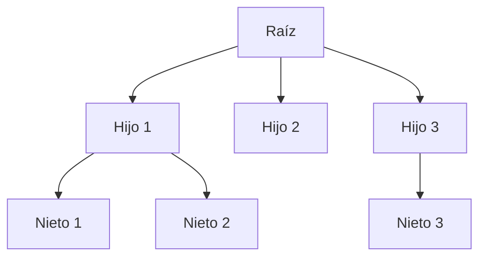

Reglas:

- Cada nodo tiene un único padre, **excepto la raíz** (que no tiene padre).
- Un nodo puede tener cero, uno o varios hijos.
- Un nodo sin hijos se llama **hoja**.

### Terminología — árbol de ejemplo

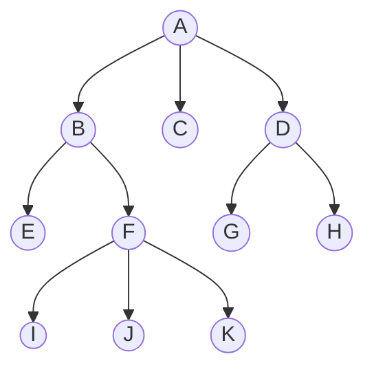

| Término | Definición | Ejemplo |
|---|---|---|
| **Raíz** | Único nodo sin padre. | `A` |
| **Nodo interno** | Tiene al menos un hijo. | `A, B, D, F` |
| **Hoja** | No tiene hijos. | `C, E, G, H, I, J, K` |
| **Hijo** (descendiente directo) | Nodo conectado por una arista hacia abajo. | `B, C, D` son hijos de `A`. |
| **Descendientes** | Hijos, nietos, bisnietos, etc. | Descendientes de `B`: `E, F, I, J, K`. |
| **Ancestro** | Si hay camino desde `u` hasta `v`, `u` es ancestro de `v`. | `A, B, F` son ancestros de `K`. |
| **Camino** | Secuencia de nodos conectados padre-hijo. | `A → B → F → K` |
| **Largo del camino** | Cantidad de aristas (= `m − 1` si hay `m` nodos). | El camino anterior tiene largo 3. |
| **Rama** | Camino desde la raíz hasta una hoja. | `A → B → F → K` |
| **Grado de un nodo** | Cantidad de hijos. | `grado(A) = 3`, `grado(C) = 0`. |
| **Grado del árbol** | Máximo grado entre todos sus nodos. | 3 |
| **Profundidad de un nodo** | Largo del camino desde la raíz hasta ese nodo. | `profundidad(A) = 0`, `profundidad(K) = 3`. |
| **Altura del árbol** | Profundidad máxima entre todas las hojas. | 3 |
| **Nivel** | Igual a la profundidad. | Nivel 0: `A`. Nivel 1: `B, C, D`. |

### Clasificación según el grado

| Grado del árbol | Tipo |
|---:|---|
| 1 | Lista o árbol degenerado |
| 2 | Árbol binario |
| > 2 | Árbol multiario |

---

## Bloque 4 — Recorridos: BFS y DFS {#bloque-4}

En muchas aplicaciones necesitamos **procesar todos los nodos** de un árbol: mostrar contenido, sumar valores, buscar elementos, serializar, evaluar expresiones, explorar directorios, etc.

Hay dos familias principales:

1. Recorrido en **anchura** (BFS).
2. Recorrido en **profundidad** (DFS).

### Recorrido en anchura (BFS)

Visita el árbol **por niveles**.

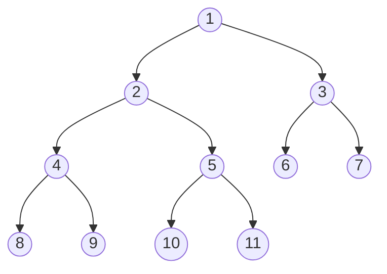

Recorrido BFS: `1, 2, 3, 4, 5, 6, 7, 8, 9, 10, 11`.

**Estructura auxiliar:** una **cola** (FIFO).

```text
BFS(raíz):
    crear cola Q
    insertar raíz en Q

    mientras Q no esté vacía:
        nodo = extraer_frente(Q)
        visitar(nodo)
        para cada hijo de nodo:
            insertar hijo al final de Q
```

### Recorrido en profundidad (DFS)

Avanza hacia nodos cada vez más profundos antes de retroceder. En árboles binarios tiene tres variantes: pre-orden, in-orden y post-orden.

Usaremos este árbol como ejemplo:

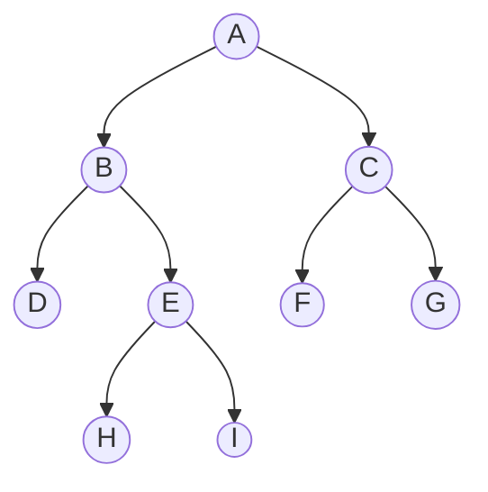

#### Pre-orden: nodo → izquierdo → derecho

```text
preorden(nodo):
    si nodo es nulo: retornar
    visitar(nodo)
    preorden(nodo.izquierdo)
    preorden(nodo.derecho)
```

Resultado: `A, B, D, E, H, I, C, F, G`

#### In-orden: izquierdo → nodo → derecho

```text
inorden(nodo):
    si nodo es nulo: retornar
    inorden(nodo.izquierdo)
    visitar(nodo)
    inorden(nodo.derecho)
```

Resultado: `D, B, H, E, I, A, F, C, G`

> 💡 **El recorrido in-orden es especial en BSTs:** produce las claves en **orden ascendente**. Lo usaremos en el Bloque 8 para verificar que un BST está bien construido.

#### Post-orden: izquierdo → derecho → nodo

```text
postorden(nodo):
    si nodo es nulo: retornar
    postorden(nodo.izquierdo)
    postorden(nodo.derecho)
    visitar(nodo)
```

Resultado: `D, H, I, E, B, F, G, C, A`

### Recursión vs. iteración

| Recorrido | Estructura típica |
|---|---|
| BFS | Cola |
| DFS recursivo | Pila de llamadas (implícita) |
| DFS iterativo | Pila explícita |

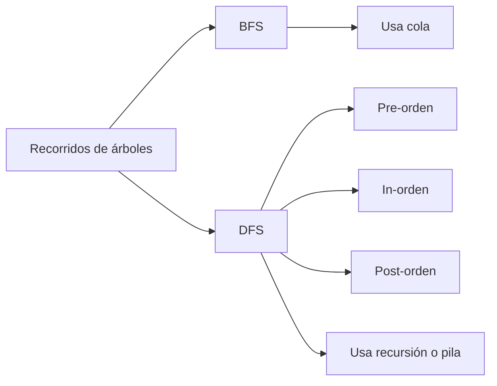

---

## Bloque 5 — Árboles binarios {#bloque-5}

Un **árbol binario** es un árbol de grado 2. Cada nodo puede tener:

- 0 hijos (hoja).
- 1 hijo.
- 2 hijos (hijo izquierdo y derecho, distinguibles).

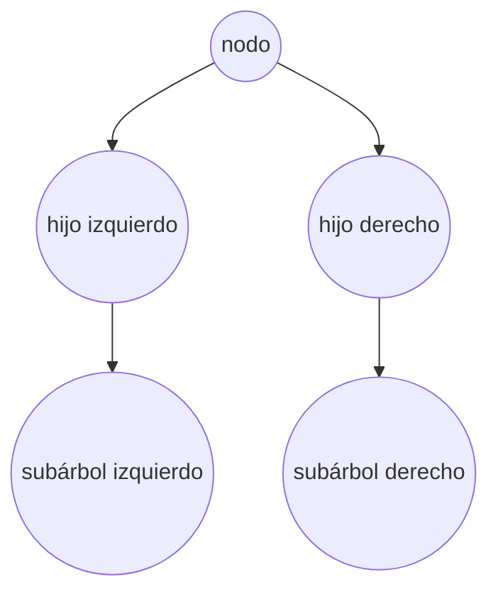

### Definición recursiva

> Un árbol binario está vacío, o está formado por una raíz y dos subárboles binarios: uno izquierdo y uno derecho.

### Propiedades importantes

Sea `n` la cantidad de nodos, `h` la altura y `e` la cantidad de hojas:

```text
e ≤ 2^h
log₂(n + 1) − 1 ≤ h ≤ n − 1
```

**Interpretación:**

- Altura **mínima**: ocurre cuando el árbol está balanceado (lo más compacto posible).
- Altura **máxima**: ocurre cuando el árbol se parece a una lista (degenerado).

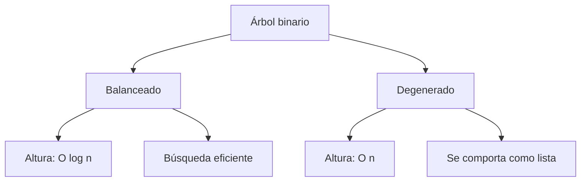

> ⚠️ **El árbol balanceado es el ideal,** pero mantener el balance no es gratis: requiere algoritmos especiales (AVL, rojo-negro). Lo veremos brevemente al final.

---

## Bloque 6 — Aplicaciones de árboles binarios {#bloque-6}

### Expresiones aritméticas

Los árboles binarios pueden representar expresiones matemáticas:

- Nodos internos: operadores.
- Hojas: operandos.

Ejemplo: `2 * (a − 1) + (a * b)`

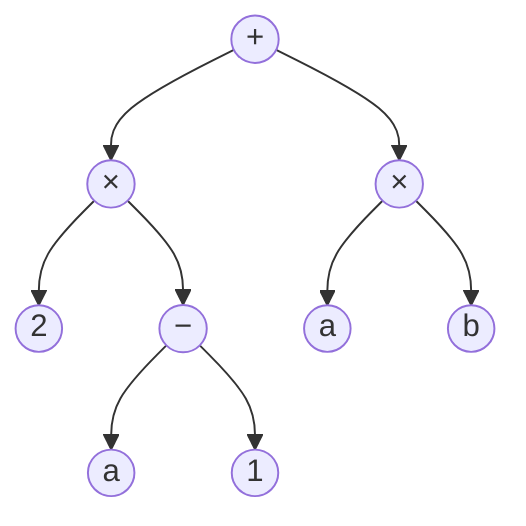

El árbol representa explícitamente el orden de evaluación, sin necesidad de paréntesis.

| Recorrido | Notación resultante |
|---|---|
| Pre-orden | Prefija: `+ × 2 − a 1 × a b` |
| In-orden | Infija: `2 × a − 1 + a × b` (con paréntesis explícitos) |
| Post-orden | Postfija: `2 a 1 − × a b × +` |

> 💡 **La notación postfija** se evalúa con una pila: cuando lees un operando, lo apilas; cuando lees un operador, desapilas dos valores, los operas y apilas el resultado. Es exactamente el patrón de calculadoras científicas HP.

### Árboles de decisión

Modelan decisiones con preguntas sí/no. Nodos internos son preguntas; hojas son decisiones finales.

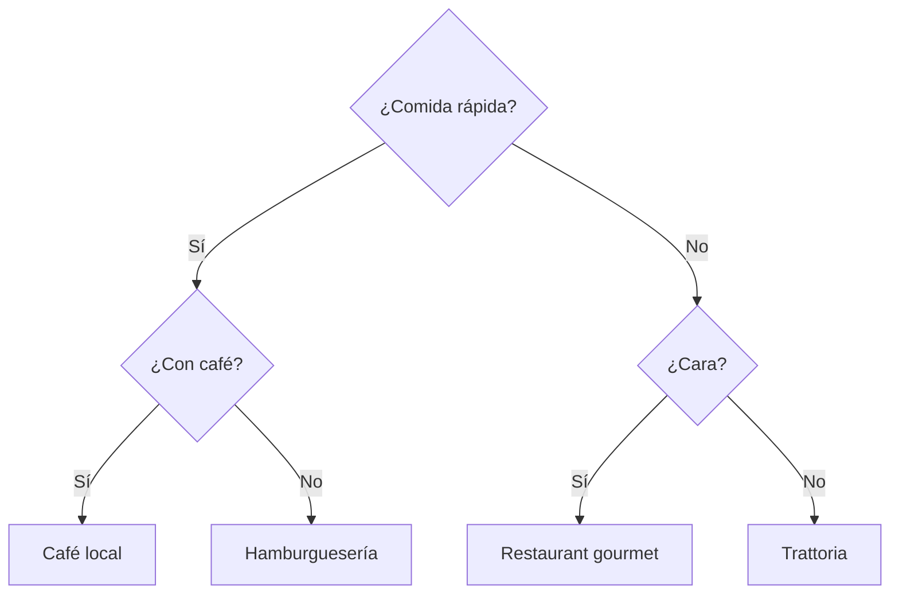

Cada camino raíz → hoja es una regla de decisión. Este es el principio detrás de los árboles de decisión usados en Machine Learning (`DecisionTreeClassifier` de scikit-learn).

### Búsqueda

La aplicación más importante: organizar datos para buscar eficientemente. Esto nos lleva a los **árboles binarios de búsqueda (BST)**.

---

## Bloque 7 — Árboles binarios de búsqueda (BST) {#bloque-7}

Un **árbol binario de búsqueda** (ABB / *Binary Search Tree*) es un árbol binario que cumple una propiedad de orden:

> Para cada nodo con clave `y`:
> - Todas las claves del subárbol izquierdo son **menores** que `y`.
> - Todas las claves del subárbol derecho son **mayores** que `y`.

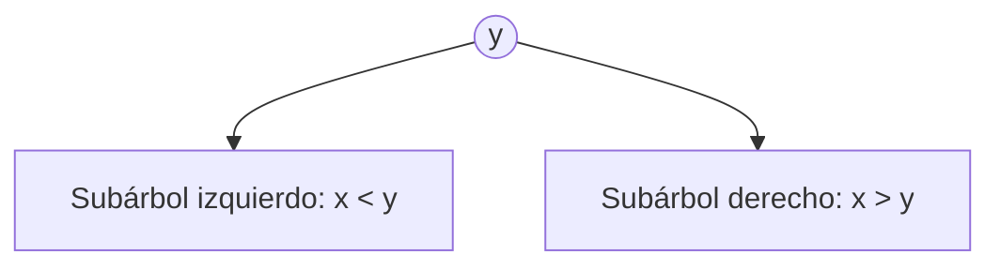

### Algoritmo de búsqueda

Para buscar una clave `x`:

1. Comparar `x` con la clave del nodo actual `y`.
2. Si `x == y`, encontrado.
3. Si `x < y`, continuar por el subárbol izquierdo.
4. Si `x > y`, continuar por el subárbol derecho.
5. Si llegamos a un árbol vacío, la clave no existe.

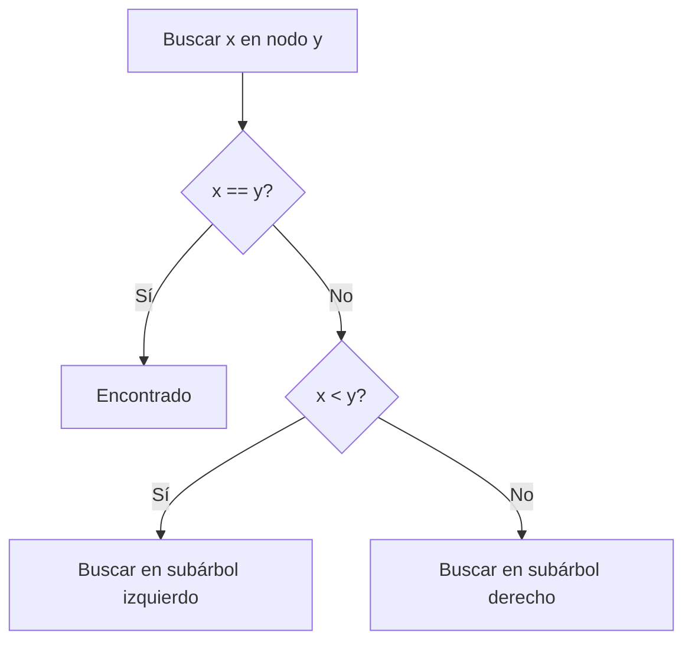

### Ejemplo de búsqueda

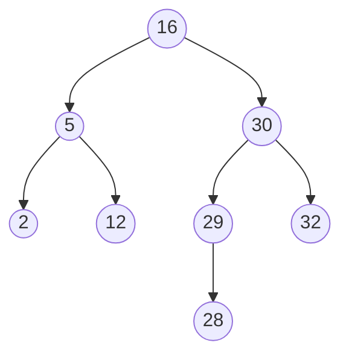

Para buscar `28`:

```text
28 > 16  → ir a la derecha
28 < 30  → ir a la izquierda
28 < 29  → ir a la izquierda
28 == 28 → encontrado
```

Ruta visitada: `16 → 30 → 29 → 28` (4 comparaciones).

> 💡 **Conexión con búsqueda binaria:** la lógica del BST es exactamente la misma que la búsqueda binaria sobre un arreglo ordenado. La diferencia es que el BST permite **insertar y borrar** sin desplazar elementos (cosa que el arreglo ordenado obliga).

---

## Bloque 8 — Construcción paso a paso de un BST {#bloque-8}

Construyamos el BST correspondiente a la secuencia `10, 5, 7, 14, 12, 18, 15`.

**Regla de inserción:**

- Si la clave nueva es menor que el nodo actual, ir al subárbol izquierdo.
- Si es mayor, ir al subárbol derecho.
- Repetir hasta encontrar una posición vacía.

### Paso 1: insertar 10 (raíz)

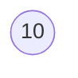

### Paso 2: insertar 5

`5 < 10` → izquierda de `10`.

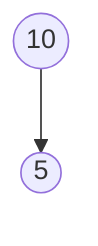

### Paso 3: insertar 7

`7 < 10` → izquierda. `7 > 5` → derecha.

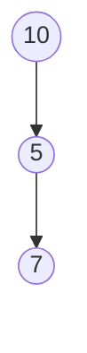

### Paso 4: insertar 14

`14 > 10` → derecha.

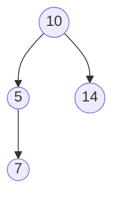

### Paso 5: insertar 12

`12 > 10` → derecha. `12 < 14` → izquierda.

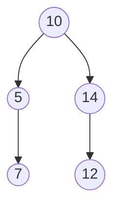

### Paso 6: insertar 18

`18 > 10` → derecha. `18 > 14` → derecha.

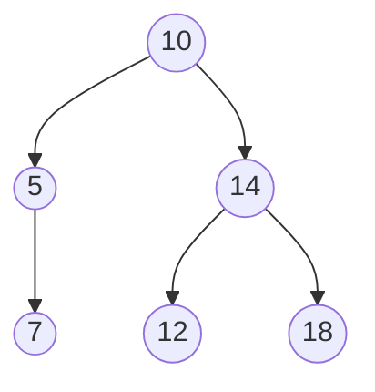

### Paso 7: insertar 15

`15 > 10` → derecha. `15 > 14` → derecha. `15 < 18` → izquierda.

**Árbol final:**

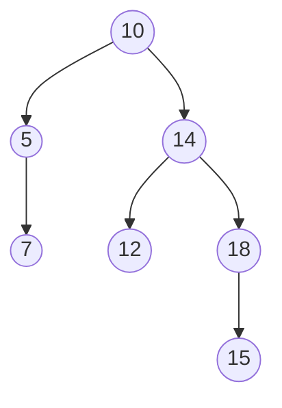

### Verificación con recorrido in-orden

Un BST correctamente construido produce las claves en orden ascendente al recorrerlo en in-orden:

```text
5, 7, 10, 12, 14, 15, 18
```

Confirma que el árbol respeta la propiedad de búsqueda.

---

## Bloque 9 — Costo de las operaciones y el problema del balance {#bloque-9}

El costo de buscar en un BST depende de la **profundidad** del nodo. En cada comparación se baja un nivel:

```text
costo de búsqueda = O(altura del árbol)
```

### Mejor caso: árbol balanceado

Si el árbol está balanceado, su altura es logarítmica:

```text
h = O(log₂ n)    →    búsqueda = O(log₂ n)
```

Ejemplo: con `n = 1.000.000`, `log₂(n) ≈ 20`. **Buscar entre un millón de elementos requiere ~20 comparaciones.**

### Peor caso: árbol degenerado

Si los elementos se insertan en orden creciente (`1, 2, 3, 4, 5`), el BST queda como una lista:

```mermaid
flowchart TD
    N1((1)) --> N2((2))
    N2 --> N3((3))
    N3 --> N4((4))
    N4 --> N5((5))
```

Aunque sigue siendo un BST válido, su altura es `n − 1`, por lo que la búsqueda es `O(n)`.

### Resumen de costos

| Estructura | Búsqueda | Inserción | Observación |
|---|---:|---:|---|
| Lista desordenada | `O(n)` | `O(1)` al final | Búsqueda costosa. |
| Lista ordenada (arreglo) | `O(log n)` | `O(n)` por desplazamientos | Inserción costosa. |
| BST no balanceado | `O(h)` | `O(h)` | `h` puede ser `n`. |
| BST balanceado | `O(log n)` | `O(log n)` | Mantiene altura baja. |
| Tabla hash | `O(1)` promedio | `O(1)` promedio | No mantiene orden (Clase 4). |

### Árboles balanceados

Para evitar el peor caso, existen árboles que se reorganizan automáticamente:

- **Árboles AVL** — primer árbol auto-balanceado (1962).
- **Árboles rojo-negro** — usados en `std::map` de C++ y `TreeMap` de Java.
- **Árboles 2-3** — base teórica de los B-trees.
- **B-trees** — el estándar de bases de datos (PostgreSQL, MySQL, Oracle) y sistemas de archivos (NTFS, ext4).

Idea central: mantener `h = O(log₂ n)` para garantizar `O(log n)` en búsqueda, inserción y borrado.

> 💡 **Por qué los B-trees dominan en bases de datos:** un B-tree mantiene muchas claves por nodo (típicamente cientos) en lugar de solo dos. Esto reduce el número de "saltos" entre páginas de disco — y un acceso a disco es ~100 000× más lento que un acceso a RAM. Cuando consultas un índice de PostgreSQL, estás recorriendo un B-tree.

---

## Bloque 10 — Implementación de referencia en Python {#bloque-10}

Esta implementación es **didáctica**: no es balanceada, pero permite experimentar con inserción, búsqueda y recorridos.

```python
from collections import deque
from dataclasses import dataclass
from typing import Optional


@dataclass
class Node:
    key: int
    left: Optional["Node"] = None
    right: Optional["Node"] = None


class BinarySearchTree:
    def __init__(self):
        self.root: Optional[Node] = None

    def insert(self, key: int) -> None:
        self.root = self._insert(self.root, key)

    def _insert(self, node: Optional[Node], key: int) -> Node:
        if node is None:
            return Node(key)

        if key < node.key:
            node.left = self._insert(node.left, key)
        elif key > node.key:
            node.right = self._insert(node.right, key)
        # claves duplicadas: ignoradas en este ejemplo

        return node

    def search(self, key: int) -> bool:
        current = self.root

        while current is not None:
            if key == current.key:
                return True
            elif key < current.key:
                current = current.left
            else:
                current = current.right

        return False

    def inorder(self) -> list[int]:
        result = []

        def walk(node: Optional[Node]) -> None:
            if node is None:
                return
            walk(node.left)
            result.append(node.key)
            walk(node.right)

        walk(self.root)
        return result

    def preorder(self) -> list[int]:
        result = []

        def walk(node: Optional[Node]) -> None:
            if node is None:
                return
            result.append(node.key)
            walk(node.left)
            walk(node.right)

        walk(self.root)
        return result

    def postorder(self) -> list[int]:
        result = []

        def walk(node: Optional[Node]) -> None:
            if node is None:
                return
            walk(node.left)
            walk(node.right)
            result.append(node.key)

        walk(self.root)
        return result

    def breadth_first(self) -> list[int]:
        if self.root is None:
            return []

        result = []
        queue = deque([self.root])

        while queue:
            node = queue.popleft()
            result.append(node.key)

            if node.left is not None:
                queue.append(node.left)
            if node.right is not None:
                queue.append(node.right)

        return result
```

### Prueba rápida

```python
bst = BinarySearchTree()

for x in [10, 5, 7, 14, 12, 18, 15]:
    bst.insert(x)

print("Inorden:   ", bst.inorder())
print("Preorden:  ", bst.preorder())
print("Postorden: ", bst.postorder())
print("Anchura:   ", bst.breadth_first())

print("¿Existe 12?", bst.search(12))
print("¿Existe 99?", bst.search(99))
```

Salida esperada:

```text
Inorden:    [5, 7, 10, 12, 14, 15, 18]
Preorden:   [10, 5, 7, 14, 12, 18, 15]
Postorden:  [7, 5, 12, 15, 18, 14, 10]
Anchura:    [10, 5, 14, 7, 12, 18, 15]
¿Existe 12? True
¿Existe 99? False
```

### Experimento: árbol degenerado

```python
bst = BinarySearchTree()

for x in [1, 2, 3, 4, 5, 6, 7]:
    bst.insert(x)

print(bst.inorder())          # [1, 2, 3, 4, 5, 6, 7]
print(bst.breadth_first())    # [1, 2, 3, 4, 5, 6, 7] ← degenerado
```

Conceptualmente el árbol queda como una lista: `1 → 2 → 3 → 4 → 5 → 6 → 7`. Esto demuestra por qué el orden de inserción afecta el costo en un BST no balanceado, y por qué los árboles auto-balanceados (AVL, rojo-negro) son importantes en producción.

---

<details>
<summary><strong>🟢 Ejercicio 1 — Problema de búsqueda (click para ver)</strong></summary>

Dada la colección:

```text
L = {(8, "A"), (3, "B"), (10, "C"), (1, "D")}
```

Responde:

1. ¿Cuál es la clave de cada registro?
2. ¿Cuál es la información asociada de cada uno?
3. ¿Qué registro se obtiene al buscar `K = 10`?
4. ¿Qué ocurre al buscar `K = 7`?

**Solución:**

1. Las claves son `8, 3, 10, 1`.
2. Las informaciones asociadas son `"A", "B", "C", "D"`.
3. Se obtiene el registro `(10, "C")`.
4. La búsqueda falla: no existe ningún registro con clave `7`.

</details>

<details>
<summary><strong>🟢 Ejercicio 2 — Terminología de árboles (click para ver)</strong></summary>

Usa el siguiente árbol:

```mermaid
flowchart TD
    A((A)) --> B((B))
    A --> C((C))
    B --> D((D))
    B --> E((E))
    C --> F((F))
```

Responde:

1. ¿Cuál es la raíz?
2. ¿Cuáles son las hojas?
3. ¿Cuál es la profundidad de `E`?
4. ¿Cuál es la altura del árbol?
5. ¿Cuál es el grado de `A`?
6. ¿Cuál es el grado del árbol?

**Solución:**

1. `A`.
2. `D, E, F`.
3. 2 (camino `A → B → E`).
4. 2.
5. `grado(A) = 2` (hijos `B` y `C`).
6. 2.

</details>

<details>
<summary><strong>🟢 Ejercicio 3 — Recorridos (click para ver)</strong></summary>

Para el árbol:

```mermaid
flowchart TD
    A((A)) --> B((B))
    A --> C((C))
    B --> D((D))
    B --> E((E))
    C --> F((F))
    C --> G((G))
```

Calcula:

1. Recorrido en pre-orden.
2. Recorrido en in-orden.
3. Recorrido en post-orden.
4. Recorrido en anchura.

**Solución:**

1. Pre-orden: `A, B, D, E, C, F, G`.
2. In-orden: `D, B, E, A, F, C, G`.
3. Post-orden: `D, E, B, F, G, C, A`.
4. Anchura: `A, B, C, D, E, F, G`.

</details>

<details>
<summary><strong>🟢 Ejercicio 4 — Construcción de BST (click para ver)</strong></summary>

Construye el BST para la secuencia `20, 10, 30, 5, 15, 25, 35, 13`.

Luego responde:

1. ¿Cuál es la raíz?
2. ¿Dónde queda `13`?
3. ¿Cuál es el recorrido in-orden?
4. ¿Cuántas comparaciones se hacen para buscar `13`?

**Solución:**

Árbol resultante:

```mermaid
flowchart TD
    N20((20)) --> N10((10))
    N20 --> N30((30))
    N10 --> N5((5))
    N10 --> N15((15))
    N30 --> N25((25))
    N30 --> N35((35))
    N15 --> N13((13))
```

1. La raíz es `20`.
2. `13 < 20` → izquierda; `13 > 10` → derecha; `13 < 15` → izquierda. Queda como hijo izquierdo de `15`.
3. In-orden: `5, 10, 13, 15, 20, 25, 30, 35` (ordenado, como debe ser).
4. 4 comparaciones (con `20`, `10`, `15`, `13`).

</details>

<details>
<summary><strong>🟢 Ejercicio 5 — Peor caso (click para ver)</strong></summary>

Construye el BST para `1, 2, 3, 4, 5, 6`.

Responde:

1. ¿Cuál es la altura?
2. ¿Por qué este árbol se parece a una lista?
3. ¿Cuál es el costo de buscar `6`?
4. ¿Cómo podría evitarse este problema?

**Solución:**

1. Altura = 5 (todos los nodos quedan en el subárbol derecho).
2. Cada nodo tiene solo un hijo derecho, formando una "cadena" desde la raíz hasta la hoja, exactamente como una lista enlazada.
3. `O(n) = O(6)`. Hay que comparar con `1, 2, 3, 4, 5, 6`.
4. Insertar los datos en orden aleatorio (no ordenado) o, mejor, usar un árbol auto-balanceado como AVL o rojo-negro, que reorganizan los nodos automáticamente para mantener la altura logarítmica.

</details>

---

## Referencia rápida — Diccionarios y árboles binarios

```
PROBLEMA DE BÚSQUEDA — tres familias
─────────────────────────────────────────────────────────────────
  Listas         O(n)            simple, lento
  Árboles BST    O(log n) ideal  ordenado, ver clase 3
  Hashing        O(1) promedio   sin orden, ver clase 4

TERMINOLOGÍA DE ÁRBOLES
─────────────────────────────────────────────────────────────────
  raíz                  único nodo sin padre
  hoja                  nodo sin hijos
  nodo interno          tiene al menos un hijo
  profundidad(v)        largo del camino raíz → v
  altura(árbol)         profundidad máxima
  grado(v)              cantidad de hijos
  grado(árbol)          máximo grado entre todos los nodos

RECORRIDOS
─────────────────────────────────────────────────────────────────
  BFS         por niveles, usa cola
  DFS pre     nodo → izquierdo → derecho
  DFS in      izquierdo → nodo → derecho   (BST: orden ascendente)
  DFS post    izquierdo → derecho → nodo

PROPIEDAD BST
─────────────────────────────────────────────────────────────────
  Para todo nodo y:
    subárbol_izquierdo(y) < y < subárbol_derecho(y)

COSTOS
─────────────────────────────────────────────────────────────────
  BST balanceado    búsqueda/inserción/borrado    O(log n)
  BST degenerado    búsqueda/inserción/borrado    O(n)

ÁRBOLES BALANCEADOS (auto-organizados)
─────────────────────────────────────────────────────────────────
  AVL, rojo-negro, 2-3, B-trees
  Garantizan altura O(log n) sin importar el orden de inserción
```

---

*→ Próxima clase: [Tablas Hash](../clase-04-tablas-hash/README.md)*
