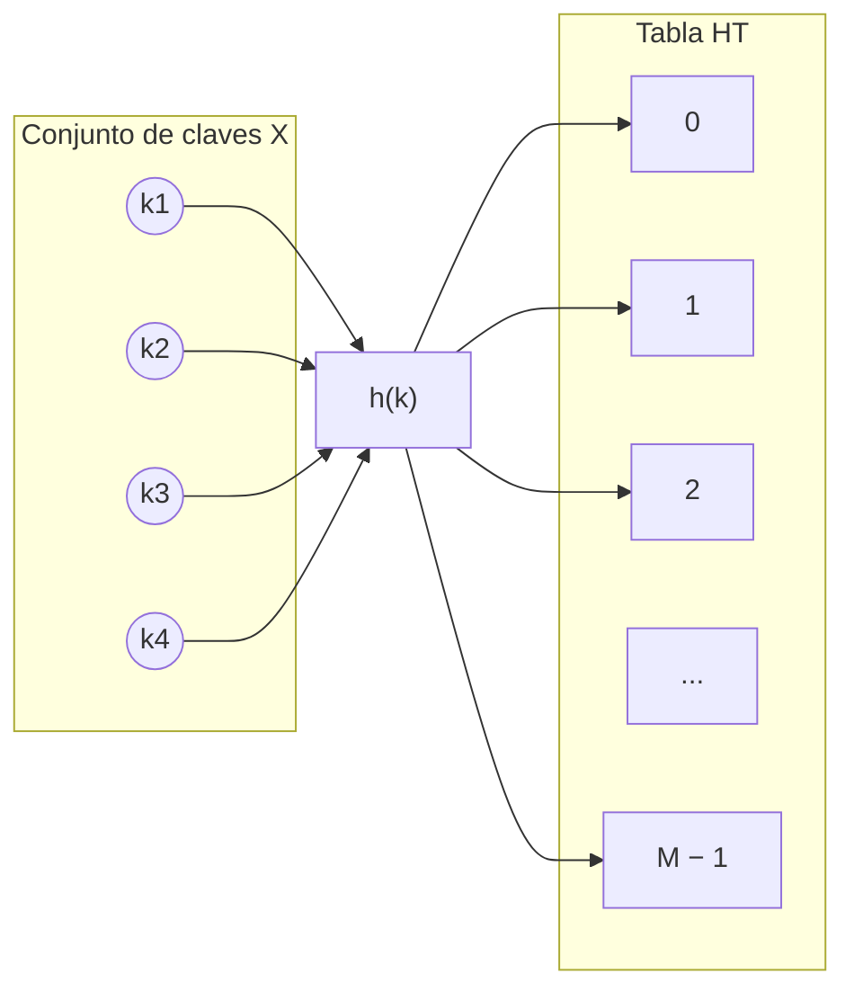
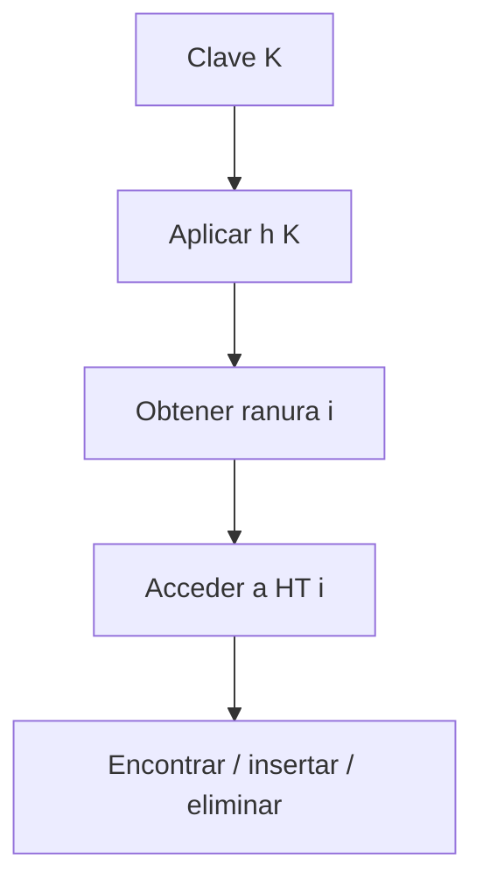
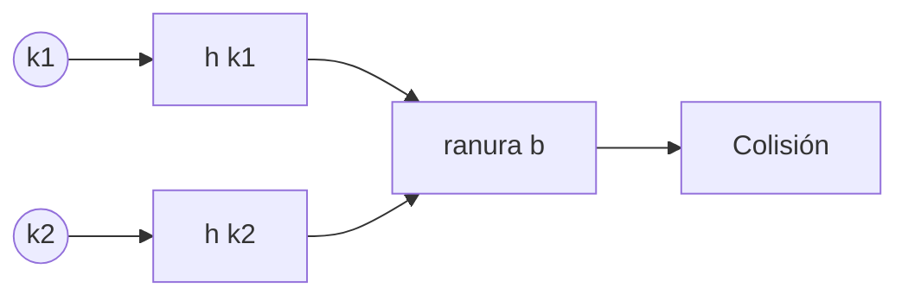
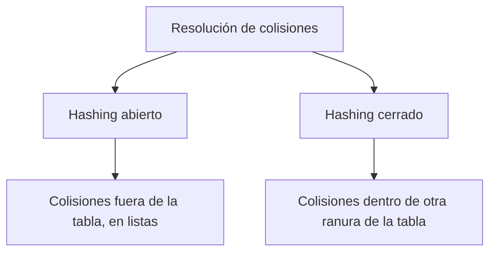
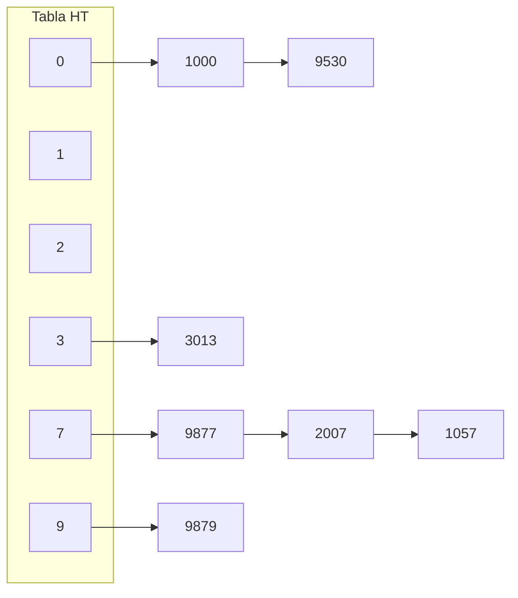
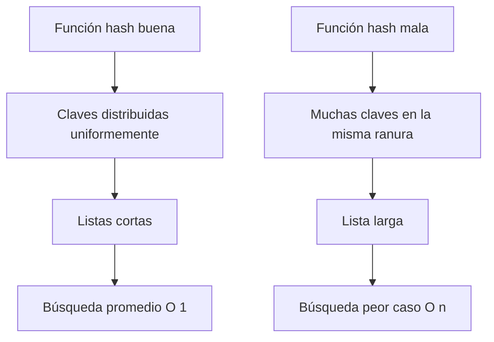
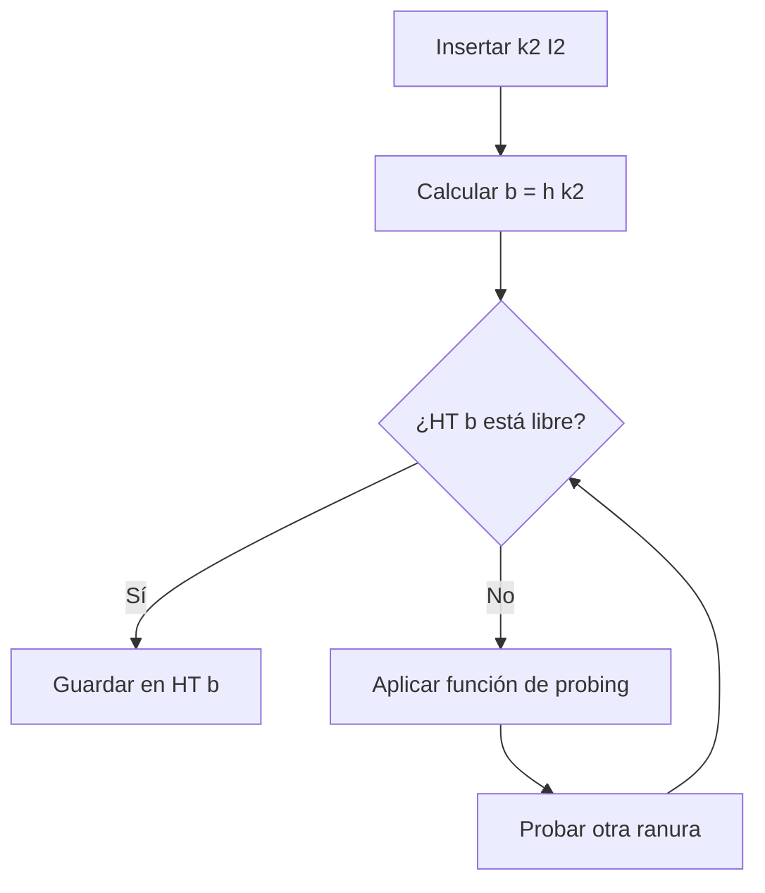
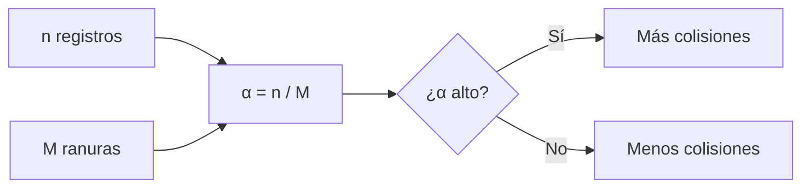
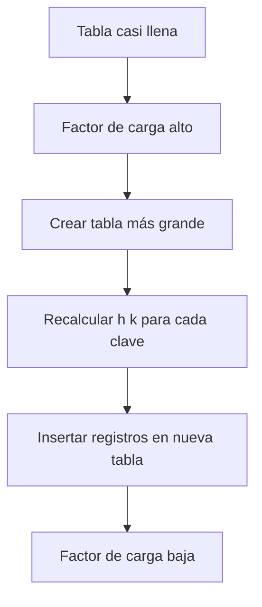
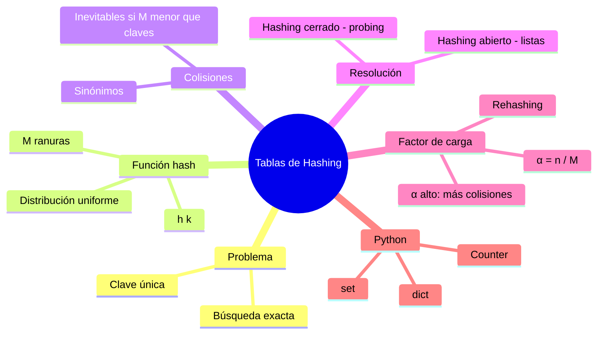

# Clase 4 — Tablas Hash

**Búsqueda exacta en tiempo promedio O(1)**

---

## Tabla de contenidos

1. [Idea general de hashing](#bloque-1)
2. [Cuándo conviene (y cuándo no)](#bloque-2)
3. [Colisiones: por qué son inevitables](#bloque-3)
4. [Hashing abierto (encadenamiento)](#bloque-4)
5. [Hashing cerrado (*open addressing*)](#bloque-5)
6. [Factor de carga y *rehashing*](#bloque-6)
7. [`dict` y `set` en Python](#bloque-7)
8. [Comparación con listas y árboles](#bloque-8)
9. [Aplicaciones en ingeniería de datos](#bloque-9)

---

## Bloque 1 — Idea general de hashing {#bloque-1}

En la Clase 3 vimos el **problema de búsqueda exacta**: dada una clave `K`, encontrar el registro `(K, I)` en una colección. Hasta ahora hemos resuelto esto con listas (lento) o BSTs (mejor, pero hasta `O(log n)`).

Las **tablas hash** prometen algo más ambicioso: **`O(1)` promedio** para búsqueda, inserción y borrado.

### La idea central

Hasta ahora, accedemos a un arreglo usando **una posición**:

```python
A[0]
A[1]
A[2]
```

En hashing, accedemos usando **una clave**:

```python
usuarios["pablo"]
productos[12345]
config["host"]
```

Para lograrlo, usamos una **función de hashing**:

```text
h : X → {0, 1, …, M − 1}
```

Donde:

- `X` es el conjunto de posibles claves.
- `M` es el número de **ranuras** de la tabla.
- `h(k)` transforma una clave `k` en una posición válida del arreglo.



### Pseudocódigo

```text
insertar(K, I):
    i = h(K)
    HT[i] = (K, I)

buscar(K):
    i = h(K)
    return HT[i]
```

> 💡 **Por qué es rápido:** acceder a `HT[i]` es `O(1)` (acceso por índice en un arreglo). Calcular `h(K)` también es `O(1)` para claves de tamaño fijo. Por lo tanto, el costo total es `O(1)` — **siempre que no haya colisiones**, lo que veremos en el Bloque 3.

---

## Bloque 2 — Cuándo conviene (y cuándo no) {#bloque-2}

### Ventajas

Las tablas hash permiten:

- Insertar registros rápidamente.
- Eliminar registros rápidamente.
- Buscar registros con muy pocos accesos en promedio.
- Implementar diccionarios desordenados.
- Resolver problemas de búsqueda exacta de manera eficiente.



### Cuándo NO usar hashing

Hashing es excelente para búsqueda **exacta**, pero no para todos los problemas:

1. **Claves repetidas.** Las tablas hash funcionan naturalmente con claves únicas. Para almacenar varios valores por clave, conviene almacenar listas.
2. **Recorrer claves ordenadas.** Hashing no mantiene las claves ordenadas por valor.
3. **Obtener mínimo o máximo eficientemente.** No hay relación estructural entre posición y orden.
4. **Consultas por rango** (por ejemplo: "todas las claves entre 1000 y 2000"). Para esto son mejores los árboles balanceados o índices especializados.

> ⚠️ **`dict` en Python conserva el orden de inserción** desde Python 3.7, pero **no está ordenado por clave**. Es una optimización de implementación; sigue siendo una estructura basada en hashing.

---

## Bloque 3 — Colisiones: por qué son inevitables {#bloque-3}

### Caso ideal (no realista)

Si las claves posibles fueran `{0, 1, 2, …, n − 1}` y tuviéramos un arreglo `HT[0..n−1]`, podríamos definir `h(k) = k`. Cada clave tendría su ranura única. Pero esto rara vez ocurre en la práctica.

### Caso real

El conjunto de claves posibles suele ser **mucho más grande** que la cantidad de registros que almacenaremos:

- Posibles claves (por ejemplo, todos los strings cortos): mil millones.
- Registros reales que vamos a guardar: 1.000.
- Ranuras razonables en la tabla: tal vez 2.000.

No tendría sentido crear un arreglo de mil millones de posiciones para guardar 1.000 registros. Por eso usamos una tabla más pequeña, donde:

```text
|X| ≫ n
```

(`|X|` = posibles claves, `n` = registros almacenados).

### ¿Qué es una colisión?

Como hay **menos ranuras que claves posibles**, pueden existir claves distintas que terminan en la misma ranura.

Dos claves `k₁` y `k₂` **colisionan** bajo la función `h` si:

```text
h(k₁) = h(k₂) = b
```

Se dice que `k₁` y `k₂` son **sinónimos** bajo `h`.



> 💡 **Conclusión clave:** las colisiones son **inevitables** en cualquier tabla hash con `M < |X|`. Por eso necesitamos estrategias para resolverlas. Hay dos familias: **hashing abierto** y **hashing cerrado**.



---

## Bloque 4 — Hashing abierto (encadenamiento) {#bloque-4}

En **hashing abierto** (también llamado *separate chaining*), cada ranura de la tabla apunta a una **lista**. Todos los registros cuya clave se mapea a la misma ranura se almacenan en esa lista.



### Ejemplo con `h(k) = k mod 10`

| Clave | `h(clave)` | Ranura |
|---:|---:|---:|
| 1000 | 0 | 0 |
| 9530 | 0 | 0 |
| 3013 | 3 | 3 |
| 9877 | 7 | 7 |
| 2007 | 7 | 7 |
| 1057 | 7 | 7 |
| 9879 | 9 | 9 |

La ranura `7` contiene tres claves porque todas terminan en `7`.

### Costo

Si la función `h` distribuye uniformemente las claves entre `M` ranuras, cada lista tendrá aproximadamente `n/M` registros. Con buena distribución y suficiente espacio, las listas son cortas y la búsqueda es **`O(1)` promedio**.

Pero si la función es mala y muchas claves caen en la misma ranura, la búsqueda puede degradarse a **`O(n)`** en peor caso.



### Implementación en Python

Esta implementación es didáctica — no busca reemplazar a `dict`, sino mostrar la estructura interna:

```python
class HashTableChaining:
    def __init__(self, capacity=10):
        self.capacity = capacity
        self.table = [[] for _ in range(capacity)]
        self.size = 0

    def _hash(self, key):
        return hash(key) % self.capacity

    def put(self, key, value):
        index = self._hash(key)
        bucket = self.table[index]

        # Si la clave ya existe, actualizar el valor
        for i, (k, v) in enumerate(bucket):
            if k == key:
                bucket[i] = (key, value)
                return

        # Si no existe, insertarla
        bucket.append((key, value))
        self.size += 1

    def get(self, key):
        index = self._hash(key)
        bucket = self.table[index]

        for k, v in bucket:
            if k == key:
                return v

        raise KeyError(key)

    def delete(self, key):
        index = self._hash(key)
        bucket = self.table[index]

        for i, (k, v) in enumerate(bucket):
            if k == key:
                del bucket[i]
                self.size -= 1
                return

        raise KeyError(key)

    def __len__(self):
        return self.size
```

Uso:

```python
ht = HashTableChaining(capacity=10)

ht.put(1000, "A")
ht.put(9530, "B")
ht.put(3013, "C")

print(ht.get(1000))    # A
print(ht.get(9530))    # B
print(len(ht))         # 3
```

Para inspeccionar las colisiones internamente:

```python
for i, bucket in enumerate(ht.table):
    print(i, bucket)
```

---

## Bloque 5 — Hashing cerrado (*open addressing*) {#bloque-5}

En **hashing cerrado**, los registros se almacenan **directamente dentro de la tabla**. Si la ranura calculada ya está ocupada, el registro debe ubicarse en otra ranura de la misma tabla.

La política que decide qué ranura revisar después se llama **política de resolución de colisiones**.



> ⚠️ **La misma estrategia debe usarse para insertar y buscar.** Si insertamos siguiendo una secuencia de búsqueda y luego buscamos con otra distinta, podríamos no encontrar la clave.

### Secuencia de probing

Cualquier técnica de hashing cerrado puede verse como una secuencia de ranuras a inspeccionar:

```text
⟨r₀, r₁, r₂, …⟩
```

La primera siempre es `r₀ = h(k)`. Si está ocupada, se revisa `r₁`, luego `r₂`, etc. De manera general:

```text
rᵢ = (r₀ + p(k, i)) mod M
```

Donde `p(k, i)` es la **probe function** y `M` es la cantidad de ranuras. El módulo asegura que la posición siga dentro de la tabla (la secuencia "da la vuelta").

### Sondeo lineal

La técnica más simple. La probe function es `p(k, i) = i`:

```text
rᵢ = (h(k) + i) mod M
```

Ejemplo con `M = 10` y `h(k) = 7`:

| `i` | `rᵢ` |
|---:|---:|
| 0 | 7 |
| 1 | 8 |
| 2 | 9 |
| 3 | 0 |
| 4 | 1 |

La secuencia recorre la tabla circularmente: `7 → 8 → 9 → 0 → 1 → 2 → …`.

### Doble hashing

Otra técnica común: usar **otra función hash** para definir el salto entre ranuras. Esto reduce los problemas del sondeo lineal (acumulación de claves en regiones contiguas, llamado *clustering*).

### Implementación con sondeo lineal

```python
_EMPTY = object()
_DELETED = object()


class HashTableLinearProbing:
    def __init__(self, capacity=10):
        self.capacity = capacity
        self.keys = [_EMPTY] * capacity
        self.values = [None] * capacity
        self.size = 0

    def _hash(self, key):
        return hash(key) % self.capacity

    def _find_slot(self, key):
        start = self._hash(key)
        first_deleted = None

        for i in range(self.capacity):
            index = (start + i) % self.capacity
            current_key = self.keys[index]

            if current_key is _EMPTY:
                return first_deleted if first_deleted is not None else index

            if current_key is _DELETED:
                if first_deleted is None:
                    first_deleted = index
                continue

            if current_key == key:
                return index

        raise RuntimeError("La tabla está llena")

    def put(self, key, value):
        index = self._find_slot(key)

        if self.keys[index] is _EMPTY or self.keys[index] is _DELETED:
            self.size += 1

        self.keys[index] = key
        self.values[index] = value

    def get(self, key):
        start = self._hash(key)

        for i in range(self.capacity):
            index = (start + i) % self.capacity
            current_key = self.keys[index]

            if current_key is _EMPTY:
                break

            if current_key is not _DELETED and current_key == key:
                return self.values[index]

        raise KeyError(key)

    def delete(self, key):
        start = self._hash(key)

        for i in range(self.capacity):
            index = (start + i) % self.capacity
            current_key = self.keys[index]

            if current_key is _EMPTY:
                break

            if current_key is not _DELETED and current_key == key:
                self.keys[index] = _DELETED
                self.values[index] = None
                self.size -= 1
                return

        raise KeyError(key)
```

> 💡 **¿Por qué la marca `_DELETED`?** Si al borrar una celda la dejamos como vacía, podríamos cortar una secuencia de búsqueda. Imagina que insertamos `A` y `B` (con la misma ranura inicial; `B` queda en la siguiente). Si borramos `A` y dejamos su ranura vacía, al buscar `B` veríamos la ranura vacía y concluiríamos erróneamente que `B` no existe. La marca `_DELETED` indica "sigue buscando".

---

## Bloque 6 — Factor de carga y *rehashing* {#bloque-6}

El rendimiento de una tabla hash depende de la relación entre registros almacenados y ranuras disponibles. Esto se mide con el **factor de carga**:

```text
α = n / M
```

Donde `n` = registros almacenados y `M` = ranuras totales.

### Interpretación

| Factor de carga | Interpretación |
|---:|---|
| α cercano a 0 | Muchas ranuras libres, baja probabilidad de colisión. |
| α cercano a 1 | Tabla muy llena, alta probabilidad de colisión. |
| α ≈ 0.6 | Buen balance práctico entre espacio y rendimiento. |



### Ejemplos

```text
n = 600,  M = 1000  →  α = 0.6   (60% ocupada — bien)
n = 950,  M = 1000  →  α = 0.95  (casi llena — colisiones frecuentes)
```

### Rehashing

Cuando el factor de carga crece demasiado, una tabla hash bien diseñada hace **rehashing**:

1. Crea una tabla más grande (típicamente del doble del tamaño).
2. Recalcula la posición de cada clave con la nueva `M`.
3. Inserta todos los registros en la nueva tabla.



> 💡 **Costo amortizado:** aunque rehashing es `O(n)` cuando ocurre, no ocurre en cada operación. Si duplicamos el tamaño cuando se llena, el costo amortizado por inserción sigue siendo `O(1)`. Esta es la misma técnica que usa `list.append` en Python.

---

## Bloque 7 — `dict` y `set` en Python {#bloque-7}

En Python, las clases `dict` y `set` están implementadas usando tablas de hashing. Esto explica sus tiempos `O(1)` promedio.

### `dict` — operaciones comunes

| Operación | Tiempo promedio | Descripción |
|---|---:|---|
| `M[k]` | O(1) | Retorna el valor asociado a la clave. |
| `M[k] = v` | O(1) | Asocia la clave al valor. |
| `del M[k]` | O(1) | Remueve el valor. |
| `len(M)` | O(1) | Número de ítems. |
| `k in M` | O(1) | Pertenencia. |
| `M.get(k, d=None)` | O(1) | Retorna `M[k]` o `d` si no existe. |
| `M.setdefault(k, d)` | O(1) | Si existe retorna; si no, inserta `d`. |
| `M.pop(k, d=None)` | O(1) | Remueve y retorna; opcional default. |
| `M.popitem()` | O(1) | Remueve y retorna un par arbitrario. |
| `M.clear()` | O(n) | Remueve todos los ítems. |
| `M.update(M2)` | O(n₂) | Inserta/actualiza pares de `M2`. |
| `M == M2` | O(min{n, n₂}) | Comparación. |

### Ejemplos prácticos

#### Insertar y actualizar

```python
edades = {}
edades["Ana"] = 30
edades["Luis"] = 25
edades["Ana"] = 31    # actualiza el valor anterior

print(edades)
# {'Ana': 31, 'Luis': 25}
```

#### Búsqueda con `in` y `get`

```python
if "Luis" in edades:
    print("Luis está registrado")

# get evita KeyError
print(edades.get("Pedro", "No encontrado"))
# No encontrado
```

#### Caso típico: contar frecuencias

Uno de los usos más frecuentes de un `dict`:

```python
texto = "hashing permite busqueda rapida hashing es eficiente"
frecuencias = {}

for palabra in texto.split():
    frecuencias[palabra] = frecuencias.get(palabra, 0) + 1

print(frecuencias)
# {'hashing': 2, 'permite': 1, 'busqueda': 1, 'rapida': 1, 'es': 1, 'eficiente': 1}
```

> 💡 **`collections.Counter`** ofrece exactamente esta funcionalidad de forma más concisa. Es el patrón estándar en Python para conteo. Pero por debajo, también es una tabla hash.

### `set` — operaciones comunes

Un `set` almacena elementos únicos. El elemento funciona como clave.

```python
numeros = {10, 20, 30, 10}
print(numeros)    # {10, 20, 30} — el 10 aparece una sola vez
print(20 in numeros)    # True (O(1) promedio)
```

| Operación | Tiempo promedio | Descripción |
|---|---:|---|
| `e in S` | O(1) | Pertenencia. |
| `S.add(e)` | O(1) | Añade (sin efecto si ya existe). |
| `S.remove(e)` | O(1) | Elimina (lanza `KeyError` si no existe). |
| `S.discard(e)` | O(1) | Elimina sin error. |
| `S.pop()` | O(1) | Elimina un elemento arbitrario. |
| `len(S)` | O(1) | Cantidad de elementos. |
| `S.clear()` | O(n) | Vacía el set. |

### Casos típicos

```python
# Eliminar duplicados
datos = [1, 2, 2, 3, 3, 3, 4]
unicos = set(datos)
print(unicos)    # {1, 2, 3, 4}


# Verificar pertenencia rápidamente
usuarios_validos = {"ana", "luis", "maria"}

if "ana" in usuarios_validos:
    print("Acceso permitido")
```

---

## Bloque 8 — Comparación con listas y árboles {#bloque-8}

| Estructura | Búsqueda promedio | Orden por clave | Mín / máx eficiente | Comentario |
|---|---:|---|---|---|
| Lista desordenada | `O(n)` | No | No | Simple pero lenta. |
| Lista ordenada | `O(log n)` con búsqueda binaria | Sí | Sí | Insertar es costoso. |
| BST balanceado | `O(log n)` | Sí | Sí | Bueno para rangos y orden. |
| Tabla hash | `O(1)` promedio | No | No | Excelente para búsqueda exacta. |



---

## Bloque 9 — Aplicaciones en ingeniería de datos {#bloque-9}

### Indexación en memoria

```python
usuarios = [
    {"id": 10, "nombre": "Ana"},
    {"id": 20, "nombre": "Luis"},
    {"id": 30, "nombre": "María"},
]

indice = {}

for usuario in usuarios:
    indice[usuario["id"]] = usuario

print(indice[20])
# {'id': 20, 'nombre': 'Luis'}
```

Patrón típico: convertir una lista de registros en un índice para búsquedas rápidas. Útil para *enrichment* y *joins* en memoria.

### Agrupar registros por clave

```python
ventas = [
    {"pais": "CL", "monto": 100},
    {"pais": "AR", "monto": 50},
    {"pais": "CL", "monto": 70},
    {"pais": "PE", "monto": 30},
]

por_pais = {}

for venta in ventas:
    pais = venta["pais"]
    por_pais.setdefault(pais, []).append(venta)

print(por_pais)
# {'CL': [{'pais': 'CL', 'monto': 100}, {'pais': 'CL', 'monto': 70}],
#  'AR': [{'pais': 'AR', 'monto': 50}],
#  'PE': [{'pais': 'PE', 'monto': 30}]}
```

> 💡 **Esta operación es la base de los `groupby`** que vimos en Pandas (Módulo 02). Por debajo, Pandas usa esencialmente este patrón con tablas hash.

### Deduplicación

```python
emails_recibidos = [
    "ana@ejemplo.com",
    "luis@ejemplo.com",
    "ana@ejemplo.com",       # duplicado
    "maria@ejemplo.com",
]

emails_unicos = list(set(emails_recibidos))
print(emails_unicos)
# ['ana@ejemplo.com', 'luis@ejemplo.com', 'maria@ejemplo.com']
```

Tarea recurrente en ETL: eliminar duplicados de un dataset. `set` lo hace en `O(n)`.

### Bases de datos: índices hash

PostgreSQL ofrece índices hash explícitos (`CREATE INDEX … USING hash`). Son ideales para columnas donde solo se hacen igualdades (`WHERE id = 12345`), no rangos. Por defecto, los índices son B-trees (Clase 3) porque sirven para ambos casos.

---

## Experimentos prácticos

### Pertenencia: `list` vs `set`

```python
import time

N = 1_000_000
lista = list(range(N))
conjunto = set(range(N))
objetivo = N - 1

inicio = time.perf_counter()
print(objetivo in lista)
fin = time.perf_counter()
print("lista:", fin - inicio)

inicio = time.perf_counter()
print(objetivo in conjunto)
fin = time.perf_counter()
print("set:", fin - inicio)
```

Resultado: el `set` es **órdenes de magnitud más rápido** para pertenencia.

### Forzar colisiones artificiales

```python
class MalaClave:
    def __init__(self, valor):
        self.valor = valor

    def __hash__(self):
        return 42    # ← TODOS los objetos tienen el mismo hash

    def __eq__(self, other):
        return isinstance(other, MalaClave) and self.valor == other.valor

    def __repr__(self):
        return f"MalaClave({self.valor})"


D = {}
for i in range(5):
    D[MalaClave(i)] = i

print(D)
```

Todas las claves caen en la misma ranura, forzando colisiones. Python las distingue usando `__eq__`, pero la búsqueda se vuelve lineal.

> 💡 **En la práctica,** este es el principio detrás de los ataques de "hash collision DoS": un atacante envía claves diseñadas para colisionar, degradando el servicio a `O(n²)`. Por eso Python aleatoriza los hashes de strings desde la versión 3.3 (variable `PYTHONHASHSEED`).

---

<details>
<summary><strong>🟢 Ejercicio 1 — Calcular posiciones hash (click para ver)</strong></summary>

Sea `h(k) = k mod 10`. Calcula la ranura para cada clave:

```text
1000, 9530, 3013, 9877, 2007, 1057, 9879
```

Luego responde:

1. ¿Qué ranuras tienen colisiones?
2. ¿Qué claves son sinónimos bajo esta función?

**Solución:**

| Clave | Ranura |
|---:|---:|
| 1000 | 0 |
| 9530 | 0 |
| 3013 | 3 |
| 9877 | 7 |
| 2007 | 7 |
| 1057 | 7 |
| 9879 | 9 |

1. Las ranuras `0` y `7` tienen colisiones.
2. Sinónimos: `{1000, 9530}` (ambos en ranura 0); `{9877, 2007, 1057}` (todos en ranura 7).

</details>

<details>
<summary><strong>🟢 Ejercicio 2 — Factor de carga (click para ver)</strong></summary>

Para cada caso, calcula `α = n / M`:

| n | M | α |
|---:|---:|---:|
| 30 | 100 | ? |
| 60 | 100 | ? |
| 90 | 100 | ? |
| 1000 | 2000 | ? |

Preguntas:

1. ¿Cuál tabla tiene más riesgo de colisiones?
2. ¿Cuál desperdicia más espacio?
3. ¿Cuál parece un buen balance?

**Solución:**

| n | M | α |
|---:|---:|---:|
| 30 | 100 | 0.30 |
| 60 | 100 | 0.60 |
| 90 | 100 | 0.90 |
| 1000 | 2000 | 0.50 |

1. La tabla con `α = 0.90` (90% llena) tiene el mayor riesgo de colisiones.
2. La tabla con `α = 0.30` desperdicia más espacio (70% vacío).
3. `α ≈ 0.5` o `0.6` es el balance típico recomendado.

</details>

<details>
<summary><strong>🟢 Ejercicio 3 — Función de conteo (click para ver)</strong></summary>

Escribe una función que cuente la frecuencia de cada palabra en una lista.

Entrada:

```python
palabras = ["sql", "python", "sql", "linux", "python", "sql"]
```

Salida esperada:

```python
{"sql": 3, "python": 2, "linux": 1}
```

**Solución:**

```python
def contar_frecuencias(palabras):
    frecuencias = {}

    for palabra in palabras:
        frecuencias[palabra] = frecuencias.get(palabra, 0) + 1

    return frecuencias


palabras = ["sql", "python", "sql", "linux", "python", "sql"]
print(contar_frecuencias(palabras))
# {'sql': 3, 'python': 2, 'linux': 1}
```

Versión equivalente con `collections.Counter`:

```python
from collections import Counter

print(Counter(palabras))
# Counter({'sql': 3, 'python': 2, 'linux': 1})
```

</details>

<details>
<summary><strong>🟢 Ejercicio 4 — Preguntas conceptuales (click para ver)</strong></summary>

Responde brevemente:

1. ¿Qué problema resuelve una tabla de hashing?
2. ¿Qué hace una función de hashing?
3. ¿Por qué ocurren colisiones?
4. ¿Qué diferencia hay entre hashing abierto y cerrado?
5. ¿Qué representa el factor de carga?
6. ¿Por qué hashing no es bueno para recorrer claves en orden?
7. ¿Qué estructuras de Python usan hashing internamente?
8. ¿Cuándo preferirías un árbol balanceado en vez de una tabla hash?

**Solución:**

1. Búsqueda exacta en tiempo `O(1)` promedio.
2. Transforma una clave en una posición (ranura) dentro de un arreglo.
3. Porque el conjunto de claves posibles es típicamente mayor que la cantidad de ranuras disponibles.
4. Abierto: las colisiones se almacenan en listas externas (encadenamiento). Cerrado: las colisiones se almacenan en otras ranuras de la misma tabla (probing).
5. La proporción `n/M`: cuán llena está la tabla.
6. Porque la función hash distribuye las claves sin relación con su orden por valor.
7. `dict`, `set` y `collections.Counter`.
8. Cuando necesitas mantener el orden de las claves, hacer consultas por rango, o encontrar mínimo/máximo eficientemente.

</details>

---

## Referencia rápida — Tablas hash

```
IDEA CENTRAL
─────────────────────────────────────────────────────────────────
  h: clave → ranura {0, 1, ..., M-1}
  HT[h(k)] = (k, valor)
  Búsqueda en O(1) promedio

COLISIONES (inevitables si M < |claves posibles|)
─────────────────────────────────────────────────────────────────
  Hashing abierto (encadenamiento)
    HT[i] → lista de pares
    Ventaja: simple, robusto
  Hashing cerrado (open addressing)
    Si HT[i] ocupada, probar otras ranuras
    Sondeo lineal: r_i = (h(k) + i) mod M
    Doble hashing: usa otra función hash

FACTOR DE CARGA
─────────────────────────────────────────────────────────────────
  α = n / M
  α ≈ 0.5–0.7  → buen balance
  α > 0.8      → considerar rehashing

OPERACIONES EN dict / set DE PYTHON
─────────────────────────────────────────────────────────────────
  d[k] = v       O(1)
  d[k]           O(1)
  del d[k]       O(1)
  k in d         O(1)
  d.get(k, def)  O(1)
  s.add(x)       O(1)
  x in s         O(1)

CASOS DE USO TÍPICOS EN DE
─────────────────────────────────────────────────────────────────
  Indexación        registros por id
  Conteo            collections.Counter
  Agrupación        setdefault + append
  Deduplicación     set(lista)
  Joins en memoria  diccionario como hash table

CUÁNDO NO USAR
─────────────────────────────────────────────────────────────────
  ✗ Iteración ordenada por clave
  ✗ Consultas por rango
  ✗ Mínimo / máximo eficiente
  → para esos casos, usar BST balanceado
```

---

*→ Próxima clase: [Grafos](../clase-05-grafos/README.md)*
