# Clase 5 — Grafos

**La estructura de datos más flexible: vértices y aristas**

---

## Tabla de contenidos

1. [¿Qué es un grafo?](#bloque-1)
2. [Tipos de grafos](#bloque-2)
3. [Terminología: grado, camino, ciclo, conexidad](#bloque-3)
4. [Representación en memoria](#bloque-4)
5. [Recorridos: DFS](#bloque-5)
6. [Recorridos: BFS](#bloque-6)
7. [Comparación DFS vs BFS](#bloque-7)
8. [Camino más corto: algoritmo de Dijkstra](#bloque-8)
9. [Árbol recubridor mínimo: Prim y Kruskal](#bloque-9)
10. [Aplicaciones en ingeniería de datos](#bloque-10)

---

## Bloque 1 — ¿Qué es un grafo? {#bloque-1}

Los **grafos** son una de las estructuras de datos más flexibles y expresivas en informática. Permiten modelar problemas reales donde existen entidades conectadas: redes sociales, mapas, rutas, redes de computadores, flujos, sistemas de navegación, páginas web, etc.

### Comparación con estructuras anteriores

| Estructura | Relación entre elementos |
|---|---|
| Lista | Cada elemento tiene un único sucesor y un único predecesor. |
| Árbol | Un nodo puede tener varios sucesores, pero un único predecesor. |
| **Grafo** | Un vértice puede tener **varios sucesores y varios predecesores**. |

### Definición formal

Un grafo se define como:

```text
G = (V, E)
```

Donde:

- `V` es el conjunto de **vértices** (también llamados nodos).
- `E` es el conjunto de **aristas** (también llamadas arcos).
- Cada arista conecta un par de vértices.

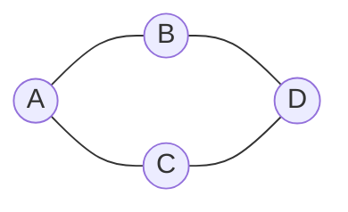

Este grafo tiene:

```text
V = {A, B, C, D}
E = {(A,B), (A,C), (B,D), (C,D)}
```

### Aplicaciones

- Redes de computadores y comunicaciones.
- Mapas y sistemas de navegación.
- Redes sociales (vértice = persona, arista = relación).
- Representación de la web (vértice = página, arista = enlace).
- Inteligencia artificial (búsqueda de caminos en espacios de estados).
- Reconocimiento de patrones, *clustering*, redes de transporte.

### Ejemplo: red social

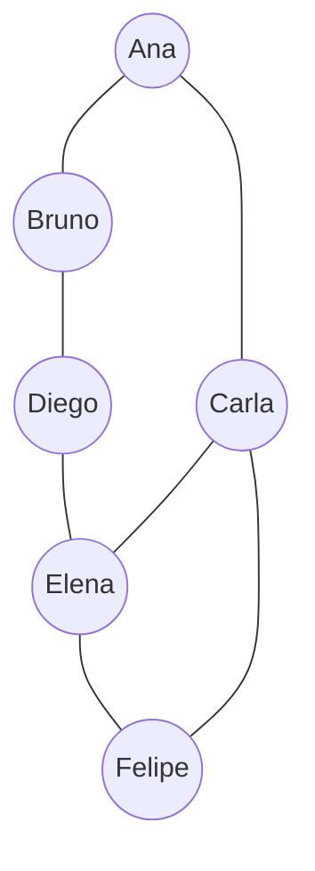

Vértices: personas. Aristas: amistades, seguimientos o interacciones.

---

## Bloque 2 — Tipos de grafos {#bloque-2}

### Por densidad

| Tipo | Descripción |
|---|---|
| Grafo ralo / disperso | Pocas aristas relativas a la cantidad de vértices. |
| Grafo denso | Muchas aristas. |
| Grafo completo | Tiene todas las aristas posibles entre sus vértices. |

#### Grafo completo

En un grafo completo no dirigido de `n` vértices, cada vértice está conectado con todos los demás:

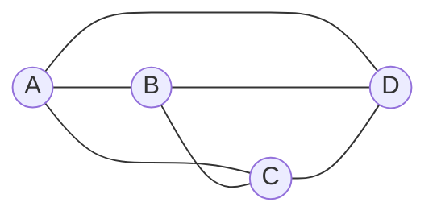

Cantidad de aristas:

```text
|E| = n · (n − 1) / 2
```

### Dirigidos vs no dirigidos

#### Grafo dirigido (dígrafo)

La dirección de las aristas importa. Se representa con flechas. Ejemplo: seguidores en Instagram o X — Ana puede seguir a Bruno sin que Bruno siga a Ana.

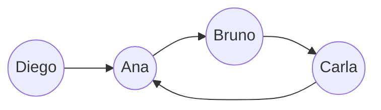

En este caso `(Ana, Bruno) ≠ (Bruno, Ana)`.

#### Grafo no dirigido

Las relaciones son bidireccionales. Ejemplo: amistad en Facebook. Si Ana es amiga de Bruno, también Bruno es amigo de Ana.

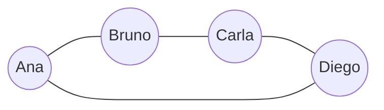

En este caso `(Ana, Bruno) = (Bruno, Ana)`.

### Grafos con peso

Un **grafo con peso** asocia un valor (peso) a cada arista. El peso puede representar distancia, tiempo, costo, capacidad, riesgo, latencia, etc.

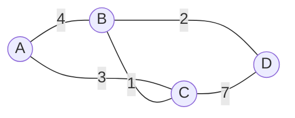

> 💡 **Caso típico DE:** un grafo de dependencias entre tareas (DAG en Airflow, Dagster) puede ser ponderado por tiempo estimado, permitiendo identificar rutas críticas en pipelines.

---

## Bloque 3 — Terminología: grado, camino, ciclo, conexidad {#bloque-3}

### Vértices adyacentes

Si existe una arista `(vᵢ, vⱼ)`, los vértices `vᵢ` y `vⱼ` son **adyacentes** o **vecinos**.

### Grado de un vértice

El **grado** de un vértice es la cantidad de aristas que inciden en él:

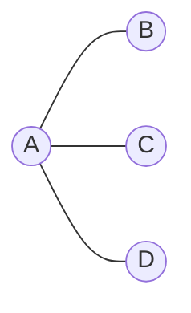

Aquí: `grado(A) = 3`, `grado(B) = grado(C) = grado(D) = 1`.

#### Grado de entrada y salida (en dígrafos)

| Concepto | Significado |
|---|---|
| Grado de entrada | Aristas que **llegan** al vértice. |
| Grado de salida | Aristas que **salen** del vértice. |

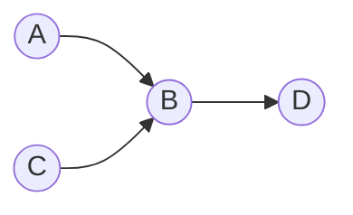

Para `B`: `grado_entrada(B) = 2`, `grado_salida(B) = 1`.

### Caminos

Un **camino** es una secuencia de vértices `⟨a₀, a₁, …, a_(m−1)⟩` tal que para cada par consecutivo existe una arista `(aᵢ, a_(i+1)) ∈ E`. El **largo** del camino es la cantidad de aristas que contiene.

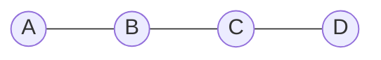

El camino `A → B → C → D` tiene largo 3 (tres aristas).

#### Camino cerrado, simple y ciclo

- **Cerrado**: el primer y último vértice son el mismo. Ej: `A → B → C → A`.
- **Simple**: todos los vértices son distintos, excepto quizás el primero y el último.
- **Ciclo**: un camino cerrado simple.

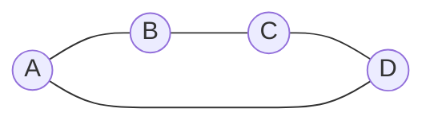

Aquí `A → B → C → D → A` es un ciclo.

#### Peso de un camino

En un grafo con pesos, el peso del camino es la suma de los pesos de sus aristas:

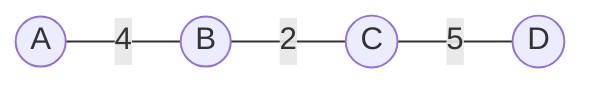

El camino `A → B → C → D` pesa `4 + 2 + 5 = 11`.

#### Grafo acíclico

Un grafo que no contiene ciclos se llama **acíclico**. Los **DAG** (*Directed Acyclic Graph*) son grafos dirigidos sin ciclos — la base de Airflow, Dagster, dbt y muchos otros sistemas de orquestación de datos.

### Subgrafos

Dado `G = (V, E)`, un **subgrafo** es `S = (V', E')` con `V' ⊆ V` y `E' ⊆ E`, donde las aristas de `E'` solo conectan vértices de `V'`.

### Conexidad

Un grafo no dirigido es **conexo** si existe al menos un camino entre cualquier par de vértices.

#### Grafo conexo


#### Grafo no conexo

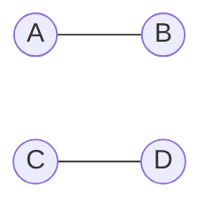

Aquí hay dos **componentes conexas**: `{A, B}` y `{C, D}`. Una **componente conexa** es un subgrafo conexo *maximal*: no se le pueden agregar más vértices sin perder la conexidad.

---

## Bloque 4 — Representación en memoria {#bloque-4}

Hay tres formas estándar de representar un grafo en código.

### Lista de aristas

Se almacena una lista con todas las aristas:

```python
edges = [
    ("A", "B"),
    ("A", "C"),
    ("B", "D"),
    ("C", "D"),
]

# Con pesos
edges = [
    ("A", "B", 4),
    ("A", "C", 3),
    ("B", "D", 2),
    ("C", "D", 7),
]
```

| Ventaja | Desventaja |
|---|---|
| Simple de construir. | Buscar vecinos cuesta caro: hay que recorrer toda la lista. |

### Lista de adyacencia

Cada vértice almacena su lista de vecinos. **Es la representación más usada en la práctica:**

```python
graph = {
    "A": ["B", "C"],
    "B": ["A", "D"],
    "C": ["A", "D"],
    "D": ["B", "C"],
}

# Con pesos
graph = {
    "A": [("B", 4), ("C", 3)],
    "B": [("A", 4), ("D", 2)],
    "C": [("A", 3), ("D", 7)],
    "D": [("B", 2), ("C", 7)],
}
```

| Ventaja | Desventaja |
|---|---|
| Muy eficiente para grafos ralos. | Para verificar si existe una arista específica `(A, B)`, hay que recorrer la lista de vecinos de `A`. |

### Matriz de adyacencia

Una matriz `n × n` donde cada celda indica si existe una arista:

```text
    A B C D
A [ 0 1 1 0 ]
B [ 1 0 0 1 ]
C [ 1 0 0 1 ]
D [ 0 1 1 0 ]
```

| Ventaja | Desventaja |
|---|---|
| Consultar si existe `(u, v)` cuesta `O(1)`. | Usa `O(\|V\|²)` memoria, incluso si el grafo tiene pocas aristas. |

> 💡 **Regla práctica:** para grafos ralos (la mayoría en la realidad), usa **lista de adyacencia con `dict`**. Para grafos densos o cuando necesitas operaciones algebraicas (PageRank, *spectral clustering*), usa matrices de NumPy o SciPy.

---

## Bloque 5 — Recorridos: DFS {#bloque-5}

En muchas aplicaciones se necesita visitar los vértices de un grafo. Los recorridos más importantes son:

1. **DFS** (*Depth First Search*) — búsqueda en profundidad.
2. **BFS** (*Breadth First Search*) — búsqueda en amplitud.

> ⚠️ **Cuidado con los ciclos.** Si no marcamos vértices visitados, un recorrido sobre un grafo con ciclos puede entrar en bucle infinito:
> ```text
> A → B → C → A → B → C → …
> ```
> Por eso los algoritmos de recorrido usan un conjunto `visitados`.

### DFS: idea general

DFS avanza hacia vértices cada vez más profundos antes de retroceder.

**Procedimiento:**

1. Escoger un vértice inicial `v`.
2. Marcar `v` como visitado.
3. Para cada vecino no visitado de `v`, iniciar recursivamente un DFS.
4. Cuando un vértice no tiene más vecinos sin visitar, retroceder.

**Intuición:** explorar un laberinto. Avanza todo lo posible por un camino; si llega a un punto sin salida, retrocede; luego prueba otro camino.

### Ejemplo

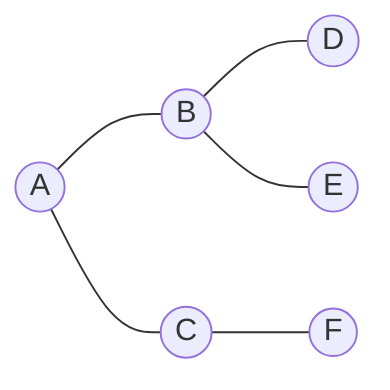

Partiendo desde `A` y visitando vecinos en orden alfabético, un recorrido DFS posible es:

```text
A, B, D, E, C, F
```

### Pseudocódigo

```text
DFS(G, v):
    marcar v como visitado
    procesar v

    para cada vecino u de v:
        si u no ha sido visitado:
            DFS(G, u)
```

### Implementación en Python

```python
def dfs(graph, start):
    visited = set()
    order = []

    def visit(node):
        visited.add(node)
        order.append(node)

        for neighbor in graph[node]:
            if neighbor not in visited:
                visit(neighbor)

    visit(start)
    return order


graph = {
    "A": ["B", "C"],
    "B": ["A", "D", "E"],
    "C": ["A", "F"],
    "D": ["B"],
    "E": ["B"],
    "F": ["C"],
}

print(dfs(graph, "A"))
# ['A', 'B', 'D', 'E', 'C', 'F']
```

### Complejidad

DFS visita todos los vértices y aristas una sola vez:

```text
O(|V| + |E|)
```

> 💡 **DFS es la base** de muchos algoritmos: detección de ciclos, ordenamiento topológico (qué tareas pueden ejecutarse antes que otras en un DAG), búsqueda de componentes fuertemente conexas, *backtracking* en problemas de búsqueda.

---

## Bloque 6 — Recorridos: BFS {#bloque-6}

BFS visita primero los vecinos directos del nodo inicial, luego los vecinos de esos vecinos, y así sucesivamente.

**Procedimiento:**

1. Escoger un vértice inicial `v`.
2. Marcar `v` como visitado.
3. Insertar `v` en una **cola**.
4. Mientras la cola no esté vacía:
   - Extraer el primer elemento.
   - Procesar sus vecinos no visitados.
   - Cada vecino nuevo se inserta al final de la cola.

**Intuición:** explora el grafo por **niveles** o **capas**.

### Ejemplo

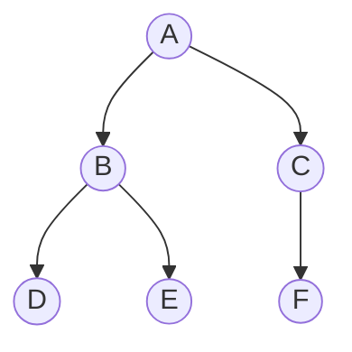

Niveles desde `A`:

```text
Nivel 0: A
Nivel 1: B, C
Nivel 2: D, E, F
```

Recorrido BFS: `A, B, C, D, E, F`.

### Pseudocódigo

```text
BFS(G, v):
    crear cola Q
    marcar v como visitado
    insertar v en Q

    mientras Q no esté vacía:
        x = extraer primero de Q
        procesar x

        para cada vecino u de x:
            si u no ha sido visitado:
                marcar u como visitado
                insertar u en Q
```

### Implementación en Python

```python
from collections import deque


def bfs(graph, start):
    visited = {start}
    queue = deque([start])
    order = []

    while queue:
        node = queue.popleft()
        order.append(node)

        for neighbor in graph[node]:
            if neighbor not in visited:
                visited.add(neighbor)
                queue.append(neighbor)

    return order


graph = {
    "A": ["B", "C"],
    "B": ["A", "D", "E"],
    "C": ["A", "F"],
    "D": ["B"],
    "E": ["B"],
    "F": ["C"],
}

print(bfs(graph, "A"))
# ['A', 'B', 'C', 'D', 'E', 'F']
```

### Complejidad

```text
O(|V| + |E|)
```

> 💡 **BFS encuentra caminos más cortos** (en cantidad de aristas) en grafos no ponderados. Esta es una propiedad útil que veremos generalizada con Dijkstra para grafos ponderados.

---

## Bloque 7 — Comparación DFS vs BFS {#bloque-7}

| Criterio | DFS | BFS |
|---|---|---|
| Estrategia | Profundiza primero. | Explora por niveles. |
| Estructura auxiliar | Pila (o recursión). | Cola. |
| Uso típico | Detectar ciclos, componentes, orden topológico, *backtracking*. | Caminos más cortos en grafos no ponderados, expansión por distancia. |
| Complejidad | `O(|V| + |E|)` | `O(|V| + |E|)` |

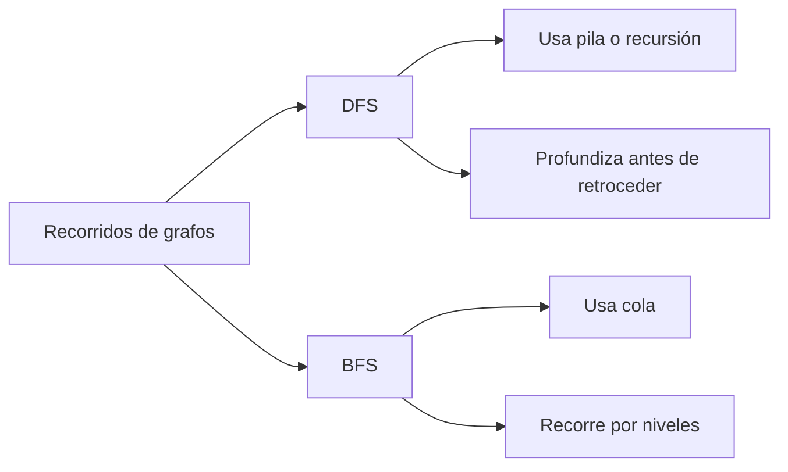

> 💡 **Conexión con la Clase 2:** la pila (LIFO) y la cola (FIFO) que vimos no son meras estructuras académicas. Son **el corazón** de DFS y BFS. Cambiar la estructura auxiliar cambia el algoritmo.

---

## Bloque 8 — Camino más corto: algoritmo de Dijkstra {#bloque-8}

En muchos problemas se quiere encontrar la **ruta de menor costo** entre vértices. Ejemplo: en un mapa, las ciudades son vértices, las carreteras son aristas, y el peso es la distancia o el tiempo de viaje.

> ⚠️ **"Más corto" no significa menor cantidad de aristas,** sino menor suma de pesos. Una ruta con 10 aristas baratas puede ser más corta que una con 2 aristas caras.

### Dijkstra

El algoritmo de **Dijkstra** (1956) resuelve el problema del camino mínimo desde un vértice origen `s` hacia **todos los demás** vértices.

> ⚠️ **Requisito:** los pesos deben ser **no negativos**. Para grafos con pesos negativos, hay que usar Bellman-Ford.

### Idea general

1. Asignar distancia `0` al vértice origen.
2. Todos los demás comienzan con distancia infinita.
3. Elegir el vértice no procesado con menor distancia conocida.
4. **Relajar** sus aristas.
5. Repetir hasta procesar todos los alcanzables.

### ¿Qué es relajar una arista?

Verificar si encontramos un camino más barato hacia un vecino. Para una arista `u → v` con peso `w`:

```text
si distancia[u] + w < distancia[v]:
    distancia[v] = distancia[u] + w
```

### Pseudocódigo

```text
DIJKSTRA(G, s):
    para cada vértice v en G:
        distancia[v] = infinito
        anterior[v] = nulo

    distancia[s] = 0
    crear cola de prioridad Q con todos los vértices

    mientras Q no esté vacía:
        u = vértice con menor distancia en Q

        para cada vecino v de u:
            alt = distancia[u] + peso(u, v)

            si alt < distancia[v]:
                distancia[v] = alt
                anterior[v] = u

    retornar distancia, anterior
```

### Implementación en Python

```python
import heapq


def dijkstra(graph, start):
    distances = {node: float("inf") for node in graph}
    previous = {node: None for node in graph}
    distances[start] = 0

    heap = [(0, start)]

    while heap:
        current_distance, node = heapq.heappop(heap)

        if current_distance > distances[node]:
            continue

        for neighbor, weight in graph[node]:
            new_distance = current_distance + weight

            if new_distance < distances[neighbor]:
                distances[neighbor] = new_distance
                previous[neighbor] = node
                heapq.heappush(heap, (new_distance, neighbor))

    return distances, previous


graph = {
    "A": [("B", 10), ("C", 3)],
    "B": [("A", 10), ("C", 2), ("D", 20)],
    "C": [("A", 3), ("B", 2), ("D", 11), ("E", 15)],
    "D": [("B", 20), ("C", 11), ("E", 5)],
    "E": [("C", 15), ("D", 5)],
}

distances, previous = dijkstra(graph, "A")
print(distances)
# {'A': 0, 'B': 5, 'C': 3, 'D': 14, 'E': 18}
```

### Reconstruir el camino

```python
def reconstruct_path(previous, target):
    path = []
    current = target

    while current is not None:
        path.append(current)
        current = previous[current]

    path.reverse()
    return path


print(reconstruct_path(previous, "E"))
# ['A', 'C', 'E']
```

### Complejidad

Con cola de prioridad (heap):

```text
O((|V| + |E|) · log |V|)
```

> 💡 **`heapq` en Python** implementa una cola de prioridad como *min-heap*: `heappop` siempre devuelve el elemento de menor prioridad en `O(log n)`. Es la estructura clave para que Dijkstra sea eficiente.

---

## Bloque 9 — Árbol recubridor mínimo: Prim y Kruskal {#bloque-9}

En un grafo conexo puede haber rutas redundantes. Si eliminamos algunas aristas, el grafo puede seguir siendo conexo.

### Definiciones

- **Árbol:** grafo conexo sin ciclos.
- **Árbol recubridor** de `G = (V, E)`: subgrafo que tiene los mismos vértices `V`, es conexo, y no tiene ciclos.
- **Árbol recubridor mínimo (MST, *Minimum Spanning Tree*):** árbol recubridor cuya suma de pesos es mínima (en grafos ponderados).

### Ejemplo

Grafo original:


MST posible:

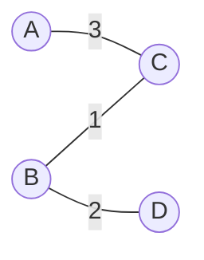

Costo total: `1 + 2 + 3 = 6`.

> 💡 **Para un mismo grafo pueden existir varios MSTs distintos** con el mismo costo total. Lo único garantizado es la suma mínima.

### Aplicaciones

- Diseño de redes de telecomunicaciones.
- Tendido de cables eléctricos o de fibra.
- Redes de transporte.
- *Clustering* y agrupamiento.
- Tratamiento de imágenes y reconocimiento facial.

Caso típico: una red de aeropuertos donde los vértices son aeropuertos y los pesos representan costos de comunicación. El MST permite conectar toda la red con costo total mínimo.

### Algoritmo de Prim

Construye el MST **creciendo desde un vértice inicial**.

#### Idea

1. Escoger un vértice inicial.
2. Agregar la arista más barata que conecte un vértice ya incluido con uno no incluido.
3. Repetir hasta incluir todos los vértices.

#### Implementación en Python

```python
import heapq


def prim(graph, start):
    visited = {start}
    edges = []
    mst = []
    total_cost = 0

    for neighbor, weight in graph[start]:
        heapq.heappush(edges, (weight, start, neighbor))

    while edges and len(visited) < len(graph):
        weight, u, v = heapq.heappop(edges)

        if v in visited:
            continue

        visited.add(v)
        mst.append((u, v, weight))
        total_cost += weight

        for neighbor, next_weight in graph[v]:
            if neighbor not in visited:
                heapq.heappush(edges, (next_weight, v, neighbor))

    return mst, total_cost


graph = {
    "A": [("B", 4), ("C", 3)],
    "B": [("A", 4), ("C", 1), ("D", 2)],
    "C": [("A", 3), ("B", 1), ("D", 7)],
    "D": [("B", 2), ("C", 7)],
}

mst, cost = prim(graph, "A")
print(mst)
# [('A', 'C', 3), ('C', 'B', 1), ('B', 'D', 2)]
print(cost)
# 6
```

Complejidad: `O((|V| + |E|) · log |V|)`.

### Algoritmo de Kruskal

Construye el MST **ordenando las aristas por peso**.

#### Idea

1. Ordenar todas las aristas de menor a mayor peso.
2. Recorrer las aristas en ese orden.
3. Agregar una arista si no forma un ciclo (usar Union-Find para detectar ciclos eficientemente).
4. Detenerse cuando el MST tenga `|V| − 1` aristas.

#### Implementación en Python

```python
class UnionFind:
    def __init__(self, vertices):
        self.parent = {v: v for v in vertices}
        self.rank = {v: 0 for v in vertices}

    def find(self, x):
        if self.parent[x] != x:
            self.parent[x] = self.find(self.parent[x])
        return self.parent[x]

    def union(self, a, b):
        root_a = self.find(a)
        root_b = self.find(b)

        if root_a == root_b:
            return False

        if self.rank[root_a] < self.rank[root_b]:
            self.parent[root_a] = root_b
        elif self.rank[root_a] > self.rank[root_b]:
            self.parent[root_b] = root_a
        else:
            self.parent[root_b] = root_a
            self.rank[root_a] += 1

        return True


def kruskal(vertices, edges):
    uf = UnionFind(vertices)
    mst = []
    total_cost = 0

    edges = sorted(edges, key=lambda edge: edge[2])

    for u, v, weight in edges:
        if uf.union(u, v):
            mst.append((u, v, weight))
            total_cost += weight

        if len(mst) == len(vertices) - 1:
            break

    return mst, total_cost


vertices = ["A", "B", "C", "D"]
edges = [
    ("A", "B", 4),
    ("A", "C", 3),
    ("B", "C", 1),
    ("B", "D", 2),
    ("C", "D", 7),
]

mst, cost = kruskal(vertices, edges)
print(mst)
# [('B', 'C', 1), ('B', 'D', 2), ('A', 'C', 3)]
print(cost)
# 6
```

Complejidad: `O(|E| · log |E|)` (dominado por el ordenamiento de aristas).

### Camino más corto vs MST

Aunque ambos problemas usan grafos con pesos, resuelven preguntas distintas:

| Problema | Pregunta que responde | Algoritmo |
|---|---|---|
| Camino más corto | ¿Cuál es la ruta de menor costo desde un origen hacia otros vértices? | Dijkstra |
| Árbol recubridor mínimo | ¿Cómo conectar todos los vértices con costo total mínimo? | Prim, Kruskal |

> 💡 **Diferencia conceptual:**
> - **Dijkstra:** "¿Cuál es la ruta más barata desde Santiago a Valparaíso?"
> - **MST:** "¿Cuál es la forma más barata de conectar todas las ciudades?"

---

## Bloque 10 — Aplicaciones en ingeniería de datos {#bloque-10}

Los grafos son centrales en muchos sistemas de datos modernos:

- **Grafos de dependencias** entre tareas: Airflow, Dagster, Prefect, dbt. Las DAGs (*Directed Acyclic Graphs*) usan ordenamiento topológico (basado en DFS) para decidir qué tareas pueden ejecutarse en paralelo.
- **Redes de datos** y *data lineage*: rastrear qué tabla deriva de cuáles otras.
- **Sistemas de recomendación**: usuario-producto como bipartito; relaciones colaborativas como grafo de similaridad.
- **Bases de datos de grafos**: Neo4j, Amazon Neptune. Operaciones como "amigos de amigos" son `O(1)` por salto, lo que las hace mucho más rápidas que SQL para consultas relacionales profundas.
- **Análisis de redes sociales**: detección de comunidades (componentes conexas), detección de influenciadores (centralidad), detección de fraude (patrones anómalos).

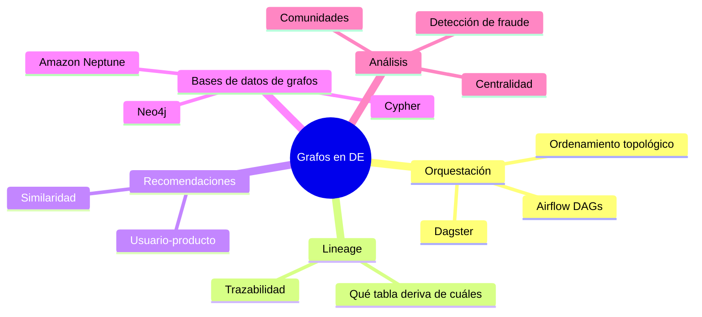

### Mini tutorial: detectar componentes conexas

Una operación útil en análisis de redes — agrupa vértices que están conectados entre sí pero aislados del resto.

```python
def connected_components(graph):
    visited = set()
    components = []

    def dfs(node, component):
        visited.add(node)
        component.append(node)

        for neighbor in graph[node]:
            if neighbor not in visited:
                dfs(neighbor, component)

    for node in graph:
        if node not in visited:
            component = []
            dfs(node, component)
            components.append(component)

    return components


graph = {
    "A": ["B"],
    "B": ["A"],
    "C": ["D"],
    "D": ["C"],
    "E": [],
}

print(connected_components(graph))
# [['A', 'B'], ['C', 'D'], ['E']]
```

### Construir grafos rápidamente

```python
def add_edge(graph, u, v):
    graph.setdefault(u, []).append(v)
    graph.setdefault(v, []).append(u)


def add_weighted_edge(graph, u, v, weight):
    graph.setdefault(u, []).append((v, weight))
    graph.setdefault(v, []).append((u, weight))


graph = {}
add_edge(graph, "A", "B")
add_edge(graph, "A", "C")
add_edge(graph, "B", "D")
add_edge(graph, "C", "D")

print(graph)
# {'A': ['B', 'C'], 'B': ['A', 'D'], 'C': ['A', 'D'], 'D': ['B', 'C']}
```

> 💡 **Para grafos más serios** existen librerías especializadas: `networkx` (de propósito general), `igraph` (más rápida), `graph-tool` (C++ bajo el capó). En producción, evaluar `networkx` para análisis exploratorio y migrar a las otras si el volumen lo requiere.

---

## Resumen de complejidades

| Algoritmo | Complejidad |
|---|---:|
| DFS | `O(\|V\| + \|E\|)` |
| BFS | `O(\|V\| + \|E\|)` |
| Dijkstra (con heap) | `O((\|V\| + \|E\|) · log \|V\|)` |
| Prim (con heap) | `O((\|V\| + \|E\|) · log \|V\|)` |
| Kruskal | `O(\|E\| · log \|E\|)` |

---

<details>
<summary><strong>🟢 Ejercicio 1 — Identificar tipo de grafo (click para ver)</strong></summary>

Para cada caso, indica si corresponde a un grafo dirigido, no dirigido o con peso (puede ser más de uno):

1. Personas y relaciones de amistad.
2. Usuarios y seguidores en X.
3. Ciudades conectadas por carreteras con distancia.
4. Páginas web y enlaces entre ellas.

**Solución:**

1. **No dirigido.** La amistad es bidireccional.
2. **Dirigido.** "Seguir" no implica reciprocidad.
3. **No dirigido + ponderado.** La carretera funciona en ambos sentidos; la distancia es un peso.
4. **Dirigido.** Una página puede enlazar a otra sin que la otra enlace de vuelta.

</details>

<details>
<summary><strong>🟢 Ejercicio 2 — Cálculo de grados (click para ver)</strong></summary>

Dado el grafo:

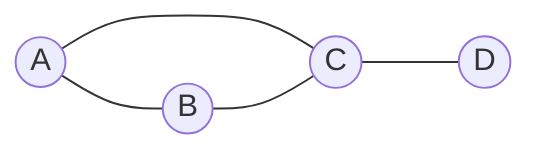

Calcula `grado(A)`, `grado(B)`, `grado(C)`, `grado(D)`.

**Solución:**

```text
grado(A) = 2  (vecinos: B, C)
grado(B) = 2  (vecinos: A, C)
grado(C) = 3  (vecinos: A, B, D)
grado(D) = 1  (vecino: C)
```

</details>

<details>
<summary><strong>🟢 Ejercicio 3 — DFS y BFS (click para ver)</strong></summary>

Dado el grafo:

```mermaid
graph LR
    A((A)) --- B((B))
    A --- C((C))
    B --- D((D))
    C --- E((E))
    D --- F((F))
    E --- F
```

Partiendo desde `A` y visitando vecinos en orden alfabético, calcula:

1. Recorrido DFS.
2. Recorrido BFS.

**Solución:**

1. **DFS:** `A, B, D, F, E, C` (profundizando primero por `B → D → F`, luego `F → E`, luego retroceso).
2. **BFS:** `A, B, C, D, E, F` (por niveles).

</details>

<details>
<summary><strong>🟢 Ejercicio 4 — Camino más corto (click para ver)</strong></summary>

Dado el grafo:

```mermaid
graph LR
    A((A)) -- 2 --- B((B))
    A -- 5 --- C((C))
    B -- 1 --- C
    B -- 4 --- D((D))
    C -- 1 --- D
```

Encuentra el camino más corto desde `A` hacia los demás vértices.

**Solución:**

| Destino | Camino | Costo |
|---|---|---:|
| B | `A → B` | 2 |
| C | `A → B → C` | 3 |
| D | `A → B → C → D` | 4 |

Notar que `A → C` directo cuesta 5, pero `A → B → C` cuesta solo `2 + 1 = 3`. Eso es lo que descubre Dijkstra al relajar aristas.

</details>

<details>
<summary><strong>🟢 Ejercicio 5 — MST (click para ver)</strong></summary>

Dado el grafo:

```mermaid
graph LR
    A((A)) -- 4 --- B((B))
    A -- 2 --- C((C))
    B -- 1 --- C
    B -- 5 --- D((D))
    C -- 8 --- D
    C -- 10 --- E((E))
    D -- 2 --- E
```

Construye un MST usando Kruskal.

**Solución:**

Aristas ordenadas por peso:

```text
(B, C, 1)   ← agregar
(A, C, 2)   ← agregar
(D, E, 2)   ← agregar
(A, B, 4)   ← formaría ciclo A-C-B-A, descartar
(B, D, 5)   ← agregar (conecta los dos componentes)
(C, D, 8)   ← formaría ciclo, descartar
(C, E, 10)  ← formaría ciclo, descartar
```

MST: `{(B, C, 1), (A, C, 2), (D, E, 2), (B, D, 5)}`. Costo total: `1 + 2 + 2 + 5 = 10`.

</details>

---

## Referencia rápida — Grafos

```
DEFINICIÓN
─────────────────────────────────────────────────────────────────
  G = (V, E)
  V = vértices
  E = aristas (conjunto de pares)

TIPOS
─────────────────────────────────────────────────────────────────
  No dirigido    relaciones bidireccionales
  Dirigido       relaciones con sentido (dígrafo)
  Ponderado      cada arista tiene un peso
  Acíclico       sin ciclos (DAG si dirigido)

REPRESENTACIONES
─────────────────────────────────────────────────────────────────
  Lista de aristas        [(u, v), (u, v, peso), ...]
  Lista de adyacencia     {u: [v1, v2, ...]}      ← más usada
  Matriz de adyacencia    M[i][j] = 1 si arista, 0 si no

RECORRIDOS                              COMPLEJIDAD
─────────────────────────────────────────────────────────────────
  DFS         pila / recursión          O(V + E)
  BFS         cola                      O(V + E)

CAMINO MÁS CORTO
─────────────────────────────────────────────────────────────────
  Dijkstra (pesos ≥ 0)                  O((V + E) · log V)
  Bellman-Ford (admite pesos negativos) O(V · E)

ÁRBOL RECUBRIDOR MÍNIMO (MST)
─────────────────────────────────────────────────────────────────
  Prim       crece desde un vértice     O((V + E) · log V)
  Kruskal    ordena aristas + Union-Find O(E · log E)

PYTHON SUGERIDO
─────────────────────────────────────────────────────────────────
  graph = {}                  diccionario de listas
  collections.deque           para BFS
  heapq                       para Dijkstra y Prim
  networkx                    librería seria de grafos
```

---

*→ Volver al [Módulo 03: Estructuras de Datos](../README.md)*
