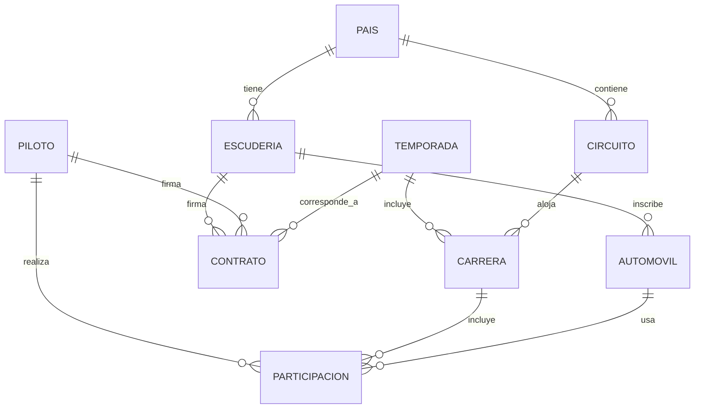

# Clase 1 — Introducción a las Bases de Datos y Semántica de Datos

---

## Tabla de contenidos

1. [Dato vs información](#bloque-1)
2. [Archivo, registro y tipos de claves](#bloque-2)
3. [Características de una base de datos](#bloque-3)
4. [Tipos de bases de datos](#bloque-4)
5. [OLTP, OLAP, Data Mart y Data Warehouse](#bloque-5)
6. [NoSQL: panorama general](#bloque-6)
7. [Etapas del diseño de bases de datos](#bloque-7)
8. [Semántica: cardinalidad, grado y dependencia existencial](#bloque-8)
9. [Tiempo, unicidad, herencia y agregación](#bloque-9)
10. [Caso integrador: Campeonato Mundial de Fórmula 1](#bloque-10)

---

## Bloque 1 — Dato vs información {#bloque-1}

### Dato

Un **dato** es un hecho relacionado con entidades del mundo real: personas, objetos, lugares, eventos o procesos.

Ejemplos:

```text
12345678-9
Juan Pérez
2025-01-15
$49.990
```

Por sí solos pueden no decir demasiado. Son observaciones aisladas.

### Información

La **información** aparece cuando los datos son **organizados, procesados y presentados** de forma útil para tomar decisiones.

```text
Cliente: Juan Pérez
RUT: 12345678-9
Total comprado en enero: $49.990
Segmento: cliente frecuente
```

Aquí los datos ya tienen contexto y pueden apoyar decisiones: enviar promociones, calcular ventas mensuales, alimentar un *dashboard*.

### Enfoque DE: convertir dato en información

En ingeniería de datos, una tarea central es transformar datos crudos en información confiable:

```text
Datos crudos → limpieza → integración → modelado → almacenamiento → consumo analítico
```

Un ejemplo típico:

```text
logs de aplicación
        ↓
proceso ETL/ELT
        ↓
tabla limpia de eventos
        ↓
modelo analítico
        ↓
dashboard de uso del producto
```

> 💡 **Esta es la cadena de valor del Data Engineer.** Cada flecha es un punto donde puede haber pérdida de calidad, demoras o errores. Diseñar la cadena con cuidado es lo que diferencia un pipeline confiable de uno frágil.

---

## Bloque 2 — Archivo, registro y tipos de claves {#bloque-2}

### Archivo y registro

Un **archivo** es un conjunto de datos relacionados entre sí porque comparten estructura o comportamiento. Cada entidad representada se almacena como un **registro** (en una tabla relacional, una **fila**).

| RUT | Nombre | Sexo | Región |
|---|---|---|---|
| 12.345.678-9 | Juan Pérez | M | 5 |
| 11.223.344-5 | María González | F | 12 |
| 9.876.543-2 | José Olivares | M | 11 |

### Tipos de claves

Las claves permiten identificar, relacionar y buscar registros.

| Tipo | Definición | Ejemplo |
|---|---|---|
| **Clave candidata** | Atributo (o conjunto) que podría identificar de forma única cada registro. | `RUT`, `email`, `numero_cliente` |
| **Clave primaria** | La clave candidata escogida como identificador principal. | `rut` en la tabla `cliente` |
| **Clave alternativa** | Clave candidata que no fue elegida como primaria. | `email` con restricción `UNIQUE` |
| **Clave secundaria** | Atributo usado para búsqueda o clasificación, puede repetirse. | `region`, `categoria_cliente` |
| **Clave simple** | Un solo atributo. | `rut` |
| **Clave compuesta** | Más de un atributo. | `(id_pedido, id_producto)` |

### Ejemplo SQL

```sql
CREATE TABLE cliente (
    rut VARCHAR(12) PRIMARY KEY,                    -- clave primaria
    nombre VARCHAR(100) NOT NULL,
    email VARCHAR(150) UNIQUE                        -- clave alternativa
);

-- Clave compuesta
CREATE TABLE detalle_pedido (
    id_pedido INT,
    id_producto INT,
    cantidad INT NOT NULL,
    PRIMARY KEY (id_pedido, id_producto)
);
```

La clave compuesta evita que el mismo producto aparezca duplicado dentro del mismo pedido.

> 💡 **Conexión con la Clase 3 del Módulo 01:** las claves primarias y foráneas son lo que permite hacer `JOIN` en SQL. Sin ellas, no podemos relacionar tablas correctamente.

---

## Bloque 3 — Características de una base de datos {#bloque-3}

Una **base de datos** es un conjunto integrado de archivos o tablas relacionados entre sí. La idea clave: los datos no están aislados, sino conectados de manera coherente.

### Visión centralizada

Los datos se gestionan desde una estructura común, evitando que cada área mantenga su propia versión:

```text
Antes (sin BD):                    Con BD:
ventas_clientes.xlsx               base_datos_corporativa
marketing_clientes.xlsx       →    └── tabla cliente (única)
soporte_clientes.xlsx
```

Cada archivo separado puede tener datos distintos para el mismo cliente.

### Minimización de redundancia

**Mal diseño** — duplica nombre/email del cliente en cada pedido:

| id_pedido | cliente_nombre | cliente_email | producto |
|---|---|---|---|
| 1 | Ana | ana@mail.com | Notebook |
| 2 | Ana | ana@mail.com | Mouse |

**Mejor diseño** — separar entidades:

```text
cliente(id_cliente, nombre, email)
pedido(id_pedido, id_cliente, fecha)
```

### Independencia de los datos

Las aplicaciones consultan datos sin saber si están en disco, particionados, indexados, replicados o distribuidos.

### Estandarización, compartición y seguridad

Una BD permite definir estándares de nombres, tipos, permisos, reglas de integridad, auditoría y accesos compartidos. Esto es la base de la **gobernanza de datos**.

---

## Bloque 4 — Tipos de bases de datos {#bloque-4}

Las bases de datos pueden clasificarse por varios criterios.

### Por modelo de representación

| Modelo | Idea principal | Ejemplo |
|---|---|---|
| Jerárquico | Árbol padre-hijo | sistemas legacy IMS |
| Reticular | Red con múltiples vínculos | modelos antiguos |
| **Relacional** | Tablas relacionadas por claves | PostgreSQL, MySQL, SQL Server |
| Orientado a objetos | Objetos con atributos y métodos | sistemas con estructuras complejas |
| Multidimensional | Hechos y dimensiones | OLAP, cubos analíticos |

#### Modelo relacional

```text
cliente(id_cliente, nombre, email)
pedido(id_pedido, id_cliente, fecha)
producto(id_producto, nombre, precio)
detalle_pedido(id_pedido, id_producto, cantidad)
```

Relaciones:

```text
cliente   1 ── N   pedido
pedido    1 ── N   detalle_pedido
producto  1 ── N   detalle_pedido
```

#### Modelo multidimensional

Típico en analítica. Se organiza alrededor de **una tabla de hechos** y **varias tablas de dimensiones**:

```text
HechoVenta(fecha_id, producto_id, cliente_id, sucursal_id, cantidad, monto)
DimFecha(fecha_id, dia, mes, trimestre, anio)
DimProducto(producto_id, nombre, categoria)
DimCliente(cliente_id, segmento, region)
DimSucursal(sucursal_id, comuna, pais)
```

Facilita preguntas como: *¿cuánto vendimos por región, categoría y trimestre?*

### Por expresividad de datos

| Tipo de dato | Descripción | Ejemplo |
|---|---|---|
| Estructurado | Esquema rígido | tablas SQL |
| Semiestructurado | Estructura flexible | JSON, XML |
| No estructurado | Sin esquema tabular | texto libre, imágenes |
| Multimedia | Audio, video, imágenes | repositorios de medios |
| Espacial/geográfico | Coordenadas, geometrías | PostGIS |

Ejemplo con PostgreSQL + PostGIS:

```sql
CREATE TABLE sucursal (
    id_sucursal SERIAL PRIMARY KEY,
    nombre TEXT NOT NULL,
    ubicacion GEOGRAPHY(POINT, 4326)
);

-- Sucursales dentro de un radio de 5 km
SELECT *
FROM sucursal
WHERE ST_DWithin(
    ubicacion,
    ST_MakePoint(-70.6693, -33.4489)::geography,
    5000
);
```

### Por distribución

| Tipo | Descripción |
|---|---|
| Centralizada | Datos en un solo sitio o servidor lógico |
| Distribuida | Datos en múltiples nodos |
| Móvil/web | Nodos con autonomía o conectividad variable |
| Federada | Integra fuentes heterogéneas (PostgreSQL + Oracle + APIs + CSVs) |

### Por rendimiento

| Tipo | Característica |
|---|---|
| Serial vs paralela | Procesamiento secuencial vs entre varios nodos |
| Disco vs memoria | Persistencia en disco vs prioriza RAM (Redis) |
| Tiempo real | Restricciones estrictas sobre tiempo de respuesta |

> 💡 **En ingeniería de datos**, el procesamiento paralelo es fundamental para grandes volúmenes: consultas paralelas en PostgreSQL, Spark, BigQuery, Snowflake, Redshift.

---

## Bloque 5 — OLTP, OLAP, Data Mart y Data Warehouse {#bloque-5}

Las bases de datos también se clasifican según el tipo de decisión que apoyan:

| Nivel | Tipo | Uso principal |
|---|---|---|
| Operacional | OLTP | transacciones diarias |
| Táctico / gestión | OLAP, Data Mart | análisis por área |
| Estratégico | Data Warehouse | análisis corporativo histórico |

### OLTP — Online Transaction Processing

Operaciones transaccionales rápidas: registrar una venta, crear factura, actualizar inventario, registrar un pago.

**Características:**
- muchas escrituras pequeñas;
- alta concurrencia;
- consistencia fuerte;
- datos actuales.

### OLAP — Online Analytical Processing

Consultas agregadas para análisis:

```sql
SELECT region, SUM(monto) AS ventas
FROM ventas
GROUP BY region;
```

**Características:**
- consultas pesadas;
- agregaciones;
- análisis histórico;
- lectura intensiva.

### Data Mart vs Data Warehouse

| Concepto | Definición | Ejemplo |
|---|---|---|
| **Data Mart** | Repositorio analítico orientado a un área específica | Mart de ventas, finanzas o marketing |
| **Data Warehouse** | Integra datos históricos de múltiples áreas | ERP + CRM + e-commerce → DW corporativo |

```text
ERP + CRM + e-commerce + soporte + marketing
        ↓
Data Warehouse corporativo
        ↓
dashboards, modelos ML, reportes ejecutivos
```

> 💡 **Regla práctica:** OLTP optimiza para "muchas operaciones pequeñas con consistencia"; OLAP para "pocas consultas grandes con velocidad". Mezclar ambos en un mismo motor suele degradar los dos.

---

## Bloque 6 — NoSQL: panorama general {#bloque-6}

**NoSQL** agrupa soluciones de persistencia que no siguen estrictamente el modelo relacional y que no siempre usan SQL como lenguaje principal.

> ⚠️ **NoSQL no significa "sin SQL".** En la práctica significa **"Not Only SQL"**. Muchos motores NoSQL ofrecen interfaces SQL-like (CQL en Cassandra, N1QL en Couchbase).

### Familias frecuentes

| Familia | Modelo | Ejemplo de uso |
|---|---|---|
| Clave-valor | `clave → valor` | caché, sesiones, tokens |
| Documental | documentos JSON/BSON | catálogos, perfiles, contenido web |
| Columnar amplia | familias de columnas | eventos masivos, series temporales |
| Grafos | nodos y relaciones | redes sociales, recomendaciones, fraude |

| Tecnología | Familia |
|---|---|
| Redis | clave-valor |
| MongoDB | documental |
| Cassandra | columnar amplia |
| Neo4j | grafos |

### ¿Cuándo considerar NoSQL?

- El esquema cambia con frecuencia.
- Hay datos semiestructurados.
- Se requiere escalabilidad horizontal.
- Se prioriza alta disponibilidad.
- Las relaciones no son naturalmente tabulares.

> 💡 **Pero NoSQL no reemplaza automáticamente al modelo relacional.** La elección depende del problema. Veremos cada familia en detalle en las clases 3, 4 y 5.

---

## Bloque 7 — Etapas del diseño de bases de datos {#bloque-7}

El diseño de bases de datos sigue una secuencia ordenada:

```text
1. Recolección y análisis de requisitos
2. Diseño conceptual
3. Elección del software
4. Diseño lógico
5. Diseño físico
6. Implementación
```

### Etapa 1: Requisitos

Preguntas clave:

- ¿Qué datos se necesitan?
- ¿Quién los usará?
- ¿Qué consultas se harán?
- ¿Qué reglas de negocio existen?
- ¿Qué volumen de datos se espera?
- ¿Qué latencia es aceptable?

**Enfoque DE adicional:**

- ¿Cuál es la fuente de los datos?
- ¿Cada cuánto llegan? ¿*Batch* o *streaming*?
- ¿Qué calidad tienen?
- ¿Hay datos sensibles?
- ¿Se requiere trazabilidad o auditoría?

### Etapa 2: Diseño conceptual

Construir un esquema **independiente del motor**. No pensar todavía en PostgreSQL, MongoDB, BigQuery: primero modelar el negocio.

```text
Cliente ──── Factura ──── Producto

Entidades posibles:
  Cliente:   RUT, Nombre, Teléfono
  Factura:   Número, Fecha
  Producto:  Código, Nombre, Precio
```

### Etapa 3: Elección del software

Criterios:

- modelo de datos requerido;
- volumen, latencia, escalabilidad;
- patrón lectura/escritura;
- licenciamiento, soporte;
- integración con herramientas existentes.

```text
Sistema transaccional bancario  → motor relacional con ACID fuerte
Catálogo flexible de productos  → documental o relacional con JSON
Analítica histórica masiva      → data warehouse columnar
```

### Etapa 4: Diseño lógico

Traducir el modelo conceptual al modelo del motor escogido.

```text
Modelo conceptual:
Cliente ──── Factura ──── Producto

Modelo relacional:
cliente(rut, nombre, telefono)
factura(id_factura, fecha, rut_cliente)
producto(id_producto, nombre, precio)
detalle_factura(id_factura, id_producto, cantidad)
```

### Etapa 5: Diseño físico

Decisiones de almacenamiento, métodos de acceso y rendimiento: índices, particiones, compresión, distribución, replicación.

```sql
CREATE INDEX idx_factura_fecha ON factura(fecha);
```

En ingeniería de datos también incluye:

```text
Parquet vs CSV
partición por fecha
distribución por customer_id
compresión Snappy / ZSTD
ordenamiento por columnas frecuentes de filtro
```

### Etapa 6: Implementación

Codificar las sentencias SQL/DDL para crear, manipular y poblar la base.

```sql
CREATE TABLE cliente (
    rut CHAR(12) PRIMARY KEY,
    nombre VARCHAR(100) NOT NULL,
    direccion VARCHAR(200),
    sexo CHAR(1)
);

CREATE TABLE factura (
    numero_factura INT PRIMARY KEY,
    fecha DATE NOT NULL,
    rut_cliente CHAR(12) NOT NULL,
    FOREIGN KEY (rut_cliente) REFERENCES cliente(rut)
);
```

---

## Bloque 8 — Semántica: cardinalidad, grado y dependencia existencial {#bloque-8}

La **semántica de datos** se refiere al **significado** de las relaciones.

> 💡 **No basta con saber que existen tablas.** Necesitamos saber qué significa cada relación. *"Persona — Automóvil"* puede significar: posee, arrienda, conduce, está autorizada. El modelo debe capturar el significado correcto.

### Semánticas principales

| Semántica | Pregunta que responde |
|---|---|
| Cardinalidad | ¿Cuántas entidades se relacionan? |
| Grado | ¿Cuántos tipos de entidades participan? |
| Dependencia existencial | ¿Una entidad depende de otra para existir? |
| Tiempo | ¿Cómo cambia la relación o dato en el tiempo? |
| Unicidad | ¿Qué debe ser único? |
| Herencia | ¿Hay tipos generales y subtipos? |
| Agregación | ¿Existe relación todo-parte? |
| Categorización | ¿Una clase puede agrupar entidades de distinto tipo? |

### Cardinalidad o multiplicidad

| Tipo | Notación | Significado | Ejemplo |
|---|---|---|---|
| 1 : 1 | `1 — 0..1` | Una a una | Empleado → Cónyuge |
| 1 : N | `1 — *` | Una a muchas | Persona → Automóviles |
| M : N | `* — *` | Muchas a muchas | Curso ↔ Alumno |

Una relación **M:N** se resuelve con una tabla intermedia:

```sql
CREATE TABLE inscripcion (
    id_curso INT,
    id_alumno INT,
    fecha_inscripcion DATE NOT NULL,
    PRIMARY KEY (id_curso, id_alumno)
);
```

### Obligatoriedad y opcionalidad

| Notación | Significado |
|---|---|
| `0..1` | cero o uno |
| `1` | exactamente uno |
| `0..*` | cero o muchos |
| `1..*` | uno o muchos |

Ejemplo: `Escudería 1 ── 1..* Piloto` indica que una escudería **debe** tener al menos un piloto.

### Grado de una asociación

| Grado | Tipo | Ejemplo |
|---|---|---|
| 1 | Unaria (recursiva) | Empleado supervisa a Empleado |
| 2 | Binaria | Persona posee Automóvil |
| 3 | Ternaria | Producto - Bodega - Pedido |

Ejemplo de asociación unaria en SQL:

```sql
CREATE TABLE empleado (
    id_empleado INT PRIMARY KEY,
    nombre TEXT NOT NULL,
    id_supervisor INT,
    FOREIGN KEY (id_supervisor) REFERENCES empleado(id_empleado)
);
```

> 💡 **Conexión con la Clase 5 del Módulo 03:** las asociaciones unarias forman grafos. Las jerarquías de empleados o de categorías son ejemplos clásicos donde una base de grafos puede ser más natural que SQL.

### Dependencia existencial

Una entidad no puede existir sin otra:

```text
DetalleFactura depende de Factura
```

```sql
CREATE TABLE factura (
    id_factura INT PRIMARY KEY,
    fecha DATE NOT NULL
);

CREATE TABLE detalle_factura (
    id_factura INT NOT NULL,
    linea INT NOT NULL,
    descripcion TEXT NOT NULL,
    monto NUMERIC(12,2) NOT NULL,
    PRIMARY KEY (id_factura, linea),
    FOREIGN KEY (id_factura) REFERENCES factura(id_factura)
);
```

Beneficios: integridad referencial, navegación más clara, eliminación de datos huérfanos.

---

## Bloque 9 — Tiempo, unicidad, herencia y agregación {#bloque-9}

### Semántica temporal

Indica cómo cambian los datos a través del tiempo. Implementación común: **estampillas de tiempo**.

```sql
CREATE TABLE contrato (
    id_contrato INT PRIMARY KEY,
    id_piloto INT NOT NULL,
    id_escuderia INT NOT NULL,
    temporada INT NOT NULL,
    fecha_inicio DATE NOT NULL,
    fecha_fin DATE
);
```

**Restricciones temporales típicas:**

- **Inserción:** cuándo puede ingresarse un dato respecto de otro relacionado.
- **Retención:** durante cuánto tiempo conservar una relación o registro.

```text
Eventos crudos       → retener 90 días
Métricas agregadas   → conservar 5 años
```

### Unicidad y exclusividad

**Unicidad por identificador:**

```sql
CREATE TABLE persona (
    rut VARCHAR(12) PRIMARY KEY,
    nombre TEXT NOT NULL,
    domicilio TEXT
);
```

**Exclusividad** — solo una alternativa puede estar presente:

```sql
-- Un automóvil pertenece a una persona O a una empresa, pero no a ambas
CREATE TABLE automovil (
    patente TEXT PRIMARY KEY,
    rut_persona VARCHAR(12),
    id_empresa INT,
    CHECK (
        (rut_persona IS NOT NULL AND id_empresa IS NULL)
        OR
        (rut_persona IS NULL AND id_empresa IS NOT NULL)
    )
);
```

### Herencia

Modela un tipo general y varios subtipos. Corresponde a relaciones del tipo *"es un / es una"*.

```text
Persona
├── Estudiante      → es una Persona
└── Profesor        → es una Persona
```

| Propiedad | Significado |
|---|---|
| Cobertura | Toda entidad del supertipo pertenece (o no) a algún subtipo |
| Exclusividad | Una entidad puede pertenecer a uno o varios subtipos |
| Dinamicidad | Una entidad puede cambiar de subtipo en el tiempo |

> 💡 **La herencia es importante para datos históricos.** Si una persona puede ser hoy estudiante y mañana profesor, ¿el modelo debe conservar esa historia? La respuesta condiciona la estructura.

### Agregación

Representa una relación **todo-parte**:

```text
Pedido
├── DetallePedido
├── Pago
└── Despacho
```

En una composición fuerte, la parte no tiene sentido sin el todo (`DetallePedido` no debería existir sin `Pedido`).

### Categorización

Modela relaciones entre clases que pueden tener distintos tipos de datos:

```text
Propietario
├── Persona
└── Empresa
```

Una entidad `Automóvil` puede asociarse a un `Propietario`, que puede ser persona o empresa.

---

## Bloque 10 — Caso integrador: Campeonato Mundial de Fórmula 1 {#bloque-10}

### Enunciado

- Los pilotos firman contratos para correr una temporada en autos de una escudería.
- Una escudería puede tener varios pilotos, pero debe tener al menos uno.
- Cada escudería pertenece a un país; un país puede tener varias.
- Los automóviles deben estar inscritos en una escudería para participar.
- Los automóviles se asignan a pilotos para una carrera específica si están disponibles.
- Un piloto puede usar **solo un automóvil** durante una carrera.
- Participar en una carrera exige tener automóvil asignado.
- Las carreras ocurren en circuitos ubicados en países.
- Un circuito puede tener varias carreras (en la misma o distintas temporadas).
- Un circuito puede estar en reparación y no tener carreras programadas.

### Modelo conceptual sugerido



### Reglas de negocio clave

| Regla | Implementación |
|---|---|
| Un piloto usa solo un automóvil por carrera | `UNIQUE(id_piloto, id_carrera)` en `participacion` |
| Un automóvil no debería estar asignado a dos pilotos en la misma carrera | `UNIQUE(id_automovil, id_carrera)` |
| Participar exige automóvil asignado | `id_automovil NOT NULL` |
| Un circuito puede no tener carreras (reparación) | Relación opcional desde el lado de circuito |
| Auto puede cambiar entre carreras | NO guardar `id_automovil` en `Piloto`; usar tabla `Participación` |

### Diseño relacional

```sql
CREATE TABLE pais (
    id_pais INT PRIMARY KEY,
    nombre TEXT NOT NULL UNIQUE
);

CREATE TABLE escuderia (
    id_escuderia INT PRIMARY KEY,
    nombre TEXT NOT NULL,
    id_pais INT NOT NULL,
    FOREIGN KEY (id_pais) REFERENCES pais(id_pais)
);

CREATE TABLE piloto (
    id_piloto INT PRIMARY KEY,
    nombre TEXT NOT NULL,
    nacionalidad TEXT
);

CREATE TABLE temporada (
    id_temporada INT PRIMARY KEY,
    anio INT NOT NULL UNIQUE
);

CREATE TABLE contrato (
    id_contrato INT PRIMARY KEY,
    id_piloto INT NOT NULL,
    id_escuderia INT NOT NULL,
    id_temporada INT NOT NULL,
    FOREIGN KEY (id_piloto) REFERENCES piloto(id_piloto),
    FOREIGN KEY (id_escuderia) REFERENCES escuderia(id_escuderia),
    FOREIGN KEY (id_temporada) REFERENCES temporada(id_temporada),
    UNIQUE (id_piloto, id_temporada)        -- un piloto, un contrato por temporada
);

CREATE TABLE automovil (
    id_automovil INT PRIMARY KEY,
    codigo TEXT NOT NULL UNIQUE,
    id_escuderia INT NOT NULL,
    disponible_tecnicamente BOOLEAN NOT NULL DEFAULT TRUE,
    FOREIGN KEY (id_escuderia) REFERENCES escuderia(id_escuderia)
);

CREATE TABLE circuito (
    id_circuito INT PRIMARY KEY,
    nombre TEXT NOT NULL,
    id_pais INT NOT NULL,
    en_reparacion BOOLEAN NOT NULL DEFAULT FALSE,
    FOREIGN KEY (id_pais) REFERENCES pais(id_pais)
);

CREATE TABLE carrera (
    id_carrera INT PRIMARY KEY,
    nombre TEXT NOT NULL,
    fecha DATE NOT NULL,
    id_temporada INT NOT NULL,
    id_circuito INT NOT NULL,
    FOREIGN KEY (id_temporada) REFERENCES temporada(id_temporada),
    FOREIGN KEY (id_circuito) REFERENCES circuito(id_circuito)
);

CREATE TABLE participacion (
    id_carrera INT NOT NULL,
    id_piloto INT NOT NULL,
    id_automovil INT NOT NULL,
    posicion_final INT,
    PRIMARY KEY (id_carrera, id_piloto),
    FOREIGN KEY (id_carrera) REFERENCES carrera(id_carrera),
    FOREIGN KEY (id_piloto) REFERENCES piloto(id_piloto),
    FOREIGN KEY (id_automovil) REFERENCES automovil(id_automovil),
    UNIQUE (id_carrera, id_automovil)       -- un auto, un piloto por carrera
);
```

> 💡 **Reglas avanzadas requieren más que constraints.** Verificar que el automóvil asignado pertenezca a la misma escudería del contrato vigente del piloto requiere *triggers*, validaciones en aplicación, o procesos ETL con reglas explícitas. La integridad por sí sola no captura toda la lógica de negocio.

### Vista analítica (modelo dimensional)

```text
hecho_participacion_f1
- id_carrera
- id_piloto
- id_automovil
- posicion_final

dim_piloto
dim_escuderia
dim_temporada
dim_circuito
dim_pais
```

---

## Buenas prácticas

1. Modela primero el negocio, después el motor.
2. Define claves claras desde el inicio.
3. Evita relaciones M:N sin tabla intermedia.
4. Documenta cardinalidades y reglas de negocio.
5. Usa nombres consistentes para tablas y columnas.
6. Distingue datos operacionales de datos analíticos.
7. Considera el tiempo como parte del modelo.
8. Evalúa el motor según el patrón de uso, no por moda.
9. Diseña restricciones para prevenir datos inválidos.
10. Piensa en trazabilidad y calidad desde el comienzo.

## Errores comunes

| Error | Consecuencia |
|---|---|
| No definir clave primaria | Duplicados y *joins* ambiguos |
| Confundir dato con información | Modelos poco útiles para decisiones |
| Una sola tabla gigante | Redundancia y baja mantenibilidad |
| Ignorar cardinalidad | Relaciones incorrectas |
| No modelar el tiempo | Pérdida de historia |
| Elegir NoSQL sin necesidad | Complejidad innecesaria |
| Diseñar físico antes que conceptual | Dependencia prematura del motor |
| No documentar reglas de negocio | Pipelines frágiles |

---

<details>
<summary><strong>🟢 Ejercicio 1 — Tipos de claves (click para ver)</strong></summary>

Dada esta tabla:

```text
cliente(rut, email, nombre, region, fecha_registro)
```

Responde:

1. ¿Qué atributos podrían ser claves candidatas?
2. ¿Cuál escogerías como clave primaria?
3. ¿Qué atributos podrían ser claves secundarias?

**Solución:**

1. **Claves candidatas:** `rut` (único e inmutable) y `email` (puede ser único pero cambia más). Ambos pueden identificar a un cliente.
2. **Clave primaria:** `rut`. Es estable y único legalmente. El `email` puede cambiar y se modela como `UNIQUE` (clave alternativa).
3. **Claves secundarias:** `region`, `fecha_registro`, `nombre`. Son útiles para filtros y agrupaciones, pero pueden repetirse.

</details>

<details>
<summary><strong>🟢 Ejercicio 2 — Relación M:N (click para ver)</strong></summary>

Modela la relación entre `estudiante` y `curso`. Requisitos:

- un estudiante puede inscribirse en muchos cursos;
- un curso puede tener muchos estudiantes;
- registrar fecha de inscripción;
- no duplicar la misma inscripción.

**Solución:**

```sql
CREATE TABLE estudiante (
    id_estudiante INT PRIMARY KEY,
    nombre TEXT NOT NULL,
    email TEXT UNIQUE
);

CREATE TABLE curso (
    id_curso INT PRIMARY KEY,
    nombre TEXT NOT NULL,
    semestre TEXT NOT NULL
);

CREATE TABLE inscripcion (
    id_estudiante INT,
    id_curso INT,
    fecha_inscripcion DATE NOT NULL,
    PRIMARY KEY (id_estudiante, id_curso),
    FOREIGN KEY (id_estudiante) REFERENCES estudiante(id_estudiante),
    FOREIGN KEY (id_curso) REFERENCES curso(id_curso)
);
```

La PK compuesta `(id_estudiante, id_curso)` evita duplicados naturalmente.

</details>

<details>
<summary><strong>🟢 Ejercicio 3 — OLTP vs OLAP (click para ver)</strong></summary>

Diseña dos modelos simplificados para ventas:

1. Modelo OLTP para registrar ventas.
2. Modelo OLAP para analizar ventas por fecha, producto y región.

**Solución:**

**OLTP (transaccional, normalizado):**

```sql
CREATE TABLE cliente (
    id_cliente INT PRIMARY KEY,
    nombre TEXT NOT NULL,
    region TEXT
);

CREATE TABLE producto (
    id_producto INT PRIMARY KEY,
    nombre TEXT NOT NULL,
    precio NUMERIC(12,2) NOT NULL
);

CREATE TABLE venta (
    id_venta INT PRIMARY KEY,
    id_cliente INT NOT NULL REFERENCES cliente(id_cliente),
    fecha TIMESTAMP NOT NULL DEFAULT CURRENT_TIMESTAMP
);

CREATE TABLE detalle_venta (
    id_venta INT NOT NULL REFERENCES venta(id_venta),
    id_producto INT NOT NULL REFERENCES producto(id_producto),
    cantidad INT NOT NULL CHECK (cantidad > 0),
    PRIMARY KEY (id_venta, id_producto)
);
```

**OLAP (estrella, desnormalizado):**

```sql
CREATE TABLE dim_fecha (
    fecha_id INT PRIMARY KEY,
    fecha DATE NOT NULL,
    dia INT, mes INT, trimestre INT, anio INT
);

CREATE TABLE dim_producto (
    producto_id INT PRIMARY KEY,
    nombre TEXT, categoria TEXT
);

CREATE TABLE dim_region (
    region_id INT PRIMARY KEY,
    region TEXT, pais TEXT
);

CREATE TABLE fact_ventas (
    fecha_id INT REFERENCES dim_fecha(fecha_id),
    producto_id INT REFERENCES dim_producto(producto_id),
    region_id INT REFERENCES dim_region(region_id),
    cantidad INT,
    monto NUMERIC(12,2)
);
```

Diferencias clave: OLTP optimiza inserción y consistencia; OLAP optimiza consultas agregadas con menos JOINs.

</details>

---

## Referencia rápida — Conceptos de bases de datos

```
DATO vs INFORMACIÓN
─────────────────────────────────────────────────────────────────
  Dato         → hecho aislado
  Información  → dato organizado, útil para decidir

CLAVES
─────────────────────────────────────────────────────────────────
  Candidata    podría identificar de forma única
  Primaria     candidata escogida como identificador principal
  Alternativa  candidata no escogida (UNIQUE)
  Secundaria   atributo de búsqueda, puede repetirse
  Compuesta    formada por más de un atributo

NIVEL ORGANIZACIONAL
─────────────────────────────────────────────────────────────────
  OLTP            transacciones diarias
  OLAP            análisis agregado
  Data Mart       analítico departamental
  Data Warehouse  analítico corporativo histórico

ETAPAS DE DISEÑO
─────────────────────────────────────────────────────────────────
  1. Requisitos
  2. Diseño conceptual    independiente del motor
  3. Elección de software
  4. Diseño lógico        adaptado al paradigma
  5. Diseño físico        índices, particiones, almacenamiento
  6. Implementación

SEMÁNTICA
─────────────────────────────────────────────────────────────────
  Cardinalidad         1:1, 1:N, M:N
  Grado                unaria, binaria, ternaria
  Dependencia          débil depende de fuerte
  Tiempo               válido_desde / válido_hasta
  Unicidad             PK, UNIQUE
  Herencia             "es un"
  Agregación           "tiene partes"
```

---

*→ Próxima clase: [Bases de Datos Relacionales](../clase-02-bases-de-datos-relacionales/README.md)*
