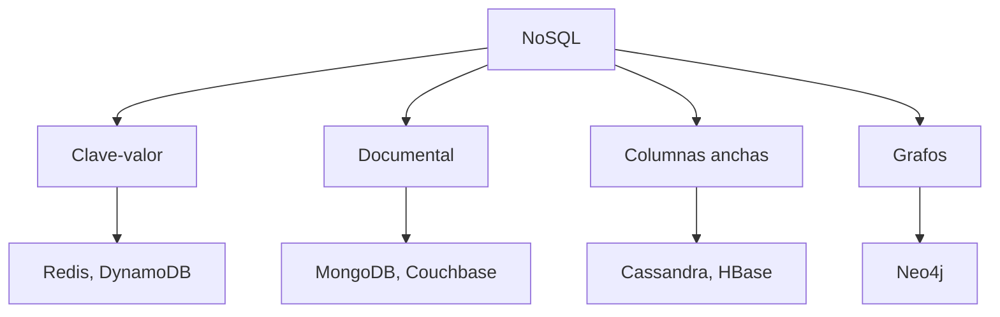
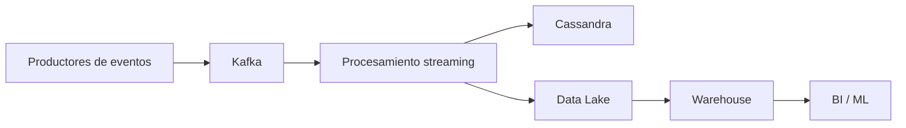

# Clase 3 — NoSQL, Columnas Anchas y Cassandra

---

## Tabla de contenidos

1. [¿Qué es NoSQL? Familias y motivación](#bloque-1)
2. [SQL vs NoSQL: comparación práctica](#bloque-2)
3. [ACID, BASE y el teorema CAP](#bloque-3)
4. [Tipos de consistencia](#bloque-4)
5. [Almacenamiento por filas vs por columnas](#bloque-5)
6. [Cassandra: principios de modelado](#bloque-6)
7. [Conceptos: keyspace, partition key y clustering](#bloque-7)
8. [CQL: ejemplos prácticos](#bloque-8)
9. [Diseño de particiones y patrones de tablas](#bloque-9)
10. [Caso práctico: librería en Cassandra](#bloque-10)

---

## Bloque 1 — ¿Qué es NoSQL? Familias y motivación {#bloque-1}

Una base de datos **NoSQL** es una familia amplia de soluciones de persistencia que, en general:

- No siguen estrictamente el modelo relacional.
- No dependen de SQL como lenguaje principal de consulta.
- Suelen priorizar escalabilidad horizontal, disponibilidad, flexibilidad de esquema o baja latencia.
- Se usan en sistemas distribuidos, aplicaciones web de alto tráfico, *streaming*, caché, IoT y analítica operativa.

> 💡 **NoSQL no significa "anti-SQL".** En la práctica significa **"Not Only SQL"**. Muchas arquitecturas modernas combinan bases relacionales y NoSQL según el caso de uso.

### ¿Por qué surgieron?

El modelo relacional sigue siendo potente, pero algunas aplicaciones modernas exigen:

- escalar a muchos nodos;
- responder con baja latencia;
- tolerar fallos de red o nodos caídos;
- manejar esquemas cambiantes;
- procesar grandes volúmenes de eventos.

Casos típicos en ingeniería de datos:

| Caso | Requisito principal | Tecnología posible |
|---|---|---|
| Sesiones de usuario | Lectura/escritura muy rápida por clave | Redis, DynamoDB |
| Eventos IoT por dispositivo y tiempo | Escrituras masivas y particiones temporales | Cassandra |
| Catálogo flexible de productos | Documentos con atributos variables | MongoDB |
| Recomendaciones por relaciones | Recorridos entre nodos | Neo4j |
| Agregaciones analíticas por columnas | Lectura eficiente de pocas columnas | BigQuery, Redshift, ClickHouse |

### Las cuatro familias principales



#### Clave-valor

Almacenan pares `clave → valor`. Patrón de acceso principal: dada una clave, obtener un valor.

```text
"user:123"     -> "Juan Pérez"
"session:456"  -> {"token": "abc", "expira": "2026-01-01"}
```

**Casos de uso:** caché, sesiones web, tokens temporales, contadores, *feature flags*.

**Ventajas:** muy baja latencia, modelo simple, escalabilidad horizontal.

**Limitaciones:** no modela relaciones complejas; sin diseño cuidadoso de la clave, las consultas son difíciles.

#### Documentales

Almacenan documentos JSON/BSON/XML. Veremos MongoDB en la próxima clase.

#### Columnas anchas (familias de columnas)

Como Cassandra o HBase. **No deben confundirse con bases analíticas puramente columnares** (las veremos en el Bloque 5).

Permite que distintas filas tengan distinto número y tipo de columnas. Optimizada para escrituras masivas y lecturas por clave.

**Casos de uso:** series de tiempo, eventos de sensores, *logs* distribuidos, mensajería, historiales.

#### Grafos

Como Neo4j. Veremos en la Clase 5.

---

## Bloque 2 — SQL vs NoSQL: comparación práctica {#bloque-2}

| Aspecto | SQL / Relacional | NoSQL |
|---|---|---|
| Modelo | Tablas, filas, columnas | Depende del tipo |
| Esquema | Rígido o controlado | Flexible o semi-estructurado |
| Consultas | SQL, *joins*, agregaciones | Específicas según motor |
| Integridad | FKs, *constraints*, transacciones | Suele delegarse al diseño o a la aplicación |
| Escalamiento | Vertical y también horizontal | Frecuentemente horizontal |
| Mejor para | Consistencia fuerte, datos estructurados | Baja latencia, disponibilidad, escala |
| Diseño | Conceptual → lógico → físico | Frecuentemente: consultas → tablas |

> 💡 **La diferencia más importante de mentalidad:** en SQL, modelas las **entidades** y luego decides cómo consultar. En NoSQL (especialmente Cassandra), modelas las **consultas** y luego decides cómo guardar. Es un cambio profundo.

---

## Bloque 3 — ACID, BASE y el teorema CAP {#bloque-3}

### ACID: propiedades transaccionales clásicas

Comunes en bases relacionales y sistemas transaccionales.

| Propiedad | Significado | Ejemplo |
|---|---|---|
| **A**tomicidad | Una transacción ocurre completa o no ocurre | Si falla un pago, no se descuenta dinero parcialmente |
| **C**onsistencia | La BD pasa de un estado válido a otro válido | No puede existir una factura sin cliente si hay FK obligatoria |
| **I**solation / Aislamiento | Transacciones concurrentes no se interfieren indebidamente | Dos usuarios no venden la misma unidad si solo queda una |
| **D**urabilidad | Un `COMMIT` confirmado persiste aunque falle el sistema | Una compra confirmada no se pierde al reiniciar |

```sql
BEGIN;
UPDATE cuentas SET saldo = saldo - 100 WHERE id_cuenta = 1;
UPDATE cuentas SET saldo = saldo + 100 WHERE id_cuenta = 2;
COMMIT;
```

Si algo falla entre ambos `UPDATE`, se debe hacer `ROLLBACK`.

### BASE: enfoque NoSQL distribuido

| Propiedad | Significado |
|---|---|
| **B**asically Available | El sistema intenta responder aunque algunos nodos fallen |
| **S**oft State | El estado puede cambiar internamente por replicación |
| **E**ventual Consistency | Si no hay nuevas escrituras, las réplicas eventualmente convergen |

Ejemplo intuitivo:

```text
1. Escribes un dato en el nodo A.
2. El nodo B aún no lo ve.
3. La replicación ocurre después.
4. Finalmente todos los nodos convergen al mismo valor.
```

**Aceptable para:** métricas agregadas, *feeds* de actividad, recomendaciones, conteos aproximados.

**Peligroso para:** saldos bancarios, inventario crítico, reservas con cupos limitados, transacciones financieras estrictas.

### Teorema CAP

En un sistema distribuido, ante particiones de red, **no se puede garantizar simultáneamente**:

| Letra | Propiedad | Significado |
|---|---|---|
| **C** | Consistency | Todos los nodos ven el mismo dato al mismo tiempo |
| **A** | Availability | Toda solicitud recibe respuesta |
| **P** | Partition tolerance | Funciona aunque haya fallos de red entre nodos |

En sistemas distribuidos reales, la tolerancia a particiones suele ser necesaria (la red **siempre** puede fallar). Por eso, ante una partición, el diseño escoge entre:

- **CP** — priorizar consistencia: rechazar o bloquear operaciones para evitar datos divergentes.
- **AP** — priorizar disponibilidad: responder aunque algunas réplicas estén desactualizadas.

| Tipo | Prioridad | Ejemplos típicos |
|---|---|---|
| CP | Consistencia + tolerancia a particiones | HBase, MongoDB en ciertos modos |
| AP | Disponibilidad + tolerancia a particiones | Cassandra, DynamoDB, CouchDB |
| CA | Consistencia + disponibilidad | Sistemas no particionados o de un solo nodo |

> ⚠️ **CAP no clasifica perfectamente todos los sistemas todo el tiempo.** Muchos motores permiten configurar niveles de consistencia y disponibilidad por operación. Lee con cuidado la documentación de cada uno.

---

## Bloque 4 — Tipos de consistencia {#bloque-4}

### Consistencia estricta

Todo cambio se propaga de forma inmediata y sincrónica.

- **Ventaja:** lecturas confiables y coherentes.
- **Costo:** mayor latencia, menor disponibilidad ante fallos.

### Consistencia eventual

Después de una escritura puede pasar tiempo antes de que todos los nodos vean el cambio:

```text
T0: escribo estado = "pagado" en nodo A
T1: nodo B aún muestra estado = "pendiente"
T2: replicación completa
T3: nodo B muestra estado = "pagado"
```

Es útil cuando la aplicación tolera pequeñas ventanas de inconsistencia.

### Consistencia sintonizable: N, W, R

Algunos sistemas (Cassandra, DynamoDB) permiten ajustar el nivel por operación:

| Parámetro | Significado |
|---|---|
| `N` | Número total de réplicas del dato |
| `W` | Réplicas que deben confirmar una escritura |
| `R` | Réplicas consultadas durante una lectura |

**Regla práctica:**

```text
Si R + W > N, aumenta la probabilidad de leer el dato más reciente.
```

Con `N = 3`:

| Configuración | Lectura | Escritura | Resultado |
|---|---:|---:|---|
| R=1, W=1 | rápida | rápida | Puede leer datos antiguos |
| R=2, W=2 | media | media | Mayor consistencia |
| R=3, W=1 | lenta | rápida | Lectura más confiable |
| R=1, W=3 | rápida | lenta | Escritura más confiable |

> 💡 **Esto es un *trade-off* operativo, no de diseño.** Puedes elegir consistencia "fuerte" para operaciones críticas (saldos) y "rápida" para operaciones tolerantes (vistas de productos), todo en la misma base de datos.

---

## Bloque 5 — Almacenamiento por filas vs por columnas {#bloque-5}

### Por filas (row-oriented)

Cada registro completo se guarda junto:

```text
Fila 1: id=1, nombre=Ana,  edad=30, ciudad=Santiago
Fila 2: id=2, nombre=Luis, edad=25, ciudad=Valparaíso
```

Eficiente para OLTP — consultar o modificar un registro completo:

```sql
SELECT * FROM cliente WHERE id_cliente = 1;
```

### Por columnas (columnar)

Cada columna se guarda junta:

```text
id:      1, 2, 3, 4
nombre:  Ana, Luis, Marta, José
edad:    30, 25, 41, 28
ciudad:  Santiago, Valparaíso, Santiago, Lima
```

Eficiente para OLAP — leer pocas columnas de muchas filas:

```sql
SELECT ciudad, AVG(edad)
FROM cliente
GROUP BY ciudad;
```

**Ventajas para OLAP:**

- Menos lectura de disco si solo se necesitan algunas columnas.
- Mejor compresión (valores similares quedan juntos).
- Agregaciones más eficientes.

**Limitaciones para OLTP:**

- Insertar/leer registros completos tiene más *overhead*.
- Actualizaciones frecuentes son costosas.

### Bases columnares vs columnas anchas

| Concepto | Significado | Ejemplos |
|---|---|---|
| Base columnar | Optimizada para analítica, almacena físicamente por columnas | Vertica, ClickHouse, BigQuery, Redshift |
| Base de columnas anchas | Modelo distribuido con filas particionadas y familias de columnas | Cassandra, HBase, Bigtable |

> ⚠️ **No son lo mismo,** aunque ambas usan la palabra "columna". Cassandra es de **columnas anchas**: distribuye filas en particiones y permite columnas variables por fila. ClickHouse es **columnar analítica**: optimiza agregaciones masivas. Para analítica pesada, ClickHouse o BigQuery; para escrituras masivas distribuidas con consultas predecibles, Cassandra.

### Compresión y proyecciones (en columnar analítica)

Los datos por columnas se comprimen mucho mejor porque valores similares están cerca:

```text
pais: Chile, Chile, Chile, Chile, Perú, Perú
```

Las **proyecciones** son estructuras físicas optimizadas para patrones de consulta frecuentes (orden, ordenamiento, *clustering*).

---

## Bloque 6 — Cassandra: principios de modelado {#bloque-6}

**Cassandra** es una base distribuida, descentralizada, altamente disponible y escalable horizontalmente.

**Casos de uso típicos:**

- Métricas de sensores e IoT.
- *Logs* de aplicaciones distribuidas.
- Historial de actividad de usuarios.
- *Time series* a gran escala.
- Mensajería.
- Eventos de *clickstream*.

### Modelado: las consultas mandan

A diferencia del modelo relacional, en Cassandra **no se parte de entidades normalizadas**. Se parte de las **consultas**.

```text
Enfoque relacional:
Modelo conceptual → modelo lógico → normalización → tablas → consultas

Enfoque Cassandra:
Consultas necesarias → tablas por consulta → particiones → ordenamiento → CQL
```

### Reglas prácticas

1. **Una tabla por cada consulta importante.**
2. **Desnormaliza sin miedo, pero con control.**
3. Evita *joins*: Cassandra no está diseñada para resolverlos.
4. Mantén juntos los datos que se leen juntos.
5. Minimiza el número de particiones necesarias para responder una consulta.
6. Escoge bien la **clave de partición** para distribuir carga.
7. Usa **clustering columns** para ordenar dentro de una partición.
8. **Evita particiones gigantes y *hot partitions*.**

### Cassandra NO es relacional

#### No hay JOINs

En SQL:

```sql
SELECT c.nombre, o.id_orden, o.fecha
FROM clientes c
JOIN ordenes o ON c.id_cliente = o.id_cliente;
```

En Cassandra, normalmente se crea una tabla con los datos ya juntos:

```sql
CREATE TABLE orders_by_customer (
    customer_id int,
    customer_name text,             -- ← duplicado intencional
    order_no text,
    order_date timestamp,
    PRIMARY KEY (customer_id, order_no)
);
```

#### No hay integridad referencial

Cassandra no garantiza automáticamente que un `customer_id` referenciado exista en otra tabla, ni hace eliminaciones en cascada. La integridad debe manejarse en:

- diseño de aplicación;
- procesos de validación;
- *jobs* de reconciliación;
- patrones de escritura coordinada.

> ⚠️ **El error más común al llegar de SQL** es intentar normalizar Cassandra. Resulta en *queries* lentas, *workarounds* con `ALLOW FILTERING` y operaciones que no escalan. La duplicación controlada **es parte del diseño**, no un error.

---

## Bloque 7 — Conceptos: keyspace, partition key y clustering {#bloque-7}

| Concepto | Descripción |
|---|---|
| **Cluster** | Conjunto de nodos Cassandra |
| **Keyspace** | Contenedor de tablas; similar a una base de datos |
| **Tabla** | Contenedor de filas organizadas por particiones |
| **Partición** | Grupo de filas relacionadas almacenadas juntas |
| **Fila** | Contenedor de columnas identificado por clave primaria |
| **Partition key** | Decide en qué nodos se almacena la partición |
| **Clustering columns** | Ordenan filas dentro de una partición |

### Forma general de la PK en Cassandra

```sql
PRIMARY KEY ((partition_key), clustering_column_1, clustering_column_2)
```

Ejemplo:

```sql
PRIMARY KEY ((customer_id), order_date, order_no)
```

Interpretación:

- `customer_id` define la **partición** (todos los pedidos de un cliente quedan juntos en el mismo nodo).
- `order_date` y `order_no` ordenan los registros **dentro de esa partición**.

> 💡 **Esta sintaxis es la clave de Cassandra.** Los paréntesis dobles `((...))` separan la *partition key* de las *clustering columns*. Es lo primero que deberías diseñar antes de tocar el resto del esquema.

---

## Bloque 8 — CQL: ejemplos prácticos {#bloque-8}

### Crear un keyspace

```sql
CREATE KEYSPACE myspace
WITH REPLICATION = {
    'class': 'SimpleStrategy',
    'replication_factor': 3
};

USE myspace;
```

### Crear tabla con datos juntos

```sql
CREATE TABLE orders_by_customer (
    customer_id int,
    customer_name text,
    order_no text,
    order_date timestamp,
    PRIMARY KEY (customer_id, order_no)
);
```

### Tipos definidos por usuario y colecciones

Cassandra permite estructuras anidadas:

```sql
CREATE TYPE orderline (
    product_no text,
    product_name text,
    price decimal
);

CREATE TYPE myorder (
    order_no text,
    orderlines list<frozen<orderline>>
);

CREATE TABLE customer (
    id int PRIMARY KEY,
    name text,
    address text,
    orders list<frozen<myorder>>
);
```

Insertar como JSON:

```sql
INSERT INTO customer JSON
'{
    "id": 1,
    "name": "María",
    "address": "Santiago",
    "orders": [{
        "order_no": "UNO",
        "orderlines": [
            {"product_no": "A1", "product_name": "Toy", "price": 66.0},
            {"product_no": "A2", "product_name": "Book", "price": 40}
        ]
    }]
}';
```

> ⚠️ **Las colecciones (`list`, `set`, `map`) son útiles para listas pequeñas.** Para colecciones grandes o que crecen indefinidamente, conviene modelarlas como filas separadas en una tabla aparte. Una colección demasiado grande causa hot partitions.

### Mejor: tablas por consulta

#### Consulta 1: pedidos de un cliente

```sql
CREATE TABLE orders_by_customer (
    customer_id int,
    customer_name text,
    order_no text,
    order_date timestamp,
    PRIMARY KEY (customer_id, order_no)
);

SELECT * FROM orders_by_customer WHERE customer_id = 10;
```

#### Consulta 2: productos de un pedido

```sql
CREATE TABLE order_lines_by_order (
    order_no text,
    product_no text,
    product_name text,
    price decimal,
    PRIMARY KEY (order_no, product_no)
);

SELECT * FROM order_lines_by_order WHERE order_no = 'ORD-001';
```

#### Versión que une ambas consultas

```sql
CREATE TABLE orders_full_by_customer (
    customer_id int,
    customer_name text,
    order_no text,
    product_no text,
    product_name text,
    price decimal,
    PRIMARY KEY (customer_id, order_no, product_no)
);
```

Esta tabla responde tanto "pedidos de un cliente" como "productos de un pedido", siempre que la consulta empiece por `customer_id`.

---

## Bloque 9 — Diseño de particiones y patrones de tablas {#bloque-9}

La partición es **central** para el rendimiento.

### Buena partición

- Distribuye carga entre nodos.
- Evita particiones gigantes.
- Responde consultas con pocas particiones.
- Tiene cardinalidad suficiente.

### Mala partición

```sql
PRIMARY KEY (country, event_time)
```

Si muchos eventos vienen del mismo país, `country = 'CL'` concentra demasiados datos en una sola partición. Esto es una **hot partition**.

### Mejor: composite partition key para series de tiempo

```sql
CREATE TABLE events_by_device_day (
    device_id text,
    event_day date,
    event_time timestamp,
    event_type text,
    payload text,
    PRIMARY KEY ((device_id, event_day), event_time)
) WITH CLUSTERING ORDER BY (event_time DESC);
```

La partición es `(device_id, event_day)` — los eventos se distribuyen por dispositivo **y** por día, evitando concentración. Las consultas naturales son por dispositivo y rango de tiempo:

```sql
SELECT *
FROM events_by_device_day
WHERE device_id = 'sensor-001'
  AND event_day = '2026-05-09';
```

### Patrón: tabla por entidad consultada por ID

```sql
CREATE TABLE hotels (
    hotel_id text PRIMARY KEY,
    name text,
    phone text,
    address text
);
```

### Patrón: tabla por búsqueda secundaria

```sql
CREATE TABLE hotels_by_poi (
    poi_name text,
    hotel_id text,
    name text,
    phone text,
    address text,
    PRIMARY KEY (poi_name, hotel_id)
);
```

### Patrón: tabla por reservas con orden temporal inverso

```sql
CREATE TABLE reservations_by_guest (
    guest_id text,
    start_date date,
    confirmation_number text,
    hotel_id text,
    hotel_name text,
    room_number text,
    end_date date,
    PRIMARY KEY (guest_id, start_date, confirmation_number)
) WITH CLUSTERING ORDER BY (start_date DESC);
```

`CLUSTERING ORDER BY (start_date DESC)` permite consultar las reservas más recientes primero, sin costo adicional.

### Cassandra en pipelines de datos



Cassandra suele participar como almacenamiento **operacional** para lecturas rápidas, mientras que el *data lake* o *warehouse* se usa para análisis histórico pesado:

- **Cassandra:** últimas lecturas de sensores por dispositivo.
- **Data lake:** histórico completo en Parquet.
- **Warehouse:** agregados diarios para BI.

---

## Bloque 10 — Caso práctico: librería en Cassandra {#bloque-10}

Consultas requeridas:

- **Q1:** Identificar libros que tratan de cierta temática o estilo.
- **Q2:** Encontrar libros de un mismo escritor.
- **Q3:** Mostrar datos personales de un autor.
- **Q4:** Identificar premios obtenidos por un escritor.

(Supuesto: un libro tiene solo un autor.)

### Modelo lógico orientado a consultas

| Consulta | Tabla | Partition key | Clustering columns |
|---|---|---|---|
| Q1 | `books_by_topic` | `topic` | `book_title` |
| Q2 | `books_by_author` | `author_id` | `book_title` |
| Q3 | `author_by_id` | `author_id` | — |
| Q4 | `awards_by_author` | `author_id` | `award_year`, `award_name` |

### Cypher CQL

```sql
-- Q1: libros por temática
CREATE TABLE books_by_topic (
    topic text,
    book_title text,
    book_id uuid,
    author_id uuid,
    author_name text,
    publication_year int,
    PRIMARY KEY (topic, book_title, book_id)
);

-- Q2: libros por autor
CREATE TABLE books_by_author (
    author_id uuid,
    book_title text,
    book_id uuid,
    topic text,
    publication_year int,
    PRIMARY KEY (author_id, book_title, book_id)
);

-- Q3: datos del autor
CREATE TABLE author_by_id (
    author_id uuid PRIMARY KEY,
    author_name text,
    birth_date date,
    nationality text,
    biography text
);

-- Q4: premios por autor (ordenados desc)
CREATE TABLE awards_by_author (
    author_id uuid,
    award_year int,
    award_name text,
    institution text,
    PRIMARY KEY (author_id, award_year, award_name)
) WITH CLUSTERING ORDER BY (award_year DESC, award_name ASC);
```

> 💡 **Observa la duplicación intencional:** `author_name` aparece en `books_by_topic` y `books_by_author`. Si el autor cambia de nombre, hay que actualizar ambas tablas. Es el costo del modelo Cassandra.

---

## Buenas prácticas para NoSQL

1. **Diseña según patrones de acceso.** Antes de crear tablas, escribe las consultas reales.
2. **Acepta la desnormalización controlada.** En NoSQL, duplicar datos puede ser correcto.
3. **Documenta la fuente de verdad.** Si duplicas datos, define qué tabla manda.
4. **Diseña claves cuidadosamente.** Una mala clave genera *hot partitions*.
5. **Evita usar NoSQL como si fuera relacional.** No fuerces *joins* ni normalización excesiva.
6. **Evalúa consistencia requerida.** No todos los datos toleran consistencia eventual.
7. **Piensa en retención.** *Logs* y eventos deben tener TTL o políticas de compactación.
8. **Observa cardinalidad y distribución.** Especialmente en Cassandra.
9. **Separa workloads.** OLTP, *streaming* y OLAP no siempre deben vivir en el mismo motor.
10. **Mide antes de optimizar.** Latencia, *throughput*, particiones, *compaction* y GC importan.

## Errores comunes

| Error | Por qué es problemático | Mejor alternativa |
|---|---|---|
| Elegir NoSQL solo porque "escala más" | NoSQL no es automáticamente mejor | Evalúa el patrón de uso |
| Modelar Cassandra como PostgreSQL | Múltiples tablas + querer hacer JOINs | Una tabla por consulta importante |
| Partition key con baja cardinalidad | Pocas particiones enormes | Composite key (`(device, day)`) |
| Depender de `ALLOW FILTERING` | Indica que el modelo no calza con la consulta | Crear tabla diseñada para esa consulta |
| No controlar duplicación | Inconsistencias entre tablas | Eventos/jobs de sincronización |

---

<details>
<summary><strong>🟢 Ejercicio 1 — ACID vs BASE (click para ver)</strong></summary>

Para cada caso, indica si necesitas ACID estricto o si BASE (consistencia eventual) es aceptable:

1. Sistema de pagos bancarios.
2. Conteo de visitas a un *post* en una red social.
3. Reserva de asientos en un avión.
4. Recomendación de productos basada en historial.
5. Inventario en un sistema de retail crítico.

**Solución:**

| Caso | Modelo | Razón |
|---|---|---|
| 1. Pagos bancarios | **ACID** | El dinero no puede duplicarse ni perderse |
| 2. Conteo de visitas | **BASE** | Diferencias de unas pocas visitas son tolerables |
| 3. Reserva de asientos | **ACID** | No puede haber dos personas en el mismo asiento |
| 4. Recomendaciones | **BASE** | Una recomendación basada en datos un poco antiguos sigue siendo útil |
| 5. Inventario crítico | **ACID** | No vender lo que no hay (oversell) es inaceptable |

</details>

<details>
<summary><strong>🟢 Ejercicio 2 — Diseño de partition key (click para ver)</strong></summary>

Tienes una tabla de eventos `(user_id, event_time, event_type, data)` con millones de eventos por día. Diseña la PK para optimizar la consulta:

> "Dame todos los eventos del usuario X en el día Y."

**Solución:**

```sql
CREATE TABLE events_by_user_day (
    user_id text,
    event_day date,
    event_time timestamp,
    event_type text,
    data text,
    PRIMARY KEY ((user_id, event_day), event_time)
) WITH CLUSTERING ORDER BY (event_time DESC);
```

- **Partition key compuesta:** `(user_id, event_day)`. Distribuye eventos por usuario y por día — evita que un solo usuario activo cree una partición gigante.
- **Clustering column:** `event_time` con orden DESC, para obtener eventos recientes primero.

Consulta:

```sql
SELECT * FROM events_by_user_day
WHERE user_id = 'U123' AND event_day = '2026-05-09';
```

Esta consulta toca **una sola partición**, que es el ideal en Cassandra.

</details>

<details>
<summary><strong>🟢 Ejercicio 3 — Modelar para múltiples consultas (click para ver)</strong></summary>

Tienes un dominio de *e-commerce* y necesitas responder:

1. Pedidos de un cliente, ordenados por fecha desc.
2. Detalles de un pedido específico.
3. Productos más vendidos en una fecha dada.

Diseña las tablas Cassandra.

**Solución:**

```sql
-- Q1: pedidos de un cliente
CREATE TABLE orders_by_customer (
    customer_id text,
    order_date timestamp,
    order_id text,
    total decimal,
    status text,
    PRIMARY KEY (customer_id, order_date, order_id)
) WITH CLUSTERING ORDER BY (order_date DESC);

-- Q2: detalles de un pedido
CREATE TABLE order_items_by_order (
    order_id text,
    item_no int,
    product_id text,
    product_name text,
    quantity int,
    price decimal,
    PRIMARY KEY (order_id, item_no)
);

-- Q3: productos más vendidos por fecha
CREATE TABLE products_by_date_sales (
    sale_date date,
    sales_count counter,
    product_id text,
    PRIMARY KEY ((sale_date), sales_count, product_id)
) WITH CLUSTERING ORDER BY (sales_count DESC);
```

Notar que `Q3` requiere usar `counter` (tipo especial de Cassandra para conteos) o mantener una tabla materializada con totales actualizados desde un *job* de *streaming*.

</details>

---

## Referencia rápida — NoSQL y Cassandra

```
FAMILIAS NoSQL
─────────────────────────────────────────────────────────────────
  Clave-valor        Redis, DynamoDB           caché, sesiones
  Documental         MongoDB                   catálogos, perfiles
  Columnas anchas    Cassandra, HBase          eventos, time series
  Grafos             Neo4j                     redes, recomendaciones

ACID vs BASE
─────────────────────────────────────────────────────────────────
  ACID    Atomicity, Consistency, Isolation, Durability
  BASE    Basically Available, Soft state, Eventual consistency

CAP THEOREM
─────────────────────────────────────────────────────────────────
  C   Consistencia
  A   Availability
  P   Partition tolerance
  → ante particiones, elegir entre C y A

CONSISTENCIA SINTONIZABLE (Cassandra)
─────────────────────────────────────────────────────────────────
  N = total de réplicas
  W = réplicas que confirman escritura
  R = réplicas consultadas en lectura
  R + W > N → mayor probabilidad de leer lo último

ESTRUCTURA DE PK EN CASSANDRA
─────────────────────────────────────────────────────────────────
  PRIMARY KEY ((partition_key), clustering_col_1, clustering_col_2)
  ─ partition key   define en qué nodo se guarda
  ─ clustering      ordena dentro de la partición

REGLAS DE MODELADO CASSANDRA
─────────────────────────────────────────────────────────────────
  1. Una tabla por consulta importante
  2. Desnormalizar es OK
  3. Sin JOINs, sin FKs
  4. Datos consultados juntos → almacenados juntos
  5. Evitar particiones grandes y hot partitions
  6. Evitar ALLOW FILTERING

CASOS DE USO TÍPICOS
─────────────────────────────────────────────────────────────────
  Cassandra      eventos, time series, logs distribuidos
  HBase          alta escritura, escaneos por rango
  Bigtable       Google Cloud equivalent

NOSQL EN PIPELINES DE DATOS
─────────────────────────────────────────────────────────────────
  Cassandra        almacenamiento operacional rápido
  Data Lake        histórico completo (Parquet)
  Warehouse        agregados para BI
```

---

*→ Próxima clase: [Bases Documentales y MongoDB](../clase-04-bases-documentales-mongodb/README.md)*
